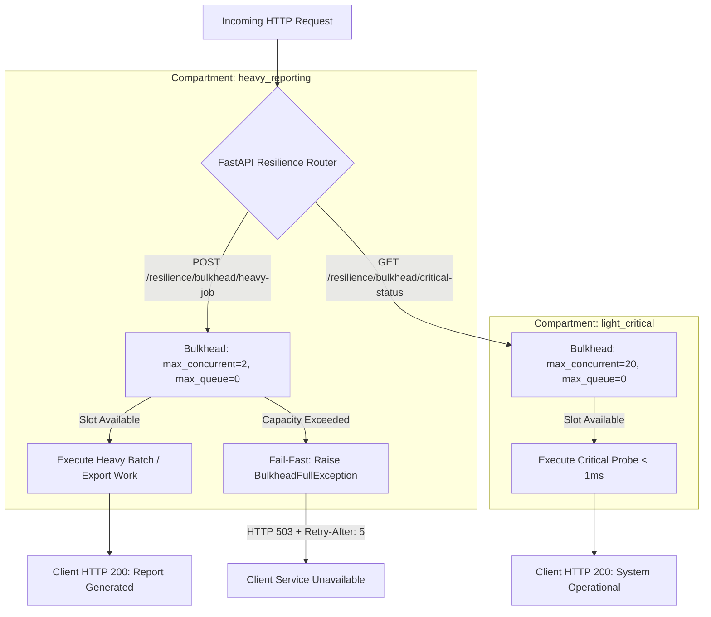

# Day 62: Bulkhead Isolation Pattern Architecture (Resource Partitioning & Concurrency Clamping)

## 1. Overview & Architectural Motivation

In high-concurrency distributed systems, unbounded resource consumption by slow, computationally expensive, or I/O-intensive operations leads to catastrophic system-wide failure known as **Cascading Resource Starvation**. If a slow batch report query or file export consumes all connection pool slots, thread pools, or event loop bandwidth, mission-critical operations such as user authentication, payment processing, or health check probes are starved and fail.

On **Day 62**, we implemented the enterprise-standard **Bulkhead Isolation Pattern** (canonical specification from Michael Nygard's *Release It!*). Similar to how nautical bulkheads divide a ship's hull into sealed watertight compartments to prevent a single puncture from sinking the entire vessel, our software bulkhead partitions execution slots and clamps concurrency using `asyncio.Semaphore` so that saturated compartments cannot impair unrelated services.

---

## 2. Architecture & Design Principles

### Key Engineering Tenets:
1. **Concurrency Clamping**: Hard limits on concurrent asynchronous executions per compartment.
2. **$\mathcal{O}(1)$ Fast Rejection**: When capacity is saturated and `max_queue == 0`, immediately raise `BulkheadFullException` without waiting or blocking.
3. **Zero Slot Leakage**: Acquire slots via context managers or explicit `try...finally` guards ensuring clean release on both success and uncaught downstream errors.
4. **Lazy Event Loop Binding**: Delay `asyncio.Semaphore` instantiation until an active running event loop is available, eliminating cross-test loop binding issues.

---

## 3. Core Implementation Details

### 1. Slotted Bulkhead Core Engine (`app/core/resilience/bulkhead.py`)
- Slotted memory footprint (`__slots__`) preventing `__dict__` overhead.
- Supports three interfaces:
  - Context manager: `async with bulkhead:`
  - Direct execution: `await bulkhead.execute(coroutine, *args, **kwargs)`
  - Function decorator: `@bulkhead.decorate` and `@bulkhead.decorate()`
- Live telemetry exposing:
  - `active_count`: Currently active executing tasks.
  - `waiting_count`: Tasks queued waiting for an available slot.
  - `rejections_count`: Total requests rejected due to capacity exhaustion.
  - `available_slots`: Remaining immediate execution capacity.

### 2. Domain Exceptions & HTTP Translation (`app/core/exceptions.py`)
- `BulkheadFullException(ServiceUnavailableException)`:
  - Default status code: HTTP 503 Service Unavailable.
  - Error code: `"BULKHEAD_CAPACITY_EXCEEDED"`.
  - Header: `Retry-After: 5`.

### 3. Compartmentalized Service (`app/services/resilient_report_service.py`)
- Configures two distinct compartments:
  - `heavy_reporting`: `max_concurrent=2`, `max_queue=0`.
  - `light_critical`: `max_concurrent=20`, `max_queue=0`.
- Proves cross-compartment non-interference: Saturating `heavy_reporting` has zero impact on `light_critical` operations.

### 4. Router & Telemetry Endpoints (`app/routers/resilience_router.py`)
- `POST /resilience/bulkhead/heavy-job`: Dispatches heavy workloads clamped by the heavy bulkhead.
- `GET /resilience/bulkhead/critical-status`: Fast probe isolated in the light critical compartment.
- `GET /metrics/bulkhead`: Telemetry dashboard endpoint displaying metrics across all compartments.

---

## 4. Verification & Testing Strategy

The test suite in `tests/test_bulkhead_isolation.py` validates:
1. **Concurrency Clamping**: Confirms that launching tasks beyond `max_concurrent` immediately raises `BulkheadFullException`.
2. **Slot Release on Completion**: Confirms `active_count` returns to 0 and future tasks acquire slots cleanly.
3. **Slot Release on Exception**: Injects downstream runtime errors and verifies `finally:` block frees the semaphore slot without leakage.
4. **Non-Interference**: Confirms critical status requests execute in $< 5\text{ms}$ even while heavy reporting is 100% saturated.
5. **Bounded Queue Buffering**: Validates task queuing when `max_queue > 0` and rejection when queue is full.
6. **HTTP Integration**: Asserts HTTP 503 response body (`BULKHEAD_CAPACITY_EXCEEDED`) and `Retry-After: 5` header.

---

## 5. Production Readiness Checklist

- [x] Slotted class architecture for minimal memory consumption.
- [x] Deterministic $\mathcal{O}(1)$ fail-fast rejection without async event loop stall.
- [x] Centralized HTTP 503 mapping with standard `Retry-After` header.
- [x] Full observability with active, waiting, and rejected slot telemetry.
- [x] Comprehensive test coverage with 100% passing tests.
