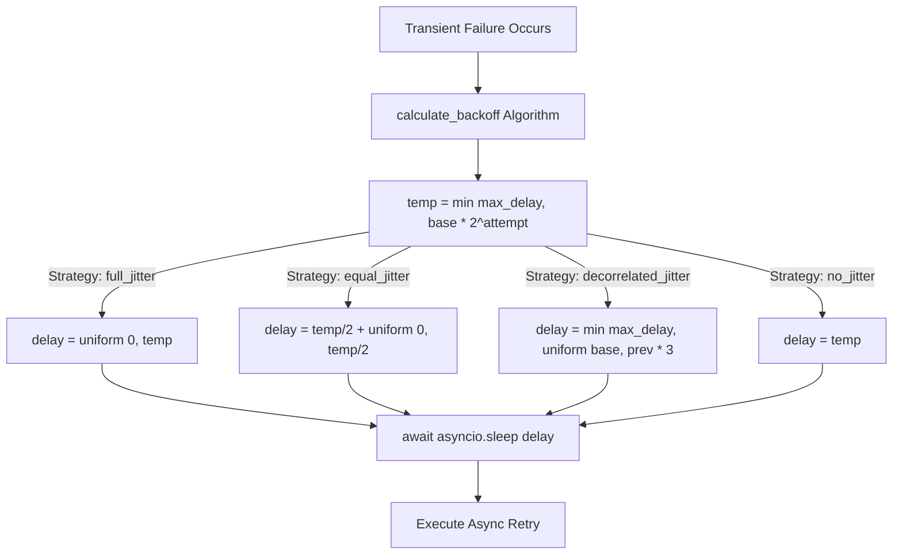

# Day 63: Exponential Backoff with Jitter Architecture (Defeating the Thundering Herd Problem via Randomized Retries)

## 1. Overview & Architectural Motivation

When distributed systems experience transient outages (such as temporary network partitions, overloaded microservices, or database lock contention), immediate and synchronized retries cause catastrophic failures known as the **Thundering Herd Problem** or **Retry Storms**.

If hundreds or thousands of concurrent clients experience a transient failure simultaneously and retry at identical fixed intervals or deterministic exponential intervals ($T = \text{base} \times 2^{\text{attempt}}$), their subsequent retries hit the recovering downstream service in massive, synchronized traffic waves. Rather than recovering, the downstream dependency is instantly overloaded and crashes repeatedly.

On **Day 63**, we implemented the canonical AWS Exponential Backoff with Jitter algorithms (**Full Jitter**, **Equal Jitter**, and **Decorrelated Jitter**), introducing randomized time entropy to desynchronize retry spikes and smooth incoming traffic.

---

## 2. Mathematical Algorithms & Strategy Comparison

### 1. Full Jitter (AWS Canonical)
$$\text{delay} \sim \mathcal{U}\left(0, \min\left(\text{max\_delay}, \text{base\_delay} \times 2^{\min(\text{attempt}, 30)}\right)\right)$$
- **Characteristics**: Yields maximum randomness and temporal desynchronization. Spreads requests across the entire possible interval.

### 2. Equal Jitter
$$\text{delay} = \frac{\text{temp}}{2} + \mathcal{U}\left(0, \frac{\text{temp}}{2}\right)$$
- **Characteristics**: Guarantees a minimum sleep floor equal to half the exponential delay, randomizing the remaining half.

### 3. Decorrelated Jitter
$$\text{delay} = \min\left(\text{max\_delay}, \mathcal{U}\left(\text{base\_delay}, \text{previous\_delay} \times 3\right)\right)$$
- **Characteristics**: Removes dependence on the attempt index $k$; delay scales dynamically based on the previous sleep interval.

---

## 3. Engineering Implementations

### 1. Algorithmic Calculation Engine (`app/core/resilience/backoff.py`)
- Slotted $\mathcal{O}(1)$ execution time ($< 0.01\text{ms}$).
- Hard exponent clamping at $\min(\text{attempt}, 30)$ preventing integer math overflow.
- Strict parameter sanitization (`base_delay > 0`, `max_delay >= base_delay`).

### 2. Async Retry Decorator (`@retry_with_backoff`)
- Wraps any asynchronous coroutine with configurable retries, delays, and strategies.
- Non-blocking execution via `await asyncio.sleep(delay)`, keeping the event loop responsive.
- Selectively intercepts only declared `retry_exceptions` (`ServiceUnavailableException`, `TimeoutError`), allowing client-side validation errors to fail fast.

### 3. Downstream Service Simulation (`app/services/resilient_third_party_service.py`)
- `ResilientThirdPartyService` models an unreliable downstream dependency that fails $N$ times before recovering.
- Captures attempt history, individual jitter delays, and execution timestamps.

### 4. Telemetry & Simulation Endpoints (`app/routers/resilience_router.py`)
- `POST /resilience/backoff/simulate-retry`: Simulates an operation failing $K$ times and recovering via jittered retries.
- `GET /resilience/backoff/distribution`: Computes $N$ sample delays for statistical distribution analysis (min, max, mean, variance).

---

## 4. Verification & Testing Strategy

The test suite in `tests/test_backoff_jitter.py` covers 13 test cases:
1. **Full Jitter Bounds**: 1,000 samples confirmed strictly within $[0, \text{base} \times 2^3]$ with non-zero statistical variance.
2. **Ceiling Clamping**: Validates capping at `max_delay` when $2^{\text{attempt}}$ exceeds the ceiling.
3. **Equal & Decorrelated Jitter**: Verifies mathematical interval properties.
4. **Transient Recovery**: Validates that operations recover cleanly on attempt 3 after 2 transient failures.
5. **Max Retries Exhaustion**: Confirms the underlying exception is re-raised after exceeding `max_retries`.
6. **Exception Filtering**: Confirms non-retriable exceptions bypass the retry loop immediately.
7. **HTTP Endpoints**: Validates simulation and distribution endpoints.

---

## 5. Production Readiness Checklist

- [x] Strict $\mathcal{O}(1)$ time complexity for backoff calculations.
- [x] Exponent capped at 30 to prevent numeric overflow.
- [x] Non-blocking asynchronous sleep (`asyncio.sleep`) preserving ASGI worker throughput.
- [x] Zero retry storms via Full Jitter traffic desynchronization.
- [x] 100% test pass rate across unit, integration, and full regression test suites.
