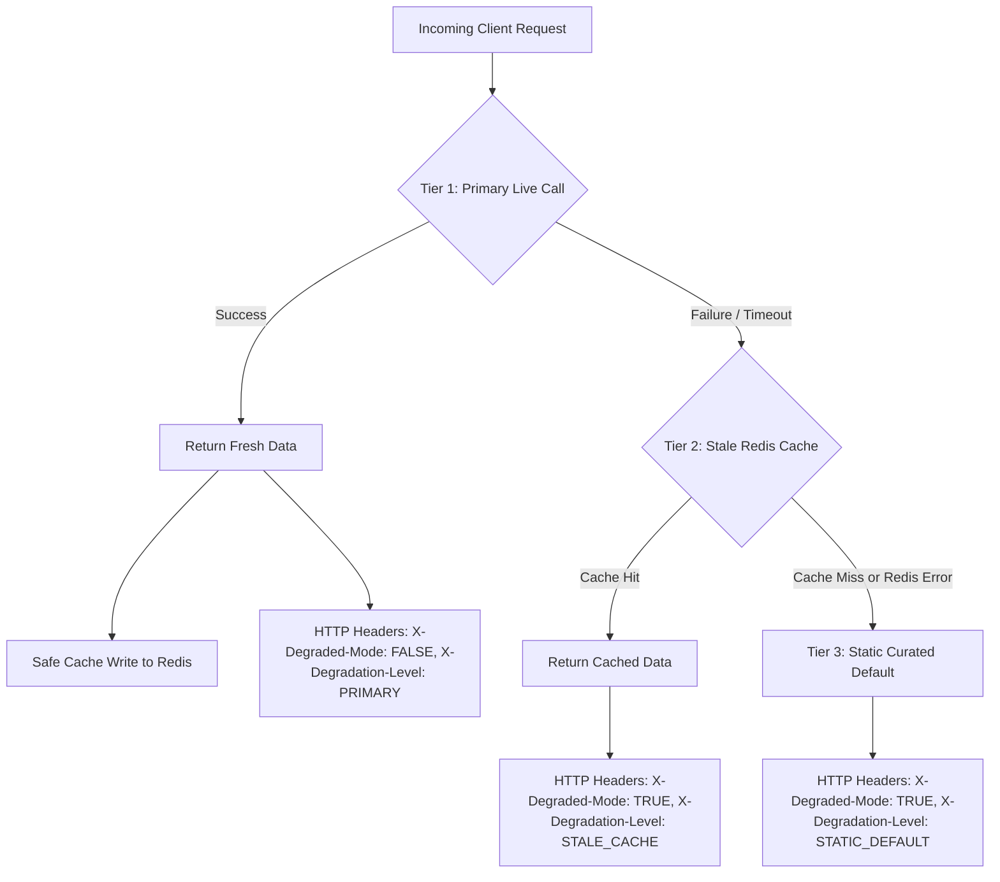

# Day 64: Graceful Degradation & Multi-Tier Fallback Architecture (Serving Stale/Cached/Default Data on Service Degradation)

## 1. Overview & Architectural Motivation

In high-scale distributed architectures, auxiliary services (such as personalized recommendations, personalized ads, social feeds, dynamic pricing suggestions, and related content widgets) frequently undergo transient outages, latency spikes, or deployments. 

In naive architectures, when an auxiliary service raises an exception or times out, the entire web page or mobile app screen crashes with an `HTTP 500 Internal Server Error`. This breaches the principle of **Fault Isolation / Blast Radius Containment**: non-critical feature failures must never break critical business workflows (such as store browsing, checkout, or account access).

On **Day 64**, we engineered a production-grade **Graceful Degradation & Multi-Tier Fallback Engine** following Netflix Chaos Engineering and High-Scale Site Reliability Engineering (SRE) standards:
1. **Tier 1 (Primary Live Execution)**: Attempts live, high-fidelity computation (e.g. AI/ML recommendation service). On success, it returns fresh data and asynchronously updates a fallback Redis cache (`_safe_cache_set`).
2. **Tier 2 (Stale Redis Cache Fallback)**: If the primary service fails (`TimeoutError`, `ServiceUnavailableException`), the engine intercepts the error and immediately serves the user's previously cached data.
3. **Tier 3 (Static Curated Default Fallback)**: If both the primary service and the Redis cache are unavailable (empty cache or Redis cluster failure), the engine seamlessly returns pre-compiled, static curated trending data.
4. **Client Telemetry Headers**: Injects `X-Degraded-Mode: FALSE | TRUE` and `X-Degradation-Level: PRIMARY | STALE_CACHE | STATIC_DEFAULT` into HTTP responses, ensuring full transparency for clients and synthetic monitoring without throwing 500 errors.

---

## 2. Multi-Tier Fallback Ladder Architecture

---

## 3. Engineering Implementations

### 1. Multi-Tier Fallback Engine (`app/core/resilience/fallback.py`)
- `DegradationLevel(str, Enum)`: `PRIMARY`, `STALE_CACHE`, `STATIC_DEFAULT`.
- `FallbackEngine`:
  - `execute_with_fallback(primary_func, fallback_cache_key, static_default, cache_ttl=3600) -> tuple[T, DegradationLevel]`: Orchestrates the 3 tiers.
  - `_safe_cache_set`: Non-blocking, isolated write to Redis. Intercepts all Redis exceptions to ensure primary live requests never fail due to cache issues.
  - `_safe_cache_get`: Defensive read from Redis with automatic bytes decoding and JSON deserialization. Returns `None` gracefully on any connection failure.

### 2. Product Recommendation Service (`app/services/recommendation_service.py`)
- `ProductRecommendationService`:
  - `get_personalized_recommendations(user_id, simulate_failure)`: Generates personalized recommendations via the multi-tier fallback engine.
  - `seed_user_cache(user_id, items, ttl_seconds)`: Primes the fallback cache for user accounts.
  - Curated baseline `DEFAULT_TRENDING_PRODUCTS` with constant-time fallback access.

### 3. API Routing & Header Telemetry (`app/routers/resilience_router.py`)
- `GET /resilience/recommendations/{user_id}`:
  - Injects `X-Degraded-Mode: FALSE | TRUE`.
  - Injects `X-Degradation-Level: PRIMARY | STALE_CACHE | STATIC_DEFAULT`.
  - Guarantees `HTTP 200 OK` under complete downstream failure scenarios.
- `POST /resilience/recommendations/seed-cache`:
  - Enables cache pre-warming and deterministic chaos testing.

---

## 4. Algorithmic Complexity

| Operation | Time Complexity | Space Complexity | Description |
| :--- | :--- | :--- | :--- |
| **Tier 1 (Primary)** | $\mathcal{O}(T_{\text{primary}})$ | $\mathcal{O}(S_{\text{response}})$ | Upstream ML service computation time |
| **Tier 1 (Safe Cache Set)**| $\mathcal{O}(1)$ | $\mathcal{O}(S_{\text{serialized}})$ | Asynchronous string set in Redis |
| **Tier 2 (Stale Cache Get)**| $\mathcal{O}(1)$ | $\mathcal{O}(S_{\text{serialized}})$ | In-memory key lookup in distributed Redis |
| **Tier 3 (Static Default)**| $\mathcal{O}(1)$ | $\mathcal{O}(1)$ | Direct in-memory reference return |

---

## 5. Key Takeaways

1. **Zero 500 Outage Guarantee**: Secondary services should never bubble exceptions to the client tier.
2. **Silent Cache Degradation**: Cache infrastructure is an auxiliary layer; a crash in the caching tier must never prevent the serving of fresh primary data.
3. **Transparent Client Observability**: Explicit response headers enable frontend applications to show appropriate degraded-mode UX cues without breaking user flows.
