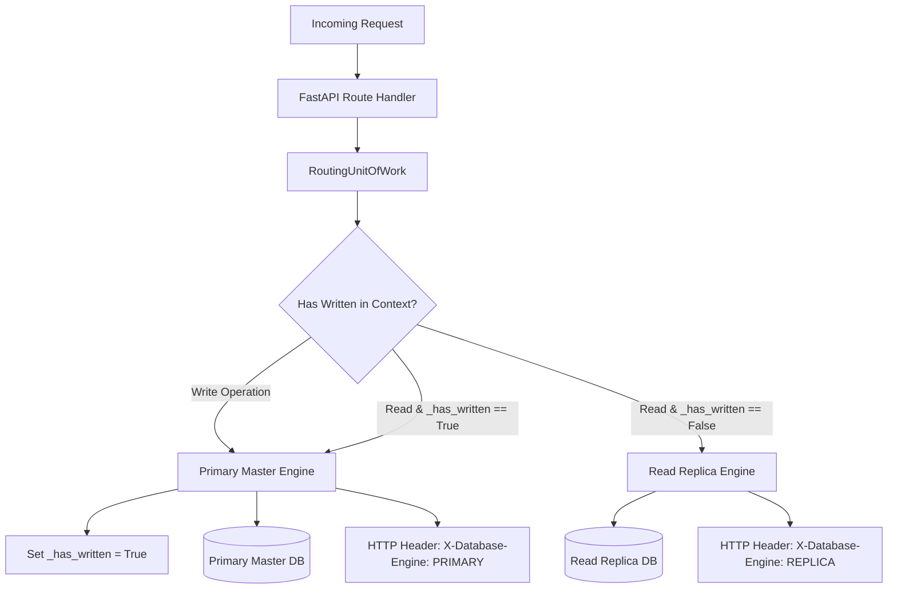

# Day 65: Database Read/Write Replica Splitting Architecture (Dynamic Multi-Engine Routing with SQLAlchemy)

## 1. Overview & Architectural Motivation

In high-scale database systems, traffic patterns are heavily asymmetric—frequently displaying a 90/10 or 95/5 read-to-write ratio (such as e-commerce catalog browsing, news portals, and social media feeds). Routing all queries to a single primary database master node exhausts connection pools, saturates CPU cores, and leads to lock contention on transactional tables.

On **Day 65**, we engineered a production-grade **Database Read/Write Replica Splitting Architecture** with dynamic multi-engine routing via SQLAlchemy 2.0:
1. **Multi-Engine Topology**: Configured two independent asynchronous database engines:
   - `primary_engine`: Handles `INSERT`, `UPDATE`, `DELETE`, and transactional write operations.
   - `replica_engine`: Handles read-only `SELECT` queries, offloading read pressure from the master node.
2. **Dynamic Routing Unit of Work (`RoutingUnitOfWork`)**:
   - Transparently routes reads to `ReplicaAsyncSession` and writes to `PrimaryAsyncSession`.
   - **Read-Your-Own-Writes Protection (Replication Lag Guard)**: Once a mutation occurs within a transaction context (`_has_written = True`), subsequent reads within that same context stick to `PrimaryAsyncSession` to prevent reading stale replica data before asynchronous replication catches up.
3. **Cursor-Level Mutation Shield**: Enforced driver-level protection via SQLAlchemy event listeners (`before_cursor_execute`) on the replica engine, intercepting and blocking any mutating SQL statement (`INSERT`, `UPDATE`, `DELETE`, `DROP`, `ALTER`) with `ReadOnlyReplicaMutationException`.
4. **Transparent HTTP Telemetry**: Response headers `X-Database-Engine: PRIMARY | REPLICA` expose operational routing targets to clients and monitoring systems.

---

## 2. Multi-Engine Routing Architecture

---

## 3. Engineering Implementations

### 1. Multi-Engine Database Configuration (`app/core/database.py`)
- Independent async engines and connection pools:
  - `primary_engine = create_async_engine(settings.database_url, pool_size=20, max_overflow=10)`
  - `replica_engine = create_async_engine(settings.database_read_replica_url or settings.database_url, pool_size=30, max_overflow=20)`
- Dual session factories: `PrimaryAsyncSession` and `ReplicaAsyncSession` configured with `expire_on_commit=False`.
- `get_dual_db_pool_status()` exposing live pool telemetry for both engines.

### 2. Routing Unit of Work & Lag Guard (`app/core/routing_session.py`)
- `RoutingUnitOfWork`:
  - `active_read_session`: returns `primary_session` if `_has_written` is True (Read-Your-Own-Writes stickiness), otherwise `replica_session`.
  - `active_write_session`: activates `_has_written = True` and returns `primary_session`.
  - Cursor listener `_guard_replica_mutations`: intercepts mutating SQL prefixes and raises `ReadOnlyReplicaMutationException`.
- Dependencies: `get_read_session()`, `get_primary_session()`, `get_primary_uow()`.

### 3. Product Service & Repositories (`app/services/product_service.py`)
- `ProductService`:
  - `get_product(product_id)`: executes query on replica session.
  - `list_products(limit)`: executes catalog query on replica session.
  - `create_product(...)`: commits via Primary master.
  - `create_and_fetch_product(...)`: proves lag guard stickiness by writing and reading in the same context.

### 4. Router & Telemetry Endpoints (`app/routers/replica_router.py`)
- `GET /database/routing/read-probe`: returns `X-Database-Engine: REPLICA`.
- `POST /database/routing/write-probe`: returns `X-Database-Engine: PRIMARY`.
- `POST /database/routing/read-after-write-probe`: returns `X-Database-Engine: PRIMARY` with `read_your_own_writes_active: true`.
- `GET /database/routing/pool-status`: dual-pool metrics.

---

## 4. Algorithmic Complexity

| Operation | Time Complexity | Space Complexity | Description |
| :--- | :--- | :--- | :--- |
| **Engine Routing Decision** | $\mathcal{O}(1)$ | $\mathcal{O}(1)$ | Instant boolean flag evaluation ($< 0.001\text{ms}$) |
| **Connection Pool Lease** | $\mathcal{O}(1)$ | $\mathcal{O}(\text{Pool Size})$ | Connection retrieval from segregated queue pool |
| **Cursor Mutation Interception**| $\mathcal{O}(1)$ | $\mathcal{O}(1)$ | SQL string prefix check before driver execution |

---

## 5. Key Production Takeaways

1. **Protect the Master Node**: Offload 95% of database workload to read replicas, preserving the primary master for transactional writes.
2. **Always Enforce Read-Your-Own-Writes**: Ignoring replication lag causes users to see ghost states immediately after updating profile data or submitting orders.
3. **Driver-Level Mutation Shielding**: Never rely purely on application convention; enforce read-only constraints at the database driver layer.
