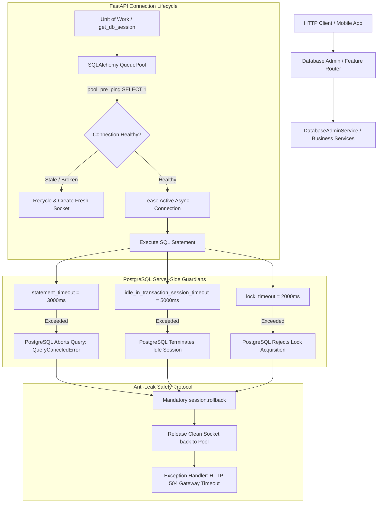

# Day 68: Database Connection Lifecycle, Statement Timeouts & Anti-Leak Architecture

## 1. Overview & Architectural Motivation

In high-concurrency production backend systems, database connection starvation and uncommitted idle transaction leaks are among the most dangerous silent killers. When an un-optimized SQL query executes without a server-side timeout, or an endpoint hangs during external I/O while holding an open transaction lock, database worker threads and connection pool slots become permanently occupied. Within seconds, incoming HTTP traffic saturates the connection pool queue, triggering cascading cascading thread exhaustion, HTTP 500 crashes, and catastrophic service outages (the **Connection Pool Starvation Outage**).

On **Day 68**, we engineered an enterprise-grade **Database Connection Lifecycle and Anti-Leak Architecture**:
1. **Hardened Server-Side Connection Execution Options (`app/core/database.py`)**:
   - `statement_timeout = 3000ms`: Hard kills runaway SQL queries executing longer than 3 seconds on the database engine level, raising `QueryCanceledError` / DBAPI error.
   - `idle_in_transaction_session_timeout = 5000ms`: Automatically terminates backend sessions that hold open transactions idle for longer than 5 seconds without committing or rolling back.
   - `lock_timeout = 2000ms`: Rejects lock acquisition attempts exceeding 2 seconds, preempting catastrophic distributed table deadlocks.
2. **Hardened Connection Pool Lifecycle Parameters**:
   - `pool_size = 20`: Dedicated pool capacity sized for continuous high throughput.
   - `max_overflow = 10`: Burst buffer allowing temporary surge traffic without crashing.
   - `pool_timeout = 5.0s`: Maximum wait time before throwing pool exhaustion exception, preventing client threads from hanging indefinitely.
   - `pool_recycle = 1800s (30 mins)`: Proactively recycles stale database sockets to prevent firewalls and TCP proxies from severing silent idle connections.
   - `pool_pre_ping = True`: Employs a pessimistic disconnect test (`SELECT 1`) prior to leasing any pooled connection, instantly replacing dropped sockets.
3. **Cross-Dialect Test Compatibility & SQLite Emulation**:
   - Registered custom SQLite `pg_sleep(seconds)` function via SQLAlchemy's engine connect listener.
   - Designed dialect-aware execution routines allowing seamless local testing under SQLite alongside enterprise PostgreSQL deployments.
4. **Decoupled Domain Exceptions & HTTP Status Mappings (`app/core/exceptions.py`, `app/core/exception_handlers.py`)**:
   - `DatabaseQueryTimeoutException` mapped to **HTTP 504 Gateway Timeout**.
   - `ConnectionPoolExhaustedException` mapped to **HTTP 503 Service Unavailable** with a strict `Retry-After: 5` header.
5. **Database Administration & Telemetry Service (`DatabaseAdminService` in `app/services/database_admin_service.py`)**:
   - Real-time connection pool introspection (`get_connection_pool_metrics`).
   - Timeout enforcement wrapper with mandatory anti-leak `session.rollback()` (`execute_with_custom_timeout`).
   - Slow/hanging query simulation (`simulate_hanging_query`).
   - Administrative query reaper via `pg_terminate_backend` (`kill_hanging_queries`).
6. **Administrative Telemetry & Diagnostics Router (`app/routers/database_admin_router.py`)**:
   - `GET /database/pool/metrics`: Exposes real-time pool metrics (checked in, checked out, overflow, total open) and timeout configurations.
   - `POST /database/diagnostics/simulate-hanging-query`: Simulates slow query execution and verifies statement timeout cancellation.
   - `POST /database/diagnostics/kill-hanging`: Reaps lingering long-running queries based on a customizable age threshold.

---

## 2. Server-Side Timeouts vs Unbounded Execution Comparison

| Metric / Dimension | Unbounded Database Execution (Vulnerable) | Hardened Anti-Leak Architecture (Day 68) |
| :--- | :--- | :--- |
| **Runaway Query Handling** | Queries run indefinitely, consuming CPU and memory | Hard killed at `statement_timeout = 3000ms` |
| **Idle Transaction Leaks** | Sessions hold table locks forever if worker crashes | Hard killed at `idle_in_transaction_session_timeout = 5000ms` |
| **Lock Deadlock Prevention** | Queries wait indefinitely in lock queue | Rejected at `lock_timeout = 2000ms` |
| **Connection Pool Saturation** | Worker threads hang until timeout; cascading crashes | Rejects at `pool_timeout = 5.0s`, returns HTTP 503 with `Retry-After` |
| **Stale Connection Sockets** | Dropped TCP sockets cause sudden 500 errors | `pool_pre_ping = True` heals stale connections automatically |
| **Connection Reclamation** | Socket accumulation causes OS file descriptor exhaustion | `pool_recycle = 1800s` recycles connections periodically |
| **Failure Observability** | Opaque hanging processes without client guidance | Standardized HTTP 504 and HTTP 503 JSON envelopes |

---

## 3. Database Connection Lifecycle & Anti-Leak Architecture

---

## 4. Source Code Mapping

| Layer / File | Responsibility |
| :--- | :--- |
| [`app/core/config.py`](file:///e:/FastApi1/app/core/config.py) | Configuration settings for pool sizing and server-side timeouts (`statement_timeout`, `idle_in_transaction`, `lock_timeout`, `pool_timeout`). |
| [`app/core/database.py`](file:///e:/FastApi1/app/core/database.py) | Engine creation with PostgreSQL `server_settings`, SQLite `timeout=5.0`, `pool_pre_ping`, `pool_recycle`, and SQLite `pg_sleep` hook. |
| [`app/core/exceptions.py`](file:///e:/FastApi1/app/core/exceptions.py) | Decoupled domain exceptions: `DatabaseQueryTimeoutException` (504) and `ConnectionPoolExhaustedException` (503). |
| [`app/core/exception_handlers.py`](file:///e:/FastApi1/app/core/exception_handlers.py) | Translates domain exceptions into standardized `ErrorResponse` envelopes with `Retry-After` header support. |
| [`app/schemas/database_admin.py`](file:///e:/FastApi1/app/schemas/database_admin.py) | Pydantic contracts for connection pool telemetry and hanging query simulation. |
| [`app/services/database_admin_service.py`](file:///e:/FastApi1/app/services/database_admin_service.py) | Business logic for timeout enforcement, query cancellation rollback, pool telemetry, and reaper execution. |
| [`app/routers/database_admin_router.py`](file:///e:/FastApi1/app/routers/database_admin_router.py) | API endpoints: `GET /database/pool/metrics`, `POST /database/diagnostics/simulate-hanging-query`, `POST /database/diagnostics/kill-hanging`. |
| [`tests/test_database_timeouts.py`](file:///e:/FastApi1/tests/test_database_timeouts.py) | Automated test suite verifying timeout cancellation, connection recovery, pool configuration, and HTTP diagnostics. |

---

## 5. Verification & Test Results

The test suite in [`tests/test_database_timeouts.py`](file:///e:/FastApi1/tests/test_database_timeouts.py) verifies all core behaviors:
1. `test_statement_timeout_cancels_and_raises_exception`: Queries exceeding the timeout raise `DatabaseQueryTimeoutException`.
2. `test_connection_healthy_after_timeout_cancellation`: Rollback cleanly restores connection state; subsequent queries execute without errors.
3. `test_pool_pre_ping_and_timeout_configurations`: Configuration invariants strictly verified.
4. `test_pool_exhaustion_maps_to_503_and_retry_after`: Pool exhaustion triggers HTTP 503 with `Retry-After: 5`.
5. `test_simulated_pool_saturation_timeout`: Pool queue saturation raises timeout error as expected.
6. `test_get_database_pool_metrics_endpoint`: `GET /database/pool/metrics` returns full operational telemetry.
7. `test_simulate_hanging_query_fast_success`: Fast simulated queries return HTTP 200 OK.
8. `test_simulate_hanging_query_timeout_returns_504`: Slow simulated queries return HTTP 504 Gateway Timeout.
9. `test_kill_hanging_queries_endpoint`: Administrative reaper endpoint executes safely.
