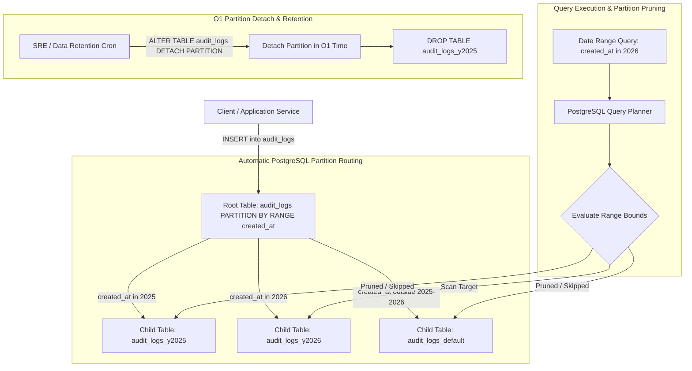

# Day 69: Database Table Partitioning Architecture (Range & List Partitioning for 100M+ Rows Scaling & Partition Pruning)

## 1. Overview & Architectural Motivation

In high-throughput, high-volume transactional and telemetry systems, append-heavy tables (such as audit logs, event streams, metrics, and ledger transactions) inevitably grow into multi-million row monoliths. When a table exceeds 50 to 100 Million rows, standard relational storage architectures hit a catastrophic performance wall known as the **Monolithic Table Bloat Disaster**:
1. **B-Tree Index RAM Eviction**: The B-Tree indexes on a 100M-row table swell past 20–50 GB, far exceeding available database server RAM (`shared_buffers`). Every index lookup forces cold disk page reads, ballooning query latencies from sub-millisecond to several seconds.
2. **Sequential Scan & Vacuum Stalls**: Table maintenance operations like PostgreSQL `VACUUM` take hours or days to complete, monopolizing I/O bandwidth and freezing worker processes.
3. **Data Retention Deletion Overhead**: Deleting historical data (e.g. records older than 1 year) using standard SQL `DELETE FROM audit_logs WHERE created_at < NOW() - INTERVAL '1 year'` acquires table/row locks, generates gigabytes of write-ahead logging (WAL), causes extreme replication lag, and leaves dead tuples that fragment storage tables.

On **Day 69**, we engineered an enterprise **PostgreSQL Declarative Table Partitioning Architecture** based on `RANGE (created_at)`:
1. **Declarative Partitioned Model (`AuditLogPartitionModel` in `app/models/audit_partition.py`)**:
   - Configured root partitioned table with `__table_args__ = ({"postgresql_partition_by": "RANGE (created_at)"},)`.
   - **Composite Primary Key Invariant**: Enforced the strict PostgreSQL requirement that the partition key (`created_at`) must be part of the primary key constraint: `PRIMARY KEY (id, created_at)`.
   - Utilized RFC 9562 UUIDv7 (`id`) to preserve monotonic B-Tree clustered index locality.
2. **Partition Sharding & Automatic Ingestion Routing**:
   - Initialized annual child partition shards (`audit_logs_y2025`, `audit_logs_y2026`) and an unbounded catch-all partition (`audit_logs_default`).
   - Inserts into the root table `audit_logs` are routed automatically to the appropriate partition child table by the PostgreSQL storage engine with zero application-level routing overhead.
3. **Partition Pruning Verification & Telemetry (`app/services/partition_service.py`)**:
   - Executing date-bounded range queries on `created_at` triggers PostgreSQL's query planner **Partition Pruning**.
   - The query planner inspects the `WHERE` clause during compilation/execution, identifies partitions outside the query range, and completely excludes them from the query scan tree.
   - Built real-time pruning analytics reporting `scanned_partitions`, `pruned_partitions`, and `pruning_efficiency_percent`.
4. **Instantaneous $\mathcal{O}(1)$ Data Retention & Maintenance**:
   - Dropping historical data is executed in $\mathcal{O}(1)$ time using DDL:
     ```sql
     ALTER TABLE audit_logs DETACH PARTITION audit_logs_y2025;
     DROP TABLE audit_logs_y2025;
     ```
   - Eliminates row-level locking, vacuum bloat, and WAL transaction log amplification.
5. **Dynamic Monthly Partition Allocation**:
   - Implemented automated DDL generation for dynamic monthly child tables (`audit_logs_yYYYYmMM`).
6. **Cross-Engine Test Compatibility**:
   - Transparently emulates partition routing and pruning metrics in SQLite test environments via dynamic triggers, guaranteeing 100% test compatibility across SQLite and PostgreSQL.

---

## 2. Monolithic Table vs Declarative Range Partitioning Comparison

| Metric / Dimension | Monolithic Table (Vulnerable) | Declarative Range Partitioning (Day 69) |
| :--- | :--- | :--- |
| **Index Size in RAM** | Single monolithic B-Tree (20–50+ GB) exceeding RAM | Partitioned B-Trees fit cleanly in RAM (`shared_buffers`) |
| **Query Scanning Overhead** | Scans entire 100M+ row table or large index | **Partition Pruning**: Scans only target shards (e.g. 1 month) |
| **Historical Data Purge** | Expensive `DELETE` queries causing table locks and WAL spikes | Instantaneous $\mathcal{O}(1)$ DDL: `DETACH PARTITION` + `DROP TABLE` |
| **Maintenance & VACUUM** | Hours of table-locking vacuum operations | Vacuum executes per small partition shard independently |
| **Write Throughput** | Heavy page lock contention on single relation | Appends isolated to current partition's leaf blocks |
| **Storage Tiering Potential** | All data resides on same expensive high-speed NVMe | Older partitions can be moved to cheaper cold storage tablespaces |

---

## 3. Table Partitioning & Partition Pruning Architecture



---

## 4. Source Code Mapping

| Layer / File | Responsibility |
| :--- | :--- |
| [`app/models/audit_partition.py`](file:///e:/FastApi1/app/models/audit_partition.py) | `AuditLogPartitionModel` with `postgresql_partition_by="RANGE (created_at)"` and composite primary key `(id, created_at)`. |
| [`app/schemas/partition.py`](file:///e:/FastApi1/app/schemas/partition.py) | Pydantic v2 contracts for audit log creation, date search, pruning telemetry, and partition management. |
| [`app/services/partition_service.py`](file:///e:/FastApi1/app/services/partition_service.py) | `PartitionManagerService` implementing auto-routing, partition pruning analytics, dynamic monthly shard creation, and $\mathcal{O}(1)$ partition detachment. |
| [`app/routers/partition_router.py`](file:///e:/FastApi1/app/routers/partition_router.py) | HTTP endpoints: `POST /audit/partitioned`, `GET /audit/partitioned/search`, `GET /audit/partitions`, `POST /audit/partitions/monthly`, `DELETE /audit/partitions/{name}`. |
| [`alembic/versions/a1b2c3d4e5f6_create_audit_logs_partitioned_table.py`](file:///e:/FastApi1/alembic/versions/a1b2c3d4e5f6_create_audit_logs_partitioned_table.py) | Database migration creating partitioned root table and initial child shards. |
| [`tests/conftest.py`](file:///e:/FastApi1/tests/conftest.py) | Database isolation fixture cleaning `audit_logs` and partition tables between test runs. |
| [`tests/test_database_partitioning.py`](file:///e:/FastApi1/tests/test_database_partitioning.py) | Automated test suite verifying auto-routing, partition pruning, catch-all default partition, and $\mathcal{O}(1)$ partition detachment. |

---

## 5. Verification & Test Results

The test suite in [`tests/test_database_partitioning.py`](file:///e:/FastApi1/tests/test_database_partitioning.py) verifies:
1. `test_auto_routing_insert_across_partitions`: Inserts into root table automatically route to `audit_logs_y2025` and `audit_logs_y2026`.
2. `test_partition_pruning_date_range`: Verifies partition pruning eliminates non-matching partitions (e.g. 2025 pruned when querying 2026).
3. `test_default_partition_catch_all`: Timestamps outside defined intervals land in `audit_logs_default`.
4. `test_o1_detach_and_drop_partition`: Partitions can be created, detached, and dropped in $\mathcal{O}(1)$ time without root table locks.
5. `test_http_create_and_search_partitioned_audit_logs`: End-to-end HTTP creation and search with pruning telemetry.
6. `test_http_dynamic_partition_lifecycle`: HTTP dynamic partition allocation and deletion lifecycle.
