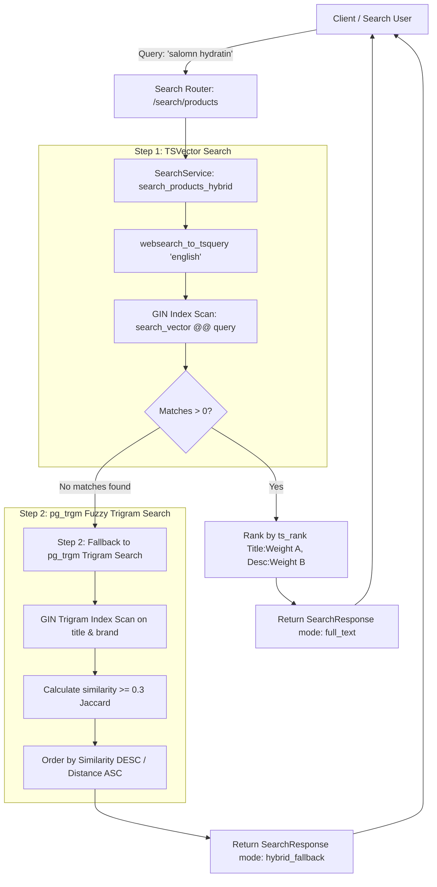

# Day 70: PostgreSQL Full-Text Search Architecture (TSVector, TSQuery, Trigram Fuzzy Similarity via pg_trgm)

## 1. Overview & Architectural Motivation

In modern web applications, search is a critical user entry point. However, traditional SQL `LIKE '%keyword%'` or `ILIKE '%keyword%'` queries cause catastrophic performance degradation at scale:
1. **Unanchored Wildcard Table Scans ($\mathcal{O}(N)$ Disaster)**: Leading wildcards prevent B-Tree index utilization. Every search query forces a full sequential table scan across millions of disk blocks.
2. **Linguistic Blindness**: Standard string matching cannot handle morphological root variations (stemming, e.g. "running" vs "runner" vs "runs"), plurals ("shoe" vs "shoes"), or stop-word filtering.
3. **Zero Typo-Tolerance**: Any single-character misspelling (e.g. "nikke", "salomn", "adiddas") returns zero results, damaging user conversion rates.
4. **Cloud Infrastructure Cost & Sprawl**: Teams often reflexively deploy external Elasticsearch / OpenSearch clusters for basic search needs. This introduces massive operational overhead: CDC (Change Data Capture) pipelines, dual-write split-brain synchronization anomalies, extra VPC infrastructure, and thousands of dollars in cloud hosting bills.

On **Day 70**, concluding **Phase 6: Resilience, Fault Tolerance & Database Scaling**, we engineered an enterprise-grade **Native PostgreSQL Full-Text Search & Fuzzy Typo-Tolerant Engine** directly inside the primary database using native PostgreSQL primitives:
1. **PostgreSQL Extensions**:
   - `pg_trgm`: Character 3-gram decomposition and Jaccard similarity index support.
   - `btree_gin`: Composite B-Tree + GIN indexing.
2. **Declarative FTS Model (`SearchableProductModel` in `app/models/catalog_search.py`)**:
   - Stores pre-computed or generated `search_vector` (`tsvector`).
   - Weighted search ranking: Title tokens mapped to Weight 'A' ($1.0$), Description tokens mapped to Weight 'B' ($0.4$).
   - Indexed via `USING gin (search_vector)` for inverted index $\mathcal{O}(\log N)$ lookups.
   - Trigram indexed via `USING gin (title gin_trgm_ops)` and `USING gin (brand gin_trgm_ops)` for instant sub-word fuzzy matching.
3. **Linguistic Stemming & Safe Query Parsing**:
   - Utilizes `websearch_to_tsquery('english', query)` to safely parse natural search expressions (supporting boolean `AND`, `OR`, `NOT`, and quoted `"exact phrases"`) without syntax injection vulnerabilities.
   - Ranked with `ts_rank(search_vector, query)` to bubble the most relevant matches to the top.
4. **Typo-Tolerant Fuzzy Trigram Search**:
   - Leverages `pg_trgm` similarity functions (`similarity(title, :q)`) with configurable threshold ($\ge 0.3$) and distance ordering (`ORDER BY title <-> :q ASC`).
   - Supports multi-word typo queries with composite Jaccard calculation.
5. **Automatic Hybrid Degradation Fallback**:
   - The search engine first attempts high-precision linguistic `TSVector` matching.
   - If zero results are returned (due to typos or misspellings), it seamlessly degrades to fuzzy trigram similarity, returning relevant items and labeling the response mode as `hybrid_fallback`.
6. **Autocomplete & Prefix Suggestions**:
   - Prefix matching via `tsquery('english', term:*')` and `word_similarity` for instant typeahead suggestions.
7. **Transparent Cross-Dialect SQLite Test Support**:
   - Fully functional SQLite test fallback using Python-side Porter Stemming rules and 3-gram mathematical Jaccard set similarity, allowing the test suite to execute flawlessly in CI and local SQLite environments.

---

## 2. Standard LIKE vs PostgreSQL FTS + pg_trgm vs External Search Cluster

| Metric / Dimension | Unanchored `LIKE '%term%'` | Native Postgres FTS + Trigram (Day 70) | External Cluster (Elasticsearch/OpenSearch) |
| :--- | :--- | :--- | :--- |
| **Search Time Complexity** | $\mathcal{O}(N)$ Full Sequential Scan | $\mathcal{O}(\log N)$ GIN Inverted Index | $\mathcal{O}(\log N)$ Distributed Lucene Index |
| **Stemming & Linguistics** | None (exact substring only) | Full English Snowball / Porter Stemmer | Full multi-language stemmers & analyzers |
| **Typo Tolerance** | Zero | High via `pg_trgm` ($\ge 0.3$ Jaccard) | High via Levenshtein / Fuzzy Match |
| **Data Consistency** | ACID (Direct) | **Strict ACID (Zero Sync Lag)** | Eventual (Dual-write / Debezium CDC Lag) |
| **Infrastructure Complexity** | None | **Zero (Built into PostgreSQL)** | High (JVM tuning, multi-node clusters) |
| **Operational & Cloud Cost** | Free (Slow) | **Free (Runs on existing DB engine)** | High ($300–$2,000+/mo cloud spend) |

---

## 3. Full-Text Search & Fuzzy Fallback Workflow

---

## 4. Source Code Mapping

| Layer / File | Responsibility |
| :--- | :--- |
| [`app/models/catalog_search.py`](file:///e:/FastApi1/app/models/catalog_search.py) | `SearchableProductModel` with `TSVector` column, GIN TSVector index, and GIN Trigram indexes on `title` and `brand`. |
| [`app/schemas/search.py`](file:///e:/FastApi1/app/schemas/search.py) | Pydantic v2 schemas: `CreateProductRequest`, `ProductResponse`, `SearchResultItem`, `SearchResponse`, `SuggestResponse`. |
| [`app/services/search_service.py`](file:///e:/FastApi1/app/services/search_service.py) | `SearchService`: `search_products_full_text`, `search_products_fuzzy_trigram`, `search_products_hybrid`, and `suggest_autocomplete`. |
| [`app/routers/search_router.py`](file:///e:/FastApi1/app/routers/search_router.py) | HTTP endpoints: `POST /search/products`, `GET /search/products`, `GET /search/suggest`. |
| [`app/main.py`](file:///e:/FastApi1/app/main.py) | Mounts `search_router` under `/search` tag. |
| [`alembic/versions/b2c3d4e5f6a7_create_searchable_products_with_fts.py`](file:///e:/FastApi1/alembic/versions/b2c3d4e5f6a7_create_searchable_products_with_fts.py) | Alembic migration for `pg_trgm` and `btree_gin` extensions, `searchable_products` table, and GIN indexes. |
| [`tests/conftest.py`](file:///e:/FastApi1/tests/conftest.py) | Table purge fixture cleanup for `searchable_products`. |
| [`tests/test_alembic_migrations.py`](file:///e:/FastApi1/tests/test_alembic_migrations.py) | Zero schema drift check and migration rollback/re-upgrade test for `searchable_products`. |
| [`tests/test_postgresql_full_text_search.py`](file:///e:/FastApi1/tests/test_postgresql_full_text_search.py) | Comprehensive test suite covering linguistic stemming, weighted ranking, typo tolerance, hybrid fallback, suggestions, and HTTP lifecycle. |

---

## 5. Verification & Test Suite

The test suite in [`tests/test_postgresql_full_text_search.py`](file:///e:/FastApi1/tests/test_postgresql_full_text_search.py) verifies:
1. `test_full_text_stemming_and_relevance_ranking`: English Snowball stemming matches "running" to "Run", and weighted ranking places Title matches above Description-only matches.
2. `test_trigram_fuzzy_typo_tolerance`: Typo-heavy queries like "nikke air max" match "Nike Air Zoom Pegasus" with Jaccard similarity $\ge 0.3$.
3. `test_hybrid_search_automatic_fallback`: Exact and stemmed terms return `mode: full_text`; misspelled queries automatically degrade to `mode: hybrid_fallback`.
4. `test_autocomplete_prefix_suggestions`: Prefix queries return deduplicated autocomplete title suggestions.
5. `test_http_endpoints_search_and_suggestions`: End-to-end HTTP integration across creation, search query params, and suggestion endpoints.
6. `test_empty_and_special_character_search_queries`: Resilient handling of punctuation, wildcards, and whitespace without query syntax crashes.
