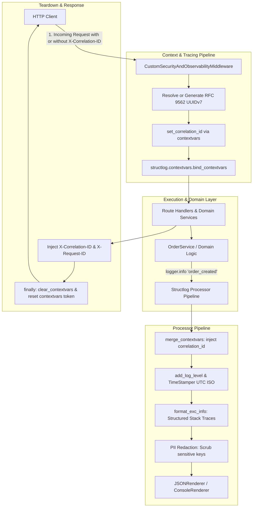

# Day 71: Production Structured JSON Logging Architecture with Structlog & Distributed Correlation ID Propagation

## 1. Overview & Architectural Motivation

In modern cloud-native distributed backend systems, relying on un-structured, plain text `print()` statements or basic standard library formatting (`[INFO] 2026-09-10: user login succeeded`) creates an unobservable operational nightmare:
1. **Un-Parsable Log Slop**: Log aggregation engines (Datadog, Grafana Loki, AWS CloudWatch, ELK Stack) cannot natively index or filter plain text strings without brittle, CPU-expensive Regular Expressions.
2. **Context Loss & Lost Traces**: When a single customer transaction cascades across multiple microservices, background queues, and concurrent ASGI coroutines, logs from different requests interleave on stdout. Without a unique tracing identifier bound to each request, identifying the specific sequence of operations causing an error is nearly impossible.
3. **Catastrophic PII Leaks**: Developers inadvertently pass sensitive customer credentials (`password`, `token`, `authorization`, `credit_card`) into logger payloads. Once written to log aggregation platforms, these credentials are visible to operations teams and violate regulatory compliance (GDPR, PCI-DSS, SOC 2).
4. **Blocking Latency Overhead**: Poorly engineered logging setups perform disk I/O or expensive string formatting on the active coroutine thread, degrading endpoint throughput and introducing unpredictable latency jitter.

On **Day 71**, inaugurating **Phase 7: Observability, Kubernetes, Production Docker & CI/CD**, we engineered an enterprise-grade **Production Structured JSON Logging Architecture** powered by `structlog` and Python `contextvars` to provide high-velocity, machine-readable JSON telemetry with automated distributed Correlation ID tracing and zero-leak sensitive data redaction.

---

## 2. Architecture & Processing Pipeline



---

## 3. Key Components Implemented

### 1. Asyncio ContextVars Isolation (`app/core/context.py`)
- Defines `correlation_id_ctx: ContextVar[str] = ContextVar("correlation_id", default="")`.
- Implements `get_correlation_id() -> str`, `set_correlation_id(cid: str) -> Token[str]`, and `reset_correlation_id(token: Token[str]) -> None`.
- Guarantees coroutine-level task isolation in $\mathcal{O}(1)$ time complexity without thread-local memory overhead.

### 2. Enterprise Structlog Pipeline & PII Redaction (`app/core/logging.py`)
- **Processor Pipeline**:
  - `structlog.contextvars.merge_contextvars`: Automatically injects `correlation_id` into every log record without manual parameter passing.
  - `structlog.processors.add_log_level`: Standardizes log severity level (`debug`, `info`, `warning`, `error`).
  - `structlog.processors.TimeStamper(fmt="iso", utc=True)`: Standardizes ISO 8601 UTC timestamps.
  - `structlog.processors.StackInfoRenderer()` & `structlog.processors.format_exc_info`: Serializes full exception stack traces into structured fields.
  - **`redact_sensitive_data_processor`**: Employs an $\mathcal{O}(1)$ `frozenset` lookup to scrub sensitive fields (`password`, `token`, `secret`, `authorization`, `credit_card`) and sensitive suffixes (`_password`, `_token`, `_secret`, `_key`) into `"[REDACTED]"`.
  - **Output Formatter**: Compact, machine-parsable `structlog.processors.JSONRenderer()` in production and testing, or colored `structlog.dev.ConsoleRenderer()` in local interactive development.
- **Standard Library Interceptor**:
  - Formats legacy standard library `logging` messages through the exact same structlog processor chain.

### 3. Middleware Integration (`app/core/middleware.py`)
- Upgrades `CustomSecurityAndObservabilityMiddleware`:
  - Extracts incoming `X-Correlation-ID` or `X-Request-ID`. If absent, generates an RFC 9562 UUIDv7.
  - Sets context in `contextvars` and binds `correlation_id` to structlog context.
  - Logs `http_request_started` with HTTP method, URL path, and client IP.
  - Measures execution latency via `time.perf_counter()`.
  - Logs `http_request_completed` with duration in milliseconds (`latency_ms`) and status code.
  - Injects `X-Correlation-ID` and `X-Request-ID` into the HTTP response headers.
  - Enforces mandatory `finally:` teardown: clears structlog context and resets the contextvars token to eliminate cross-request context leakage.

### 4. Domain Telemetry Integration (`app/services/order_service.py`)
- Instruments domain transactions with structured context:
  ```python
  logger.info(
      "order_created",
      order_id=str(order.id),
      user_id=order.user_id,
      total_amount=order.total_amount,
  )
  ```
- Any log emitted within the request automatically includes `correlation_id` without polluting domain method signatures.

### 5. Diagnostics Observability Router (`app/routers/observability_router.py`)
- `GET /observability/logging/probe`: Emits diagnostic logs across DEBUG, INFO, WARNING, and ERROR levels, returning current correlation ID and runtime logging mode.
- `POST /observability/logging/simulate-error`: Emits an error with stack trace and sensitive fields (`password`, `token`, `credit_card`) to verify redaction.

---

## 4. DSA & Performance Constraints

| Operation | Mechanism | Time Complexity | Space Complexity |
| :--- | :--- | :--- | :--- |
| **Correlation ID Lookup** | `contextvars.ContextVar.get()` | $\mathcal{O}(1)$ | $\mathcal{O}(1)$ |
| **ContextVar Binding / Reset** | `ContextVar.set()` / `reset()` | $\mathcal{O}(1)$ | $\mathcal{O}(1)$ |
| **PII Key Detection** | `frozenset` membership + suffix tuple check | $\mathcal{O}(1)$ | $\mathcal{O}(1)$ |
| **Structlog Pipeline Execution** | Ordered sequential processor chain | $\mathcal{O}(K)$ ($K \le 7$) | $\mathcal{O}(M)$ (Log event dictionary) |
| **UUIDv7 Generation** | Bitwise epoch ms + monotonic sequence + entropy | $\mathcal{O}(1)$ | $\mathcal{O}(1)$ (128 bits) |

---

## 5. Verification Results

- **Unit & Integration Suite (`tests/test_structured_logging.py`)**:
  - `test_json_output_formatting`: PASSED
  - `test_correlation_id_propagation_via_middleware`: PASSED
  - `test_correlation_id_auto_generation_uuidv7`: PASSED
  - `test_pii_sensitive_data_redaction`: PASSED
  - `test_sensitive_key_detection_helper`: PASSED
  - `test_redact_processor_direct`: PASSED
  - `test_asyncio_task_context_isolation`: PASSED
  - `test_contextvars_cleanup_after_request`: PASSED
  - `test_observability_probe_endpoint`: PASSED
  - `test_observability_simulate_error_endpoint`: PASSED
  - `test_stdlib_logging_interceptor`: PASSED
- **Static Type Safety**: `mypy --strict` passes across all source files with 0 errors.
- **Linter & Security Scan**: `ruff check` passes with 0 violations.
