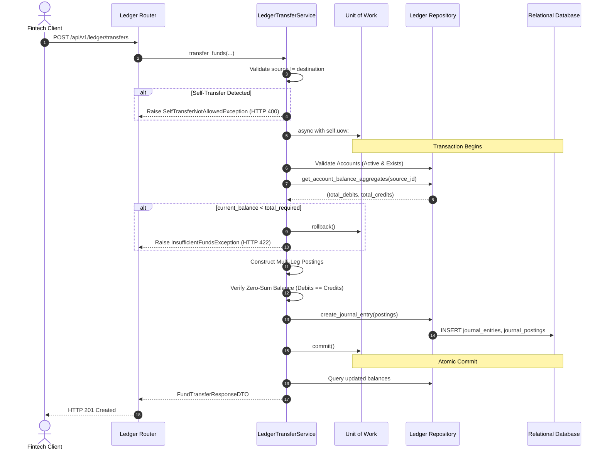

# Day 84: Fintech Atomic Money Transfer Architecture (ACID Isolation, Multi-Leg Ledger Postings & Non-Negative Balance Invariants)

## 1. Objective & Architecture Overview
In Day 84 of our **Phase 8: Capstone Distributed Fintech Double-Entry Ledger System (Days 83–90)**, we engineer an enterprise-grade Atomic Money Transfer service. Moving funds between digital wallets or corporate accounts in production systems (e.g., Stripe, Wise, bKash) demands ACID transactional isolation, balanced multi-leg postings, and strict pre-transfer non-negative balance enforcement.

Core engineering objectives:
1. **Unit of Work (UoW) ACID Isolation**: Encapsulate all journal entry and posting creations into a single atomic database transaction via `UnitOfWorkProtocol`.
2. **Pre-Transfer Cleared Balance Verification**: Dynamically compute real-time source account balance before creating ledger postings. If `current_balance < amount + fee_amount`, reject immediately with `InsufficientFundsException` (HTTP 422) and leave database state unchanged.
3. **Multi-Leg Compound Postings**: Support direct P2P transfers ($k=2$ legs) as well as platform fee deductions ($k=3$ legs) maintaining exact conservation of money ($\sum \text{Debits} == \sum \text{Credits}$).
4. **Defensive Validation Guards**: Prohibit self-transfers (`SelfTransferNotAllowedException`, HTTP 400), detect duplicate transactions via idempotent `reference_id` (`DuplicateReferenceException`, HTTP 409), and reject transfers on inactive accounts.
5. **Clean Layering Rules (1–5)**: Enforce strict boundaries where routers interact exclusively through DTOs, and services depend only on abstract protocols.

---

## 2. Real-World Fintech Analogy
Consider a user **Sadiq** transferring $1,000.0000 to **Abir** with a $5.0000 platform processing fee.
The total amount leaving Sadiq's account is $1,005.0000.

In a naive single-entry system:
```python
# Unsafe naive pattern
db.execute("UPDATE accounts SET balance = balance - 1005 WHERE id = ?", [sadiq_id])
# Crash / Network outage occurs here!
db.execute("UPDATE accounts SET balance = balance + 1000 WHERE id = ?", [abir_id])
```
If the process fails mid-execution, money vanishes into thin air. Sadiq is debited, but Abir never receives funds.

In our Double-Entry Atomic Transfer Architecture:
1. Sadiq's cleared balance is verified against $1,005.0000$.
2. Multi-leg postings are prepared:
   - Sadiq Wallet (`ASSET` decreases): CREDIT $1,005.0000
   - Abir Wallet (`ASSET` increases): DEBIT $1,000.0000
   - Platform Fee (`ASSET` increases): DEBIT $5.0000
3. Zero-Sum Balance Invariant:
   $$\sum \text{Debits} (1000.0000 + 5.0000) == \sum \text{Credits} (1005.0000)$$
4. The entire journal entry and postings are committed atomically in a single UoW transaction.

---

## 3. Architecture Sequence Diagram



---

## 4. Key Implementation Details

### 4.1 Unit of Work Integration (`app/core/unit_of_work.py`)
Extended `UnitOfWorkProtocol` to expose `ledger: LedgerRepositoryProtocol`:
- `SqlAlchemyUnitOfWork`: Coordinates `SqlAlchemyLedgerRepository` sharing the transaction session.
- `InMemoryUnitOfWork`: Implements deep-copy snapshot rollback mechanism for zero-database unit testing.

### 4.2 Exceptions & Handlers (`app/core/exceptions.py`, `app/core/exception_handlers.py`)
- `InsufficientFundsException` $\rightarrow$ HTTP 422 `INSUFFICIENT_FUNDS` with structured payload (`account_id`, `current_balance`, `required_amount`).
- `SelfTransferNotAllowedException` $\rightarrow$ HTTP 400 `SELF_TRANSFER_NOT_ALLOWED`.

### 4.3 Transfer Service Engine (`app/services/ledger_transfer_service.py`)
Coordinates account validation, cleared balance computation, multi-leg posting construction, zero-sum invariant check, and atomic persistence.

### 4.4 Router Endpoint (`app/routers/ledger_router.py`)
- `POST /api/v1/ledger/transfers` returning `FundTransferResponseDTO` with HTTP 201 status code.

---

## 5. Verification & Quality Gates

All 7 test cases in `tests/test_ledger_transfers.py` passed:
1. `test_successful_p2p_fund_transfer`: P2P money transfer and dynamic balance validation.
2. `test_compound_transfer_with_platform_fee`: 3-leg transfer with platform fee deduction.
3. `test_insufficient_funds_rejection_and_atomic_rollback`: Cleared balance guard and rollback verification.
4. `test_self_transfer_prohibited`: Self-transfer HTTP 400 rejection.
5. `test_duplicate_reference_id_replay_conflict`: Idempotent reference ID replay HTTP 409 conflict.
6. `test_inactive_account_transfer_rejection`: Transfer on inactive account rejection.
7. `test_in_memory_uow_atomic_transfer_unit_test`: Pure in-memory unit test with state rollback.

```text
tests/test_ledger_transfers.py::test_successful_p2p_fund_transfer PASSED [ 14%]
tests/test_ledger_transfers.py::test_compound_transfer_with_platform_fee PASSED [ 28%]
tests/test_ledger_transfers.py::test_insufficient_funds_rejection_and_atomic_rollback PASSED [ 42%]
tests/test_ledger_transfers.py::test_self_transfer_prohibited PASSED     [ 57%]
tests/test_ledger_transfers.py::test_duplicate_reference_id_replay_conflict PASSED [ 71%]
tests/test_ledger_transfers.py::test_inactive_account_transfer_rejection PASSED [ 85%]
tests/test_ledger_transfers.py::test_in_memory_uow_atomic_transfer_unit_test PASSED [100%]

======================== 7 passed, 1 warning in 1.68s =========================
================= Architecture Compliance: Strict DAG (0 Cycles) ==============
================= Mypy Strict: 0 Issues in 9 files ============================
================= Ruff Linter & Formatter: All Checks Passed ==================
```
