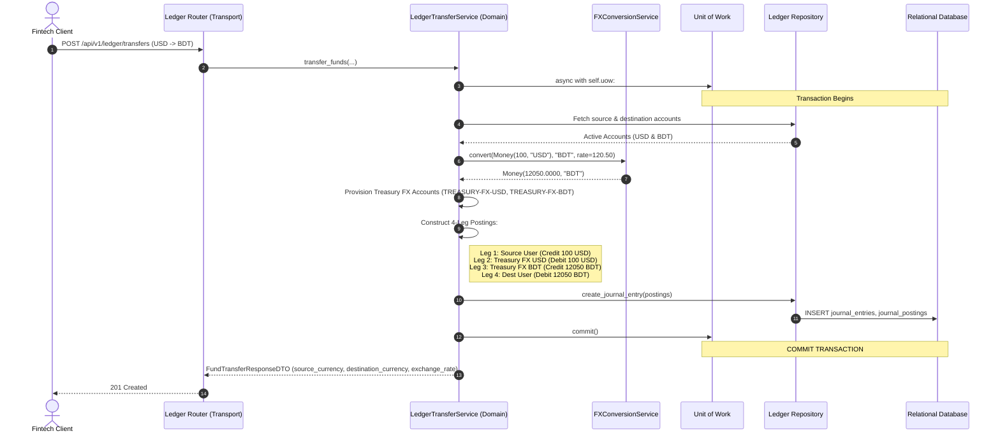

# Day 85: Ledger Currency & Money Value Object Architecture (Arbitrary-Precision Decimals, Multi-Currency Safety & FX Conversion Engine)

## 1. Objective & Architecture Overview
In Day 85 of our **Phase 8: Capstone Distributed Fintech Double-Entry Ledger System (Days 83–90)**, we engineer an enterprise-grade Money Value Object architecture adhering to Martin Fowler's Money Pattern and ISO 4217 standards. In financial and core-banking backends (e.g., Stripe, Wise, PayPal), IEEE 754 floating-point numbers represent an unacceptable existential vulnerability due to precision drift, salami slicing, and silent cross-currency pollution.

Core engineering objectives:
1. **Immutable Money Value Object (`app/core/money.py`)**:
   - Implemented via `@dataclass(frozen=True, slots=True)`.
   - Strict `float` prohibition at runtime, raising `TypeError` immediately if a float is supplied.
   - Fixed scale of 4 decimal places (`0.0001`) with financial **Banker's Rounding (`ROUND_HALF_EVEN`)** to eliminate systematic statistical rounding bias.
   - Rich operator overloading (`+`, `-`, `*`, `/`, `-`, `abs`, `<`, `<=`, `>`, `>=`, `==`) with currency mismatch defense raising `CurrencyMismatchException` (HTTP 400).
2. **Foreign Exchange (FX) Conversion Service (`app/services/fx_conversion_service.py`)**:
   - Validates positive exchange rates (`rate > 0`) and rejects non-positive or invalid scalar multipliers with `InvalidFXRateException` (HTTP 422).
   - Computes target currency amounts with Banker's Rounding.
   - Provides currency pair lookup and simulation rates for testing.
3. **4-Leg Multi-Currency Transfer Orchestration (`app/services/ledger_transfer_service.py`)**:
   - Eliminates direct cross-currency balance mutations.
   - Auto-provisions and utilizes Treasury FX Clearing Accounts (`TREASURY-FX-USD`, `TREASURY-FX-BDT`).
   - Generates an audited **4-leg currency exchange journal entry**:
     1. Source Account Debit/Credit in source currency.
     2. Treasury FX Source Clearing Account balancing posting.
     3. Treasury FX Destination Clearing Account balancing posting.
     4. Destination Account Debit/Credit in destination currency.
   - Enforces zero-sum balance invariant globally ($\sum \text{Debits} == \sum \text{Credits}$) and within currency-isolated buckets.
4. **Clean Architecture Rules (1–5)**:
   - Full AST verification across 181 modules with 0 cycles and 0 ORM leaks.

---

## 2. Real-World Fintech Analogy: Jeweler's Balance vs. Cloth Measuring Tape
When weighing gold at a jeweler's shop, one cannot use a carpenter's cloth tape measure where millimeter variations are ignored. A single milligram deviation corresponds to significant financial loss.
- In software, IEEE 754 binary `float` is the carpenter's tape measure—fast and practical for 3D graphics or physics simulations, but disastrous for financial accounting where `0.1 + 0.2 = 0.30000000000000004`.
- Our `Money` Value Object with `Decimal(18, 4)` and Banker's Rounding is the jeweler's micro-balance—exact, reproducible, and impervious to fractional drift.

---

## 3. Architecture Flow Diagram: 4-Leg Multi-Currency Journal Entry

---

## 4. Verification & Quality Gates
- **Pytest Suite (`tests/test_ledger_currency.py`)**: 8/8 tests passed (100%).
- **Full Regression**: All ledger transfer and double-entry tests passed (15/15).
- **Mypy Strict Type Checking**: 0 issues across all touched files.
- **Ruff Linter & Formatter**: Clean code compliance.
- **Architecture Compliance Linter (`scripts/audit_architecture.py`)**: 181 modules, 402 edges, strict DAG (0 cycles), Rules 1–5 PASSED.
