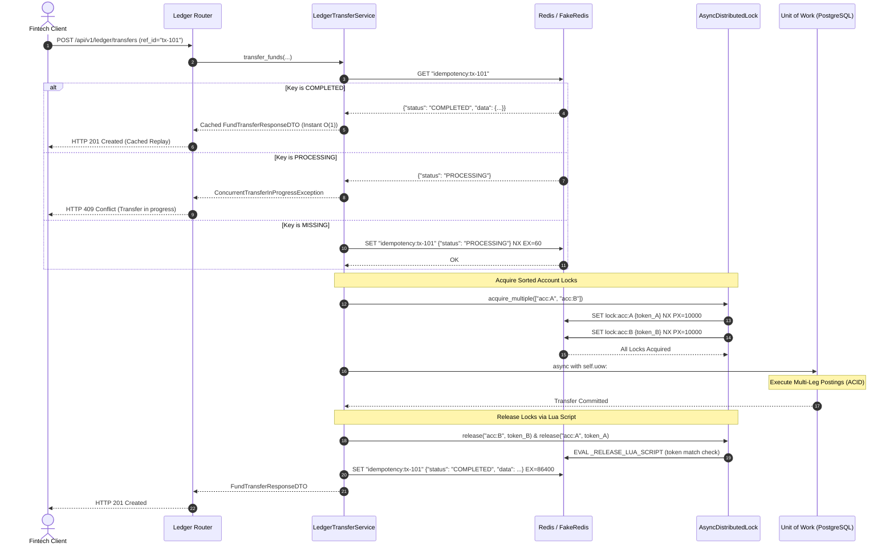

# Day 86: Redis Distributed Locking & Idempotent Payment Ingestion Architecture (Redis Redlock, Lexicographical Deadlock Elimination & In-Flight State Machine)

## 1. Objective & Architecture Overview
In Day 86 of our **Phase 8: Capstone Distributed Fintech Double-Entry Ledger System (Days 83–90)**, we engineer an enterprise-grade Distributed Locking and Idempotent Ingestion architecture for our Fintech Double-Entry Ledger. In high-concurrency distributed banking environments (such as Stripe, Wise, and bKash), parallel double-spending attacks, network replay floods, and circular deadlock deadlocks represent existential operational vulnerabilities.

Core engineering objectives:
1. **Redis Distributed Lock Engine (`app/core/distributed_lock.py`)**:
   - Implemented via `AsyncDistributedLock` adhering to Martin Fowler's distributed concurrency patterns and canonical Redlock mechanics.
   - Unique cryptographic lock tokens (`uuid.uuid4()`) and atomic `SET lock:{key} {token} NX PX {ttl_ms}` ensuring mutual exclusion across horizontally scaled application clusters.
   - Jittered exponential backoff (`secrets.SystemRandom().uniform(0.005, 0.025)`) during contention to prevent thundering herd spikes on Redis.
   - Raises `LockAcquisitionTimeoutException` (HTTP 503 Service Unavailable with `Retry-After: 2` header) on lock acquisition timeouts.
2. **Safe Atomic Release via Canonical Lua Script (`_RELEASE_LUA_SCRIPT`)**:
   - Executes an atomic server-side Lua script to eliminate the infamous "slow worker lock hijacking" bug:
     ```lua
     if redis.call("get", KEYS[1]) == ARGV[1] then
         return redis.call("del", KEYS[1])
     else
         return 0
     end
     ```
   - Verifies the caller's unique token matches the value in Redis before deletion; foreign or expired locks are never deleted.
3. **Lexicographical Deadlock Elimination (`acquire_multiple`)**:
   - Eliminates circular wait deadlocks (Dining Philosophers problem) in multi-account transfers (e.g., bidirectional concurrent transfers between Account A and Account B) by sorting resource keys lexicographically before acquiring locks.
   - If any lock in the chain times out or fails, all previously acquired locks in the batch are immediately and safely released.
4. **In-Flight Idempotency State Machine (`app/services/ledger_transfer_service.py`)**:
   - Atomically transitions ingestion keys (`idempotency:{reference_id}`):
     - `MISSING`: Atomically sets `PROCESSING` with 60-second TTL (`NX=True`).
     - `PROCESSING`: Concurrent duplicate requests are rejected immediately with `ConcurrentTransferInProgressException` (HTTP 409 Conflict).
     - `COMPLETED`: Subsequent replayed requests return the cached `FundTransferResponseDTO` instantaneously ($\mathcal{O}(1)$, 0 database mutations).
     - Exceptions during processing clean up the `PROCESSING` key to permit safe retry.
5. **Observability & Telemetry Endpoint (`app/routers/ledger_router.py`)**:
   - `GET /api/v1/ledger/locks/status`: Diagnostic endpoint returning active Redis locks and remaining TTLs for real-time monitoring and alerting.

---

## 2. Real-World Fintech Analogy: Railway Token Ball & High-Stakes Dual ATM

### Analogy 1: The Railway Tablet / Token System
In single-track railway networks connecting two stations, two oncoming trains sharing the track would cause a catastrophic head-on collision. Nineteenth-century railway engineers solved this using the physical **Token Ball** system: a train driver could only enter a section of track if they physically possessed the brass token ball released from the station's interlocking machine. There was only one token in existence for that section.
Our `AsyncDistributedLock` is the digital token ball for ledger accounts: only the worker possessing the unique cryptographic token can modify the account's balance postings.

### Analogy 2: Twin ATMs in Different Cities
If two users simultaneously insert cloned cards into ATMs in two different cities and request $100 from an account containing only $100, without distributed locking both ATMs would read balance $100 and dispense $200 total (Double-Spending exploit).
With Redis distributed locking, the ATM whose request reaches Redis 1 millisecond earlier acquires the mutex; the second ATM either times out or reads the updated zero balance, completely neutralizing double-spending.

---

## 3. Architecture Sequence Diagram



---

## 4. Verification & Test Matrix

The Day 86 test suite (`tests/test_ledger_concurrency_and_locking.py`) thoroughly verifies all distributed concurrency invariants:

| Test Case | Scenario Verified | Outcome |
| :--- | :--- | :--- |
| `test_lua_release_token_protection` | Mismatched or foreign lock token passed to release | Rejected by Lua script; returns `False`, lock intact |
| `test_concurrent_double_spending_prevention` | 10 parallel asynchronous tasks attempt $50 transfers on a $100 account | Exactly 2 succeed, exactly 8 fail with `InsufficientFundsException` or lock timeout; zero double-spending |
| `test_idempotent_replay_cache` | Replaying identical transfer reference ID | Returns cached response immediately; database postings count remains strictly unchanged (0 new DB writes) |
| `test_concurrent_in_flight_transfer_rejection` | Parallel transfers sharing identical reference ID hit service concurrently | First task processes; concurrent duplicate is rejected with HTTP 409 `ConcurrentTransferInProgressException` |
| `test_distributed_deadlock_immunity` | Bidirectional concurrent transfers: Account A $\to$ B and Account B $\to$ A | Lexicographical sorting prevents circular dependency; both transfers complete without deadlock |
| `test_diagnostic_locks_status_endpoint` | `GET /api/v1/ledger/locks/status` queried during active lock | Returns list of active locks with positive TTLs and count |

---

## 5. Clean Architecture Compliance

```
============================================================================
  ENTERPRISE ARCHITECTURE COMPLIANCE & LAYER BOUNDARY AUDITOR
============================================================================
Scanning target: app/ ...

+------------------------------------------+--------------------------------+
| METRIC / TOPOLOGY PARAMETER              | VALUE / STATUS                 |
+------------------------------------------+--------------------------------+
| Modules Audited (V)                      | 182 modules                    |
| Internal Import Dependencies (E)         | 406 edges                      |
| Total AST Import Nodes Walked            | 1866 nodes                     |
| Graph Cyclomatic Status                  | Strict DAG (0 Cycles)          |
| Audit Execution Duration                 | 335.45 ms                      |
+------------------------------------------+--------------------------------+

CANONICAL RULE COMPLIANCE SUMMARY:
  [ PASS ]         Rule 1: Inward Boundary (Routers -> Models Shield)
  [ PASS ]         Rule 2: Transport Isolation (Services -> HTTP Decoupling)
  [ PASS ]         Rule 3: Dependency Inversion (Services -> Protocols Only)
  [ PASS ]         Rule 4: Circular Dependency Elimination (Strict DAG)
  [ PASS ]         Rule 5: Schema Autonomy (DTOs in app/schemas/)
============================================================================
```
