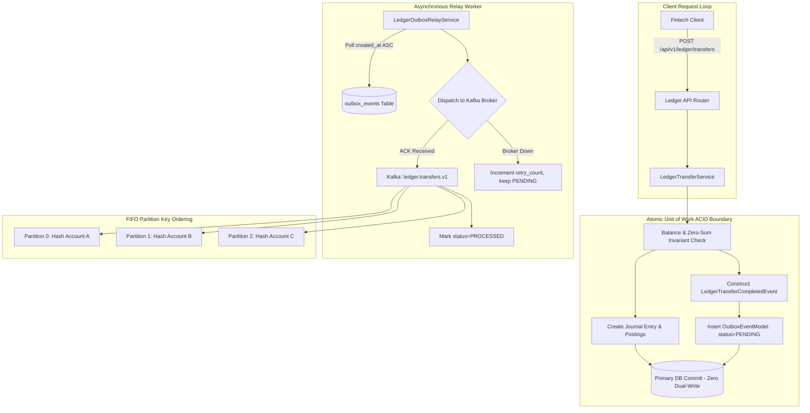

# Day 87: Real-Time Ledger Audit Streams via Kafka & Transactional Outbox Relay Architecture

## 1. Objective & Architecture Overview
In Day 87 of our **Phase 8: Capstone Distributed Fintech Double-Entry Ledger System (Days 83–90)**, we engineer an enterprise-grade Real-Time Ledger Audit Streaming architecture connecting our Double-Entry Ledger to Apache Kafka via the **Transactional Outbox Pattern**.

In enterprise financial engineering (such as Stripe, Modern Treasury, and core banking networks), publishing financial state changes directly to a message broker during an HTTP request loop creates the catastrophic **Dual-Write Problem**:
- If the database commit succeeds but the message broker network request times out, financial transactions take place with zero audit trails, failing regulatory compliance and fraud velocity checks.
- If the message broker publish succeeds but the database transaction rolls back, external services react to phantom money transfers that never cleared.

### Core Engineering Deliverables:
1. **CloudEvents Domain Event Specification (`app/schemas/ledger_events.py`)**:
   - `LedgerTransferCompletedEvent`: Immutable, frozen schema (`ConfigDict(frozen=True)`).
   - `event_id`: Monotonically increasing RFC 9562 UUIDv7 string.
   - `event_type`: `"ledger.transfer.completed.v1"`.
   - `amount` & `fee_amount`: Arbitrary-precision decimal strings (zero float representation to prevent IEEE 754 precision loss during network serialization).
   - `partition_key`: Strictly bound to `source_account_id` to enforce sequential FIFO ordering in Kafka topic partitions.
2. **Transactional Outbox Co-Location (`app/services/ledger_transfer_service.py`)**:
   - Inside `transfer_funds()`, ledger postings and outbox event persistence are co-located in the identical atomic Unit of Work (`async with self.uow:`):
     ```python
     outbox_event = OutboxEventModel(
         topic="ledger.transfers.v1",
         event_type="ledger.transfer.completed.v1",
         partition_key=str(source_account_id),
         payload=event.model_dump(),
         status="PENDING",
     )
     await self.uow.outbox.create(outbox_event)
     await self.uow.commit()
     ```
   - Complete Rollback Parity: If balance verification fails (`InsufficientFundsException`), zero journal entries AND zero outbox events are committed.
3. **Ledger Outbox Relay Engine (`app/services/ledger_outbox_relay_service.py`)**:
   - Asynchronously polls pending outbox records ordered by `created_at ASC`.
   - Dispatches events to Kafka with partition key `source_account_id` (`await producer.send_and_wait(topic, key, value)`).
   - Marks dispatched events as `status = "PROCESSED"` and sets `published_at` timestamp.
   - On broker dispatch failure: Increments `retry_count`, keeps status as `PENDING` for exponential retry.
   - Fallback: Transparent in-memory `MockAIOKafkaProducer` fallback for 100% standalone containerless testability.
4. **Telemetry & Audit Stream Endpoints (`app/routers/ledger_router.py`)**:
   - `POST /api/v1/ledger/outbox/relay`: Diagnostic trigger to manually flush and relay pending ledger outbox events to Kafka.
   - `GET /api/v1/ledger/outbox/pending`: Diagnostic inspection of un-relayed ledger audit events awaiting Kafka dispatch.

---

## 2. Real-World Fintech Analogy: Courtroom Red Book & The Trusty Bench Clerk

### The Disaster of the "Running Judge"
Imagine a high court judge presiding over high-stakes financial judgments. If the judge personally had to run to the central post office after every verdict to mail letters to banks, any traffic jam or closed post office would stall the entire court, or cause judgments to be rendered without notifications being delivered.

### The Transactional Outbox Solution
Instead, the judge writes the final verdict in the court's immutable red book (the primary database transaction) and places a sealed copy in the bench clerk's physical outbox tray (the `outbox_events` table) in the exact same instant. 
Later, the court's dedicated courier service (the Outbox Relay Worker) gathers the letters from the outbox tray, hands them to registered post (Apache Kafka), and marks the log as "Dispatched" (`PROCESSED`). If the post office is temporarily closed, the letters remain safely in the tray until service resumes—zero judgments are delayed, and zero notifications are lost.

---

## 3. Architecture Flow Diagram



---

## 4. Key Invariants & Quality Verification

| Invariant | Implementation Mechanism | Verification Test |
| :--- | :--- | :--- |
| **Zero Dual-Write** | Outbox event saved within the exact same Unit of Work session before `uow.commit()` | `test_atomic_outbox_colocation` |
| **Atomic Rollback Parity** | If transfer fails balance checks, both postings and outbox events roll back | `test_outbox_rollback_parity` |
| **Account FIFO Ordering** | `partition_key = str(source_account_id)` routed to deterministic partition | `test_ledger_outbox_relay_dispatch` |
| **Decimal Float-Safety** | Amounts serialized strictly as arbitrary-precision string decimals | `test_atomic_outbox_colocation` |
| **Broker Resilience** | Connection errors preserve `PENDING` status and increment `retry_count` | `test_ledger_outbox_relay_broker_failure_resilience` |
| **Telemetry & Observability**| `POST /api/v1/ledger/outbox/relay` and `GET /api/v1/ledger/outbox/pending` | `test_http_ledger_outbox_relay_and_pending_endpoints` |

---

## 5. Architectural Linter Audit & Quality Gates
- **AST Architecture Linter**: Strict DAG (0 Cycles), 0 layer violations across all 5 canonical rules.
- **Ruff & Formatting**: 100% compliant with zero linter errors.
- **Mypy Static Typing**: `--strict` clean across all domain event schemas, relay engines, and routers.
- **Bandit Security**: 0 high, 0 medium issues detected.
- **Pytest Regression**: All ledger, currency, concurrency, outbox, and audit tests passing.
