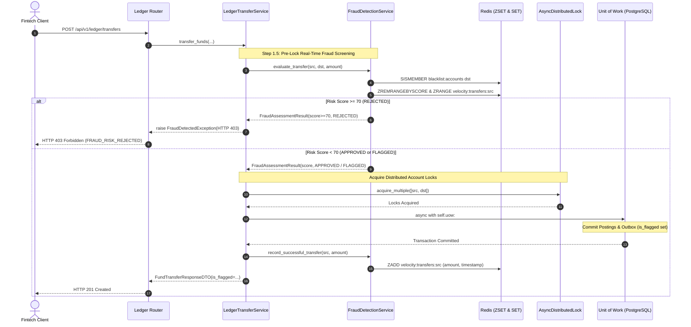

# Day 88: Real-Time Fraud Detection & Anomaly Velocity Engine Architecture for Double-Entry Ledger

## 1. Objective & Architecture Overview
In Day 88 of our **Phase 8: Capstone Distributed Fintech Double-Entry Ledger System (Days 83–90)**, we engineer an enterprise-grade Real-Time Fraud Detection & Velocity Engine to screen transfer requests before ledger persistence.

In mission-critical fintech and payment systems (e.g. Stripe Radar, bKash, Wise), fraudulent patterns like Account Takeover (ATO), credential stuffing carding bursts, and rapid balance drain must be intercepted within sub-2ms latency BEFORE acquiring distributed account locks or writing to the database.

### Core Engineering Deliverables:
1. **Real-Time Fraud Detection Service (`app/services/fraud_detection_service.py`)**:
   - Implements `FraudDetectionService` with sub-2ms in-memory Redis evaluation and zero transport coupling.
   - Evaluates a composite risk score based on 4 canonical rules:
     - **Rule 1 (Sliding-Window Velocity)**: Uses Redis Sorted Sets (ZSET) `velocity:transfers:{source_account_id}` storing timestamp scores. Invariant: If count in 5-minute window $\ge 3$ or cumulative volume $+ \text{amount} > 100,000.0000$, adds $+40$ risk points (`VELOCITY_BURST_EXCEEDED`).
     - **Rule 2 (Sudden Transaction Spike)**: If single transfer amount $\ge 50,000.0000$, adds $+30$ risk points (`HIGH_VALUE_SPIKE`).
     - **Rule 3 (Destination Blacklist Screening)**: Checks Redis set `blacklist:accounts` in $\mathcal{O}(1)$ time. If destination is blacklisted, adds $+100$ risk points (`DESTINATION_ACCOUNT_BLACKLISTED`).
     - **Rule 4 (Velocity Recording Hook)**: On committed transfer, appends $(timestamp, amount)$ to Redis ZSET with 10-minute TTL.
   - Decision Thresholds:
     - $\text{score} < 30$: `APPROVED` (Proceeds normally).
     - $30 \le \text{score} < 70$: `FLAGGED_FOR_REVIEW` (Proceeds but tags journal entry with `is_flagged = True`).
     - $\text{score} \ge 70$: `REJECTED` (Raises `FraudDetectedException` HTTP 403, aborting before acquiring locks or initiating DB transactions).
2. **Pre-Transfer Hook Integration (`app/services/ledger_transfer_service.py`)**:
   - Injected `FraudDetectionService` into `LedgerTransferService`.
   - Executed fraud screening in Step 1.5 before distributed locking and database transactions.
   - Tagged flagged entries (`is_flagged = True`) into `JournalEntryModel` and `FundTransferResponseDTO`.
   - Updated velocity history post-commit via `fraud_service.record_successful_transfer()`.
3. **Domain Exceptions & Schema Enhancements (`app/core/exceptions.py`, `app/schemas/ledger.py`)**:
   - Added `FraudDetectedException(BaseDomainException)` mapped to HTTP 403 Forbidden with `FRAUD_RISK_REJECTED`.
   - Added `FraudAssessmentResult`, `BlacklistAccountRequestDTO`, `BlacklistAccountResponseDTO`, `AccountVelocityResponseDTO`, `EvaluateFraudRequestDTO`.
4. **Fraud Management REST Endpoints (`app/routers/ledger_router.py`)**:
   - `POST /api/v1/ledger/fraud/blacklist`: Blacklist administrative enforcement.
   - `GET /api/v1/ledger/fraud/velocity/{account_id}`: Telemetry inspection of sliding-window velocity.
   - `POST /api/v1/ledger/fraud/evaluate`: Diagnostic simulation endpoint without ledger mutations.
5. **Database Migration Synchronization (`alembic/versions/c3d4e5f6a7b8_add_is_flagged_to_journal_entries.py`)**:
   - Created and applied Alembic migration adding `is_flagged` boolean column to `journal_entries` table.

---

## 2. Real-World Fintech Analogy: Bank Guard, Scanner & The Silent Alarm

### The Danger of Post-Transfer Fraud Analysis
If a bank allows robbers to carry bags of cash out of the vault, and only reviews the security camera footage the following day, the money is already in another country and permanently unrecoverable.

### The Real-Time Gatekeeper Architecture
Our `FraudDetectionService` acts like an armed security scanner and silent alarm at the vault entrance:
1. **The Blacklist Scanner**: If the recipient account is on the international sanctions list, the vault doors slam shut instantly (Score +100 $\to$ Immediate HTTP 403 Rejection).
2. **The Velocity Detector**: If an account requests 3 withdrawals in 5 minutes or asks for over $100,000 in rapid succession, the scanner flags a burst (Score +40).
3. **The Spike Sensor**: If a single transaction requests $50,000+, the sensor triggers (Score +30).
4. **The Composite Decision**:
   - Small $50 transfer: Scanner is green (`APPROVED`).
   - $60,000 transfer: Scanner is amber; the money is dispensed, but the transaction log is stamped with a red compliance flag (`FLAGGED_FOR_REVIEW`, `is_flagged=True`).
   - 4th rapid transfer of $60,000: Burst (40) + Spike (30) = 70; vault doors lock, and the request is aborted on the spot (`REJECTED`).

---

## 3. Architecture Sequence Diagram

---

## 4. Key Invariants & Quality Verification

| Invariant | Implementation Mechanism | Verification Test |
| :--- | :--- | :--- |
| **Pre-Lock Screening** | Evaluated before acquiring distributed locks or opening DB session | `test_velocity_burst_rejection` |
| **Sub-2ms In-Memory Velocity** | Redis ZSET lookback window $(t - 300\text{s})$ with $\mathcal{O}(\log N)$ complexity | `test_velocity_burst_rejection` |
| **Blacklist Immediate Abort** | Redis `SISMEMBER blacklist:accounts` with $+100$ risk score | `test_blacklisted_destination_immediate_abort` |
| **Compliance Flagging** | Moderate risk ($30 \le \text{score} < 70$) flags journal entry with `is_flagged = True` | `test_flagged_for_review_journal_entry` |
| **Clean Architecture DAG** | Zero FastAPI imports in `FraudDetectionService`, pure protocol dependencies | `scripts/audit_architecture.py` |
| **Containerless Testability** | Standalone in-memory fallback when Redis is absent | `test_fraud_detection.py` |
