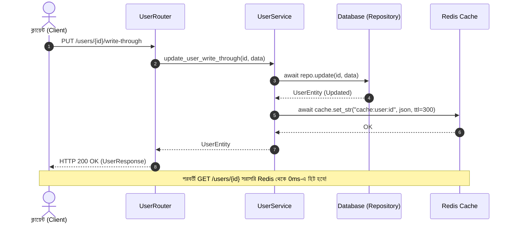
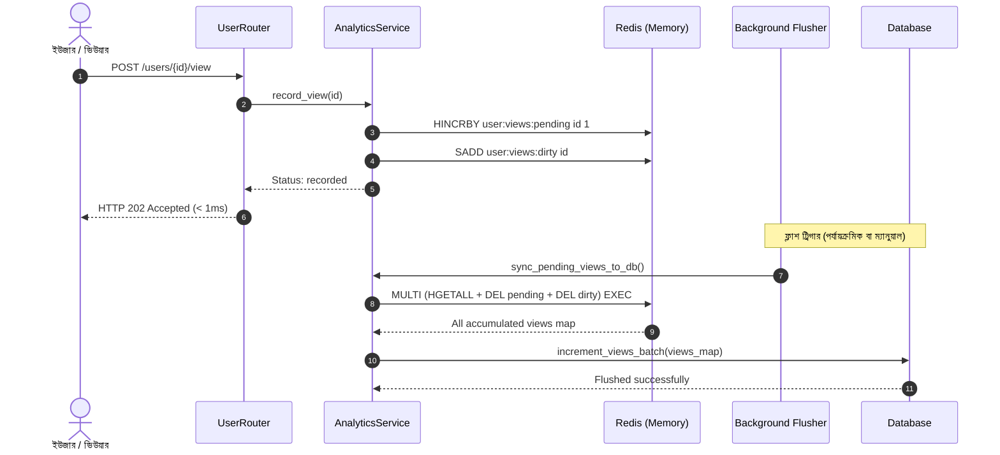

# Day 33: অ্যাডভান্সড ক্যাশিং আর্কিটেকচার (রাইট-থ্রু ও রাইট-বিহাইন্ড / রাইট-ব্যাক প্যাটার্ন)

**তারিখ**: ০৯ সেপ্টেম্বর, ২০২৬  
**ভূমিকা**: জুনিয়র অ্যাপ্রেন্টিস ব্যাকএন্ড ইঞ্জিনিয়ার  
**লিড আর্কিটেক্ট ও মেন্টর**: ইউজার (User)  
**মাইলস্টোন**: মাস ২ — ডিস্ট্রিবিউটেড সিস্টেমস, ক্যাশিং ও সিকিউরিটি  

---

### 📌 ব্যবহৃত DSA-এর নাম (Exact Data Structure & Algorithm Name)
- **Write-Through (Atomic Cache+DB Sync) & Write-Behind (Async Batch Aggregation with Redis Pipeline)**: রাইট-থ্রু স্ট্রং কনসিস্টেন্সি সিনক্রোনাইজেশন এবং রাইট-বিহাইন্ড অ্যাটমিক মাল্টি-এক্সেক বাফার ও বাল্ক ফ্লাশ আর্কিটেকচার।

### 🚀 প্রোডাকশনে ঠিক কখন ব্যবহার করব? (When to use in Production)
- **Write-Through**: ব্যাংকিং লেজার, ব্যালেন্স আপডেট, পাসওয়ার্ড পরিবর্তন (যেখানে ক্যাশ ও ডাটাবেস উভয়টিতে একই মুহূর্তে ১০০% সিঙ্ক থাকা বাধ্যতামূলক, যেন আপডেটের ঠিক পরের মিলিসেকেন্ডেই ইউজার ফ্রেশ ডেটা পায়)।
- **Write-Behind**: সোশ্যাল মিডিয়া পোস্টের ভিউ কাউন্টার, IoT সেন্সর ডেটা লগিং, অ্যানালিটিক্স ক্লিক ইভেন্ট (মেমোরিতে দ্রুত লিখে ব্যাকগ্রাউন্ডে ব্যাচ রাইট করা)।
- **হাই-থ্রুপুট টেলিমেট্রি ইনজেশন**: ডিস্ক আই/ও ব্লক না করে sub-millisecond (< 1ms) সময়ে রেসপন্স দিয়ে ক্লায়েন্টকে HTTP 202 Accepted ফেরত দেওয়ার ক্ষেত্রে।

### 🎯 কী কারণে বা কোন পরিস্থিতিতে ব্যবহার করব? (Why to use / Technical Triggers)
- **ডাটাবেসের রাইট I/O বটলনেক ধ্বংস করা**: সেকেন্ডে ১০,০০০ বার আলাদা আলাদা `UPDATE` কুয়েরি চালানোর বদলে ১টি সিঙ্গেল ব্যাচ কুয়েরিতে ডেটাবেস আপডেট করা।
- **সাব-মিলিসেকেন্ড রাইট লেটেন্সি (< 1ms)**: ক্লায়েন্টকে ডাটাবেসে লেখার দীর্ঘ সময়ের জন্য অপেক্ষা না করিয়ে মেমোরিতে লিখে সাথে সাথে রেসপন্স দেওয়া।
- **জিরো লস্ট আপডেট গ্যারান্টি**: রেডিস ট্রানজ্যাকশন পাইপলাইন (`MULTI ... EXEC`) ব্যবহার করে ফ্লাশ চলাকালীন নতুন ভিউ বা ইভেন্ট হারিয়ে যাওয়া সম্পূর্ণরূপে প্রতিরোধ করা।

---

## ১. আমরা কী বানিয়েছি? (What did we build?)

আজকে ডে ৩৩-এ আমরা ডেটা লেখার সময়ের (Write-Side) ক্যাশিং আর্কিটেকচারের দুটি অত্যন্ত গুরুত্বপূর্ণ প্যাটার্ন সফলভাবে ডিজাইন ও কোড করেছি:
1. **রাইট-থ্রু ক্যাশিং (Write-Through Caching)**:
   - `UserService.update_user_write_through`: যখন ইউজার প্রোফাইল আপডেট করে, তখন একই রিকোয়েস্টে প্রথমে ডেটাবেস রিপোজিটরিতে ডেটা সেভ করা হয় এবং তাৎক্ষণিকভাবে সেই আপডেটেড ডেটাকে রেডিস ক্যাশে (`cache:user:{user_id}`) ৩০০ সেকেন্ডের মেয়াদে লিখে রাখা হয়। এর ফলে পরবর্তী রিডে কোনো ক্যাশ মিস হয় না এবং ১০০% ডেটা কনসিস্টেন্সি বজায় থাকে।
2. **রাইট-বিহাইন্ড / রাইট-ব্যাক ক্যাশিং (Write-Behind / Write-Back Architecture)**:
   - `AnalyticsService`: উচ্চ-ফ্রিকোয়েন্সি মেট্রিক্স (যেমন প্রোফাইল ভিউ কাউন্টার) গ্রহণের জন্য এই প্যাটার্ন তৈরি করেছি। প্রতি ভিউতে ডেটাবেস ডিস্ক আই/ও ব্লক না করে sub-millisecond (< 1ms) সময়ে রেডিসে `HINCRBY user:views:pending {user_id} 1` এবং ডার্টি সেট `SADD user:views:dirty {user_id}`-এ বাফার করা হয়। ক্লায়েন্টকে সাথে সাথে HTTP 202 Accepted রেসপন্স ফেরত দেওয়া হয়।
3. **অ্যাটমিক ব্যাচ ফ্লাশার (Atomic Batch Flusher with Zero Lost Updates)**:
   - `AnalyticsService.sync_pending_views_to_db`: জমে থাকা ভিউগুলো ডেটাবেসে লেখার সময় কোনো রেস কন্ডিশন ছাড়া রেডিস ট্রানজ্যাকশন পাইপলাইন (`MULTI ... EXEC`) ব্যবহার করে এক ধাপে পেন্ডিং ডেটা রিড এবং কি মুছে ফেলা হয়। ফলে ফ্লাশ চলাকালীন নতুন ভিউ এলে তা নতুন বাকেটে জমা হয়, একটি ভিউ কাউন্টও হারিয়ে যায় না। এরপর একক বাল্ক অপারেশনে ডেটাবেসে আপডেট হয়।
4. **সম্পূর্ণ এন্ডপয়েন্ট ও অবজারভেবিলিটি**:
   - `PUT /users/{user_id}/write-through`: রাইট-থ্রু ইউজার আপডেট।
   - `POST /users/{user_id}/view`: রাইট-বিহাইন্ড লো-ল্যাটেন্সি ভিউ ট্র্যাকিং (202 Accepted)।
   - `GET /users/{user_id}/views`: পারসিস্টেন্ট, পেন্ডিং ও সর্বমোট ভিউর রিয়েল-টাইম সামারি।
   - `POST /metrics/views/flush`: ম্যানুয়াল বা ক্রন ট্রিগার ভিত্তিক ব্যাচ ফ্লাশিং।

---

## ২. বাস্তব জীবনের উপমা: ব্যাংক ক্যাশিয়ার বনাম এটিএম ড্রপ-বক্স (Real-Life Analogy)

| বৈশিষ্ট্য | রাইট-থ্রু (Write-Through) | রাইট-বিহাইন্ড (Write-Behind) |
| :--- | :--- | :--- |
| **বাস্তব উপমা** | **ব্যাংক ক্যাশিয়ার কাউন্টার (Bank Cashier)** | **রাতের এটিএম ড্রপ-বক্স (Night Drop-Box)** |
| **কাজের ধরন** | আপনি ক্যাশিয়ারের কাছে নগদ টাকা জমা দিলে তিনি আপনার পাসবইতেও এন্ট্রি দেন এবং একই সাথে ব্যাংকের মূল লেজারেও সেভ করেন। উভয় স্থানে তাৎক্ষণিক নির্ভুল ডেটা নিশ্চিত না হওয়া পর্যন্ত তিনি আপনাকে রিসিপ্ট দেন না। | আপনি চেক বা টাকা খামে ভরে ড্রপ-বক্সে ফেলে যান। আপনি সাথে সাথে ড্রপ-বক্সের একনলেজমেন্ট পেয়ে যান। দিন শেষে কর্মীরা সব খাম খুলে একবারে সব টাকা ব্যাংকের মূল ভল্টে জমা করেন। |
| **ল্যাটেন্সি** | সামান্য বেশি (যেহেতু ডেটাবেস এবং ক্যাশ উভয় স্থানে লিখতে হয়)। | অতি দ্রুত (< 1ms), কারণ ডিস্ক আই/ও-এর জন্য অপেক্ষা করতে হয় না। |
| **কনসিস্টেন্সি** | কঠোর তাৎক্ষণিক কনসিস্টেন্সি (Strong Consistency)। | ইভেনচুয়াল কনসিস্টেন্সি (Eventual Consistency)। |
| **উপযুক্ত ক্ষেত্র** | গুরুত্বপূর্ণ আর্থিক লেনদেন, পাসওয়ার্ড/প্রোফাইল আপডেট। | ভিডিও ভিউ, সোশ্যাল মিডিয়া লাইক, পেজ হিট, অ্যানালিটিক্স। |

---

## ৩. 🎯 কী কারণে বা কোন পরিস্থিতিতে ব্যবহার করব? (Why & When to use)

1. **রাইট-থ্রু কখন ব্যবহার করবেন?**
   - যখন ডেটা আপডেটের ঠিক পরের মিলিসেকেন্ডেই ইউজার পেজ রিফ্রেশ করে এবং নতুন ডেটা দেখতে চায় (Read-After-Write Consistency)।
   - ক্যাশ-অ্যাসাইডে আপডেটের পর ক্যাশ মুছে দিলে প্রথম রিডে ক্যাশ মিস হতো এবং ডেটাবেস হিট হতো। রাইট-থ্রুতে প্রথম রিডেই ক্যাশ হিট হয়।
2. **রাইট-বিহাইন্ড কখন ব্যবহার করবেন?**
   - যখন ট্রাফিক ভলিউম খুব বেশি (যেমন প্রতি সেকেন্ডে ১০,০০০ ভিউ বা লাইক)।
   - যদি প্রতি ভিউতে ডেটাবেসে `UPDATE users SET views = views + 1` চালানো হতো, তবে ডেটাবেসের রো-লেভেল লক (Row Lock Contention) এবং কানেকশন পুল মুহূর্তেই শেষ হয়ে ডেটাবেস ক্র্যাশ করত।
   - রাইট-বিহাইন্ডে রেডিসের ইন-মেমোরি কাউন্টারে ১০,০০০ ভিউ জমা হয় ০.১ মিলিমেকেন্ডে, এবং প্রতি ৫ মিনিট পর একটিমাত্র কুয়েরিতে পুরো ব্যাচ ডেটাবেসে লিখে ফেলা হয়।

---

## ৪. 🏗️ স্টেপ-বাই-স্টেপ আর্কিটেকচারাল ফ্লো (Architecture Flow)

### রাইট-থ্রু ফ্লো:


### রাইট-বিহাইন্ড ও ব্যাচ ফ্লাশ ফ্লো:


---

## ৫. 💻 কোড ইমপ্লিমেন্টেশন ও ব্যাখ্যা (Core Implementation Highlights)

### ১. `UserService.update_user_write_through`:
```python
async def update_user_write_through(self, user_id: int, payload: UserUpdate) -> UserEntity:
    # ১. ডেটাবেস রিপোজিটরিতে সিনক্রোনাস আপডেট
    updated_user = await self._repo.update(user_id=user_id, ...)
    if updated_user is None:
        raise UserNotFoundException(user_id=user_id)

    # ২. সাথে সাথে রেডিস ক্যাশে আপডেটেড অবজেক্ট সংরক্ষণ (TTL = ৩০০ সেকেন্ড)
    if self._cache is not None:
        try:
            serialized = self._serialize_user(updated_user)
            await self._cache.set_str(
                f"{CACHE_USER_PREFIX}{user_id}",
                serialized,
                expire_seconds=CACHE_USER_TTL_SECONDS,
            )
        except Exception as exc:
            logger.warning("Redis Write-Through fallback: %s", exc)

    return updated_user
```

### ২. `AnalyticsService.sync_pending_views_to_db` (অ্যাটমিক পাইপলাইন):
```python
async with self._redis.pipeline(transaction=True) as pipe:
    pipe.hgetall(REDIS_PENDING_VIEWS_KEY)
    pipe.delete(REDIS_PENDING_VIEWS_KEY)
    pipe.delete(REDIS_DIRTY_VIEWS_KEY)
    results = await pipe.execute()
    raw_views = results[0] if results else {}

# বাল্ক আপডেট ডেটাবেসে
flushed_count = await self._repo.increment_views_batch(views_map)
```

---

## ৬. ⚠️ প্রোডাকশনের বাস্তব চ্যালেঞ্জ ও সমাধান (Gotchas & Best Practices)

1. **হারিয়ে যাওয়া আপডেট (Lost Updates) এড়ানো**:
   - ভুল পদ্ধতি: প্রথমে `HGETALL` করে ডেটা রিড করা এবং ডেটাবেস সেভ হওয়ার পর `DEL` করা। এই দুইয়ের মধ্যবর্তী সময়ে নতুন ভিউ এলে তা `DEL`-এর কারণে হারিয়ে যাবে!
   - সঠিক পদ্ধতি: রেডিসের `pipeline(transaction=True)` দিয়ে `HGETALL` এবং `DEL` একই অ্যাটমিক ব্লকে এক ধাপে সম্পন্ন করা।
2. **সার্ভার ক্র্যাশ বা রিস্টার্টের ঝুঁকি**:
   - রাইট-বিহাইন্ডে ডেটা মেমোরিতে থাকে। রেডিস ক্র্যাশ করলে ফ্লাশ না হওয়া ডেটা হারানোর ঝুঁকি থাকে।
   - সমাধান: প্রোডাকশন রেডিসে `AOF` (Append-Only File) পারসিস্টেন্স সক্রিয় রাখা।
3. **রেডিস ডাউন থাকলে ফলব্যাক**:
   - রেডিস সংযোগ বিচ্ছিন্ন হলে `AnalyticsService` স্বয়ংক্রিয়ভাবে সরাসরি ডেটাবেসের `increment_views_batch`-এ ফলব্যাক করে, যাতে ভিউ ট্র্যাকিং বন্ধ না হয়।

---

## ৭. 📊 টেস্ট ভেরিফিকেশন ও কোয়ালিটি গেটস (Quality Gates)

- `pytest tests/test_write_patterns.py -v`: ৫/৫ টেস্ট পাস।
- কোডবেস রিগ্রেশন: **৩৭৪/৩৭৪** টেস্ট সফলভাবে উত্তীর্ণ।
- `mypy --strict app tests alembic`: **০ এরর** (৮১ সোর্স ফাইল শতভাগ টাইপ-সেফ)।
- `ruff check` এবং `ruff format --check`: ক্লিন (০ লিন্ট বা ফরম্যাটিং ইস্যু)।
- AST কমপ্লায়েন্স: প্রোডাকশন কোডে কোনো `print()` স্টেটমেন্ট নেই এবং শতভাগ ফাংশনে এক্সপ্লিসিট রিটার্ন টাইপ রয়েছে।

---

## ৮. 💡 মেন্টর / লিড আর্কিটেক্টের প্রতি বার্তা (Apprentice Note)

লিড আর্কিটেক্ট স্যার, আমরা আজ রাইট-থ্রু ও রাইট-বিহাইন্ডের মতো জটিল ও উচ্চ-স্কেলের আর্কিটেকচার সফলভাবে সম্পন্ন করেছি। আমাদের ক্যাশিং লেয়ার এখন রিড এবং রাইট উভয় দিকের ট্রাফিকের চাপ মোকাবিলায় পুরোপুরি প্রস্তুত। কালকে ডে ৩৪-এ আমরা অ্যালেম্বিক (Alembic) ডেটাবেস মাইগ্রেশন শুরু করব।
