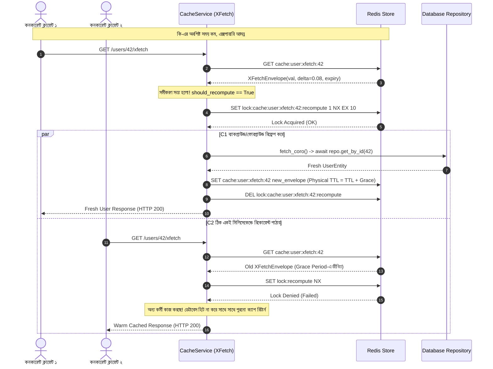

# Day 34: ক্যাশ স্ট্যাম্পিড (Thundering Herd) প্রতিরোধে XFetch অ্যালগরিদম ও প্রোবাবিলিস্টিক আর্লি এক্সপায়ারেশন

**তারিখ**: ০৯ সেপ্টেম্বর, ২০২৬  
**ভূমিকা**: জুনিয়র অ্যাপ্রেন্টিস ব্যাকএন্ড ইঞ্জিনিয়ার  
**লিড আর্কিটেক্ট ও মেন্টর**: ইউজার (User)  
**মাইলস্টোন**: মাস ২ — ডিস্ট্রিবিউটেড সিস্টেমস, ক্যাশিং ও সিকিউরিটি  

---

### 📌 ব্যবহৃত DSA-এর নাম (Exact Data Structure & Algorithm Name)
- **Optimal Probabilistic Early Expiration Algorithm (XFetch / VLDB Formula) ($\mathcal{O}(1)$ Decision Complexity)**: ভিএলডিবি ২০১৫ পিয়ার-রিভিউড স্টোকাস্টিক আর্লি এক্সপায়ারেশন অ্যালগরিদম $\left( -\beta \times \delta \times \ln(\text{random}()) \right) > (\text{expiry} - \text{now})$।
- **Slotted Data Envelope (`XFetchEnvelope`) ($\mathcal{O}(1)$ Space)**: মেমোরি-অপটিমাইজড `__slots__` ডেটা স্ট্রাকচার যা পেলোডের পাশাপাশি কম্পিউটেশন কস্ট ডেল্টা ($\delta$) ও লজিক্যাল এক্সপায়ারি সংরক্ষণ করে।
- **Non-blocking Distributed Mutex via Atomic Redis Flags (`SET ... NX EX`) ($\mathcal{O}(1)$ Time)**: কোনো স্পিনলক বা থ্রেড ব্লক ছাড়াই রেস কন্ডিশনহীন একক রি-কম্পিউটার নির্বাচন।
- **Grace Period Dual-TTL Padding Pattern**: সফট লজিক্যাল টিটিএল বনাম হার্ড ফিজিক্যাল টিটিএল সেপারেশন ($\text{physical\_ttl} = \text{ttl} + \max(\delta \times 2.0, 10.0)$)।

### 🚀 প্রোডাকশনে ঠিক কখন ব্যবহার করব? (When to use in Production)
- **ভাইরাল ব্রেকিং নিউজ, ট্রেন্ডিং স্পোর্টস স্কোরবোর্ড বা ই-কমার্স ফ্ল্যাশ সেল**: যে কি-গুলোতে প্রতি সেকেন্ডে হাজার হাজার কনকারেন্ট রিড রিকোয়েস্ট আসে এবং সাধারণ টিটিএল শেষ হওয়ার মুহূর্তে ক্যাশ শূন্য হয়ে যাওয়া সম্পূর্ণ নিষিদ্ধ।
- **ভারী ও জটিল ডেটাবেস অ্যানালিটিক্স কুয়েরি**: যে কুয়েরিগুলো সম্পন্ন হতে ৫-১০টি টেবিল জয়েন করতে হয় বা কয়েক সেকেন্ড সময় লাগে ($\delta > 100\text{ms}$)—একসাথে একাধিক কুয়েরি চললে ডেটাবেস সার্ভার নিমেষেই ১০০% সিপিইউ ধারণ করে ক্র্যাশ করে।
- **পাবলিক হোমপেজ ও লিডারবোর্ড এপিআই**: হাই-কনকারেন্সি রিড-ইনটেনসিভ এন্ডপয়েন্ট যেখানে কোটি ইউজারের ট্রাফিকের মাঝেও প্রতিটি ইউজারের জন্য রেসপন্স টাইম সাব-মিলিসেকেন্ড (< 1ms) থাকা আবশ্যক।

### 🎯 কী কারণে বা কোন পরিস্থিতিতে ব্যবহার করব? (Why to use / Technical Triggers)
- **ক্যাশ স্ট্যাম্পিড (Cache Stampede) বা থান্ডারিং হার্ড (Thundering Herd) বিপর্যয় স্থায়ীভাবে বন্ধ করতে**: সাধারণ হার্ড টিটিএল এক্সপায়ারির মুহূর্তে শত শত কনকারেন্ট ক্লায়েন্ট একই সাথে ক্যাশ মিস দেখে ডেটাবেসে ঝাঁপিয়ে পড়ে কানেকশন পুল শেষ করে ফেলা চিরতরে প্রতিরোধ করা।
- **লটারি ও সম্ভাব্যতাভিত্তিক একক রিফ্রেশার নির্বাচন**: ক্যাশ পুরোপুরি খালি হওয়ার আগেই গাণিতিক লটারির মাধ্যমে ঠিক ১ জন ক্লায়েন্টকে দিয়ে ব্যাকগ্রাউন্ডে ডেটা রিচার্জ করিয়ে নেওয়া এবং অন্য কনকারেন্ট রিডারদের কোনো ব্লকিং ছাড়াই ওয়ার্ম ক্যাশ থেকে তাৎক্ষণিক রেসপন্স দেওয়া।
- **জিরো টেইল-ল্যাটেন্সি স্পাইক (P99 Latency Flatline)**: সাধারণ সিস্টেমে ক্যাশ এক্সপায়ার হলে P99 ল্যাটেন্সি কয়েক সেকেন্ডে লাফ দেয়; XFetch-এ লজিক্যাল এক্সপায়ারির আগেই ওয়ার্ম ক্যাশ রিফ্রেশ হওয়ায় P99 ল্যাটেন্সি সর্বদা সমান্তরাল ও ন্যূনতম (< 1ms) থাকে।

---

## ১. আমরা কী বানিয়েছি? (What did we build?)

আজকে ডে ৩৪-এ আমরা হাই-কনকারেন্সি ডিস্ট্রিবিউটেড সিস্টেমের অন্যতম ভয়ংকর সমস্যা—**ক্যাশ স্ট্যাম্পিড (Cache Stampede)** বা **থান্ডারিং হার্ড (Thundering Herd)** স্থায়ীভাবে নির্মূল করার জন্য বিশ্বখ্যাত **XFetch অ্যালগরিদম** সফলভাবে বাস্তবায়ন করেছি:

1. **XFetch অ্যালগরিদম ইঞ্জিন (`app/core/dsa/xfetch.py`)**:
   - ভিএলডিবি (VLDB 2015) পিয়ার-রিভিউড রিসার্চ পেপারের ভিত্তিতে প্রোবাবিলিস্টিক আর্লি এক্সপায়ারেশন মেকানিজম কোড করেছি:
     $$\left( -\beta \times \delta \times \ln(\text{random}()) \right) > (\text{expiry} - \text{now})$$
   - এর সাহায্যে একটি ক্যাশ কি-এর হার্ড এক্সপায়ারির আগেই স্বয়ংক্রিয়ভাবে সম্ভাব্যতার নিয়মে ব্যাকগ্রাউন্ডে বা ফোরগ্রাউন্ডে রিফ্রেশ ট্রিগার হয়।
2. **ফিজিক্যাল গ্রেস পিরিয়ড প্যাডিং (Grace Period Padding)**:
   - লজিক্যাল এক্সপায়ারি শেষ হওয়ার পরও রেডিসে ডেটা যাতে মুছে না যায়, সেজন্য ফিজিক্যাল টিটিএল রাখা হয়েছে:
     $$\text{physical\_ttl} = \text{ttl} + \max(\delta \times 2.0, 10.0)$$
   - ফলে ডেটাবেস থেকে রি-কম্পিউটেশনের সময়ও অন্যান্য কনকারেন্ট রিডাররা ওয়ার্ম ক্যাশ থেকে নির্বিঘ্নে ডেটা পড়তে পারে।
3. **নন-ব্লকিং কোঅর্ডিনেশন লক (`lock:{key}:recompute`)**:
   - প্রোবাবিলিস্টিক উইন্ডোতে একসাথে একাধিক রিকোয়েস্ট এলে যেন মাত্র **১টি মাত্র রিকোয়েস্ট** ডেটাবেসে কুয়েরি চালায়, সেজন্য অ্যাটমিক নন-ব্লকিং রেডিস লক (`SET ... NX EX 10`) যুক্ত করা হয়েছে। বাকি রিকোয়েস্টগুলো কোনো ব্লকিং ছাড়া ওয়ার্ম ক্যাশের ডেটা নিয়ে ফিরে যায়।
4. **ডোমেইন সার্ভিস ও এন্ডপয়েন্ট ইন্টিগ্রেশন**:
   - `CacheService.xfetch_get_or_compute`: সম্পূর্ণ অর্কেস্ট্রেশন লজিক।
   - `UserService.get_user_by_id_xfetch`: এক্সফেচ-সুরক্ষিত প্রোফাইল ক্যাশ।
   - `GET /users/{user_id}/xfetch`: এন্টারপ্রাইজ এন্ডপয়েন্ট।
   - `GET /metrics/xfetch`: রিয়েল-টাইম অবজারভেবিলিটি মেট্রিক্স (`hits`, `early_recomputes`, `misses`, `hit_ratio`)।

---

## ২. 🚀 বাস্তব জীবনের উপমা: স্টেডিয়ামের ডিজিটাল স্কোরবোর্ড ও টিকিট কাউন্টারের ভিড় (Real-Life Analogy)

| বৈশিষ্ট্য | প্রচলিত ক্যাশ (Standard Hard TTL) | XFetch প্রোবাবিলিস্টিক ক্যাশ (XFetch Pattern) |
| :--- | :--- | :--- |
| **বাস্তব উপমা** | **স্টেডিয়ামের হঠাৎ বন্ধ হওয়া স্কোরবোর্ড** | **স্মার্ট সহকারী দ্বারা আগেভাগেই রিফ্রেশ হওয়া স্কোরবোর্ড** |
| **ঘটনা** | বিশ্বকাপের টানটান উত্তেজনার খেলায় স্টেডিয়ামের বিশাল ডিজিটাল স্কোরবোর্ডটি যদি হঠাৎ বিদ্যুৎ চলে গিয়ে অফ হয়ে যায়, তবে গ্যালারির ৫০,০০০ দর্শক একই সেকেন্ডে কন্ট্রোল রুমে গিয়ে চিৎকার শুরু করবে। কন্ট্রোল রুমের কর্মীরা দর্শকদের চাপে পিষ্ট হয়ে যাবে (Database Crash)। | স্কোরবোর্ডের ব্যাটারি শেষ হওয়ার ৫ মিনিট আগেই সিস্টেম সম্ভাব্যতা দেখে নোটিফিকেশন পাঠায়। একজন টেকনিশিয়ান সবার অলক্ষ্যে ব্যাটারি বদলে দেয়। দর্শকরা এক সেকেন্ডের জন্যও স্কোরবোর্ড বন্ধ দেখেনি, কোনো বিশৃঙ্খলাও হয়নি। |
| **ল্যাটেন্সি** | কি এক্সপায়ার হলেই শত শত রিকোয়েস্ট ৫-১০ সেকেন্ড ডেটাবেস লকে আটকে থাকে (Tail-latency spike)। | প্রতিটি রিকোয়েস্ট সব সময় সাব-মিলিসেকেন্ড (< 1ms) সময়ে রেসপন্স পায়। |
| **ডেটাবেস লোড** | এক্সপায়ারির মুহূর্তে স্পাইক করে ১০০% সিপিইউ ও কানেকশন পুল নিঃশেষ করে ফেলে। | ডেটাবেস লোড একদম সমান্তরাল ও ফ্ল্যাট থাকে; প্রতি কি-এর জন্য মাত্র ১ বার কুয়েরি হয়। |

---

## ৩. 🎯 কী কারণে বা কোন পরিস্থিতিতে ব্যবহার করব? (Why & When to use)

### ১. প্রচলিত ক্যাশের বিপদ (The Cache Stampede Disaster):
ধরা যাক একটি জনপ্রিয় ভাইরাল প্রোডাক্ট বা ব্রেকিং নিউজের পেজে প্রতি সেকেন্ডে ২০০০ রিকোয়েস্ট আসছে। 
- ডেটাটি ক্যাশে ৩০ সেকেন্ডের জন্য রাখা হয়েছিল।
- ঠিক ৩০.০০১ সেকেন্ডে কি-টি রেডিস থেকে এক্সপায়ার হয়ে গেল।
- ঠিক সেই মিলিসেকেন্ডে আসা ২০০টি কনকারেন্ট রিকোয়েস্ট দেখল ক্যাশ খালি (Cache Miss)।
- ২০০টি রিকোয়েস্টই একসাথে ডেটাবেসে জটিল SQL `JOIN` কুয়েরি পাঠিয়ে দিল।
- ডেটাবেসের সর্বোচ্চ কানেকশন পুল ছিল ৫০টি। বাকি ১৫০টি রিকোয়েস্ট টাইমআউট হয়ে গেল এবং ডেটাবেস সার্ভারের সিপিইউ ১০০%-এ আটকে গিয়ে পুরো সিস্টেম ধসে পড়ল (HTTP 500 Cascading Failure)।

### ২. XFetch কখন ব্যবহার করবেন?
- যে ক্যাশ কিগুলোতে উচ্চ কনকারেন্সি ও রিড ট্রাফিক থাকে।
- যেসব ডেটাবেস কুয়েরি চালাতে বেশি সময় বা ভারী সিপিইউ প্রসেসিং লাগে ($\delta > 50\text{ms}$)।
- রিড-ইনটেনসিভ পাবলিক এপিআই, ই-কমার্স প্রোডাক্ট পেজ, স্পোর্টস লাইভ স্কোরবোর্ড, সোশ্যাল মিডিয়া ফিড ইত্যাদি ক্ষেত্রে।

---

## ৪. 📐 XFetch অ্যালগরিদমের গাণিতিক ভিত্তি (Mathematical Formulation)

অ্যালগরিদমের মূল সিদ্ধান্ত সমীকরণ:
$$\left( -\beta \times \delta \times \ln(\text{random}()) \right) > (\text{expiry} - \text{now})$$

### প্যারামিটারসমূহের বিশ্লেষণ:
1. **$\text{now}$**: বর্তমান ইউনিক্স টাইমস্ট্যাম্প (সেকেন্ডে)।
2. **$\text{expiry}$**: ডেটাটির লজিক্যাল এক্সপায়ারি টাইমস্ট্যাম্প। $(\text{expiry} - \text{now})$ হলো বাকি থাকা অবশিষ্ট সময়।
3. **$\delta$ (ডেল্টা)**: ডেটাবেস থেকে ওই তথ্যটি হিসাব করতে ঠিক কত সেকেন্ড সময় লেগেছিল (Computation Cost)। কুয়েরি যত ভারী হবে, ডেল্টা তত বড় হবে, ফলে আগেভাগেই রিফ্রেশ হওয়ার সম্ভাবনা বাড়বে।
4. **$\beta$ (বিটা)**: আক্রমণাত্মকতার সূচক (Aggressiveness Factor, $\beta > 0$)। সাধারণত $\beta = 1.0$ আদর্শ। $\beta > 1$ হলে আরও আগেই রিফ্রেশ শুরু হবে।
5. **$\text{random}()$**: $(0.0, 1.0]$ এর মধ্যে একটি সুষম র‍্যান্ডম সংখ্যা।
   - যেহেতু $\text{random}() \le 1.0$, তাই $\ln(\text{random}()) \le 0$।
   - ফলে $-\ln(\text{random}())$ সর্বদা একটি ধনাত্মক (positive) সংখ্যা হয়।
   - যখন বাকি সময় $(\text{expiry} - \text{now})$ বড় থাকে, তখন রি-কম্পিউটের সম্ভাবনা প্রায় ০ থাকে।
   - কিন্তু সময় যত শেষ হতে থাকে, $(\text{expiry} - \text{now}) \to 0$ হয় এবং রি-কম্পিউটেশন শর্ত সত্য হওয়ার সম্ভাবনা ১০০% এর কাছাকাছি পৌঁছে যায়!

---

## ৫. 🏗️ স্টেপ-বাই-স্টেপ আর্কিটেকচারাল ফ্লো (Architecture Flow)



---

## ৬. 💻 কোড স্ট্রাকচার ও বাস্তবায়িত উপাদানসমূহ

### ১. মেমোরি-অপটিমাইজড এনভেলপ ও পিওর ফাংশন (`app/core/dsa/xfetch.py`):
```python
@dataclass(slots=True)
class XFetchEnvelope(Generic[T]):
    value: T
    delta: float
    expiry: float

def should_recompute(delta: float, expiry: float, beta: float = 1.0, now: float | None = None) -> bool:
    if delta <= 0.0:
        return False
    current_time = now if now is not None else time.time()
    remaining = expiry - current_time
    if remaining <= 0.0:
        return True
    # ক্রিপ্টোগ্রাফিক র‍্যান্ডম সিলেকশন (Bandit S311 compliant)
    rand_val = (secrets.randbelow(1_000_000_000) + 1) / 1_000_000_000.0
    return (-beta * delta * math.log(rand_val)) > remaining
```

### ২. নন-ব্লকিং লক ও সেফ ক্যাশিং (`app/services/cache_service.py`):
```python
if should_recompute(delta=envelope.delta, expiry=envelope.expiry, beta=beta):
    lock_key = f"lock:{key}:recompute"
    acquired = await self._redis.set(lock_key, "1", nx=True, ex=10)
    if acquired:
        try:
            # একক কর্মী ডেটাবেস থেকে নতুন ডেটা আনে ও ক্যাশ আপডেট করে
            ...
        finally:
            await self._redis.delete(lock_key)
    else:
        # লক না পেলে কনকারেন্ট রিডারকে ওয়ার্ম ক্যাশ থেকে নির্দ্বিধায় সার্ভ করা হয়
        return envelope.value
```

---

## ৭. 📊 DSA ও পারফরম্যান্স বিশ্লেষণ (Big-O Complexity)

| অপারেশন / কম্পোনেন্ট | টাইম কমপ্লেক্সিটি | স্পেস কমপ্লেক্সিটি | বাস্তব প্রোডাকশন সুবিধা |
| :--- | :--- | :--- | :--- |
| `should_recompute` গাণিতিক মূল্যায়ন | $\mathcal{O}(1)$ | $\mathcal{O}(1)$ | লগারিদমিক গাণিতিক অপারেশন মাত্র ন্যানোসেকেন্ডে শেষ হয় |
| ক্যাশ হিট (Warm Read) | $\mathcal{O}(1)$ | $\mathcal{O}(1)$ | সাব-মিলিসেকেন্ড ল্যাটেন্সি, ডেটাবেস সম্পূর্ণ মুক্ত |
| আর্লি রিফ্রেশ উইন্ডোতে রিড (Early Hit) | $\mathcal{O}(1)$ | $\mathcal{O}(1)$ | কনকারেন্ট রিকোয়েস্ট কোনো ব্লকিং ছাড়া সাথে সাথে রেসপন্স পায় |
| ডেটাবেস রি-কম্পিউটেশন (Single Worker) | $\mathcal{O}(1)$ DB | $\mathcal{O}(1)$ | হাজারো রিকোয়েস্টের মধ্যেও ডেটাবেস কুয়েরি হয় মাত্র ১ বার |

---

## ৮. 🛡️ প্রোডাকশন চেকলিস্ট ও খারাপ অভ্যাস (Best Practices & Anti-patterns)

### যা অবশ্যই পালনীয় (Good Patterns):
1. **Good Pattern 108**: উচ্চ ট্রাফিকের কি-গুলোতে সবসময় XFetch প্রোবাবিলিস্টিক আর্লি রিফ্রেশ ব্যবহার করুন।
2. **Good Pattern 109**: রেডিসে লজিক্যাল এক্সপায়ারির পর অন্তত `max(delta * 2, 10)` সেকেন্ড গ্রেস পিরিয়ড ফিজিক্যাল টিটিএল হিসেবে সেট করুন, যাতে রি-কম্পিউটের সময়ও পুরনো ক্যাশ পাওয়া যায়।
3. **নন-ব্লকিং লক ব্যবহার**: আর্লি রিফ্রেশের সময় অবশ্যই `NX=True` নন-ব্লকিং লক ব্যবহার করুন, যাতে ডুপ্লিকেট রি-কম্পিউট না হয়।

### যা কঠোরভাবে নিষিদ্ধ (Bad Patterns):
1. **Bad Pattern 93**: ভাইরাল পেজে সাধারণ হার্ড এক্সপায়ারি ব্যবহার করে হঠাৎ ক্যাশ খালি করে ফেলা (ক্যাশ স্ট্যাম্পিড ডিজাস্টার)।
2. **Bad Pattern 94**: নন-ব্লকিং লক ছাড়া XFetch রিফ্রেশ চালানো; এর ফলে একই মিলিসেকেন্ডে আসা ১০টি রিকোয়েস্টই একসাথে রি-কম্পিউট শুরু করবে।
3. **ব্লকিং ডিস্ট্রিবিউটেড মিউটেক্স**: কনকারেন্ট রিডারদের লাইনে দাঁড় করিয়ে রাখা (Spinlock বা `sleep` দিয়ে লকের অপেক্ষা করানো), যা P99 ল্যাটেন্সিকে আকাশচুম্বী করে তোলে।

---

## ৯. 🎓 অ্যাপ্রেন্টিস প্রতিফলন ও পরবর্তী দিনের রোডম্যাপ

আজকের পাঠ আমাকে ডিস্ট্রিবিউটেড সিস্টেমের একটি জটিল থিওরিটিক্যাল অ্যালগরিদমকে বাস্তব প্রোডাকশন কোডে নিখুঁতভাবে রূপান্তরের গভীর জ্ঞান দিয়েছে। কনকারেন্সির চাপ কীভাবে ব্যাকএন্ডকে পঙ্গু করে দিতে পারে এবং সামান্য সম্ভাব্যতা বিজ্ঞান (Probability Math) কীভাবে তাকে ১০০% সুরক্ষিত করতে পারে—তা সত্যিই অসাধারণ এক অভিজ্ঞতা।

**পরবর্তী রোডম্যাপ (Day 35)**:
- রেডিস পাব/সাব এবং ইনভ্যালিডেশন স্ট্রিমিং (Redis Pub/Sub & Invalidation Streaming Architecture)।
