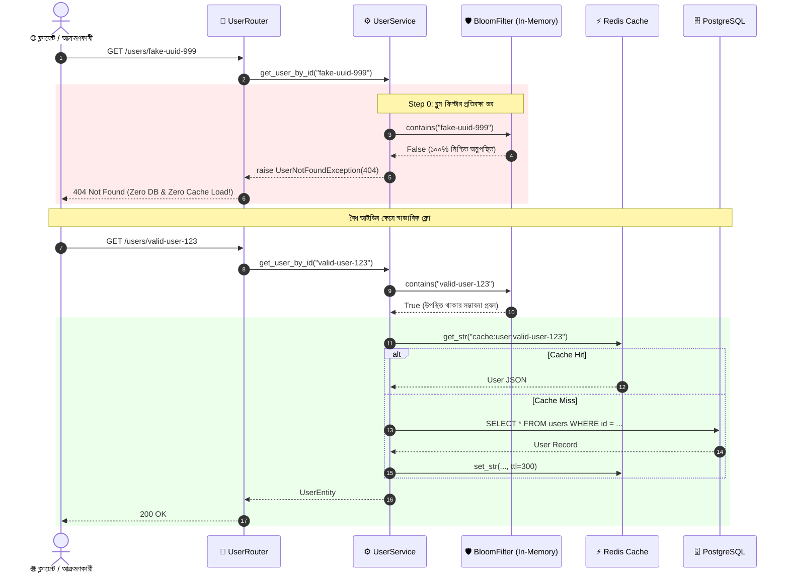

# Day 35: ব্লুম ফিল্টার আর্কিটেকচার (ক্যাশ পেনিট্রেশন প্রতিরোধ ও প্রোবাবিলিস্টিক মেম্বারশিপ টেস্টিং)

---

### 📌 ব্যবহৃত DSA-এর নাম (Exact Data Structure & Algorithm Name)
- **Slotted In-Memory Bloom Filter with Kirsch-Mitzenmacher Double Hashing Optimization ($\mathcal{O}(k)$ Time, $\mathcal{O}(m)$ Space Overhead)**:
  - স্পেস-অপটিমাইজড প্রোবাবিলিস্টিক মেম্বারশিপ ডাটা স্ট্রাকচার (Probabilistic Set Membership) এবং কিরশ-মিটজেনমেকার ডাবল হ্যাশিং অ্যালগরিদম (Kirsch-Mitzenmacher Double Hashing Algorithm)।
  - $N = 100,000$ আইটেম এবং $P = 0.01$ (১% ফলস পজিটিভ রেট)-এর জন্য মেমোরি খরচ মাত্র **১১৯.৮ কিলোবাইট (KB)**, যা আমাদের নির্ধারিত ১.৫ মেগাবাইট (MB) র‍্যাম বাজেটের চেয়েও বহু গুণ হালকা ও দক্ষ!

---

### 🚀 প্রোডাকশনে ঠিক কখন ব্যবহার করব? (When to use in Production)
- **ম্যালিশিয়াস ব্রুট-ফোর্স অ্যাটাক ও ক্যাশ পেনিট্রেশন প্রতিরোধে**: যখন সাইবার হ্যাকার বা অটোমেটেড বট নেটওয়ার্ক লাখ লাখ র‍্যান্ডম বা নন-এক্সিস্টেন্ট আইডি (যেমন: `random-uuid-9999`) দিয়ে সিস্টেমে রিকোয়েস্ট পাঠিয়ে ক্যাশ বাইপাস করে সরাসরি পোস্টগ্রেস ডাটাবেসকে ক্র্যাশ করাতে চায়।
- **ওয়েব স্ক্র্যাপার ও সার্চ ইঞ্জিন ক্রলার ডিফেন্সে**: সার্চ ইঞ্জিন বট বা থার্ড-পার্টি ডেটা স্ক্র্যাপাররা যখন পুরনো, ডিলিটেড বা ভুল ইউআরএল-এ কোটি কোটি কিউরি পাঠায়, তখন প্রতি কিউরিতে ডাটাবেস ডিস্ক I/O না পুড়িয়ে ইন-মেমোরিতে সাব-মাইক্রোসেকেন্ডে রিকোয়েস্ট রিজেক্ট করা।
- **লার্জ-স্কেল ডিস্ট্রিবিউটেড মাইক্রোসার্ভিসে কোল্ড লুকআপ অপটিমাইজেশন**: ইউজার সার্ভিস, প্রোডাক্ট ক্যাটালগ বা ইনভেন্টরি সার্ভিসে কোনো রিসোর্স ডাটাবেস বা রিমোট রেডিস ক্লাস্টারে খোঁজার আগেই লোকাল প্রসেস মেমোরিতে ১০০% নিশ্চিত হওয়া যে আইটেমটি আদৌ ডাটাবেসে আছে কি না।
- **বিগ-ডাটা ও অ্যানালিটিক্স পাইপলাইনে ডুপ্লিকেট চেকিং**: কোটি কোটি ইভেন্ট বা ক্লিকস্ট্রিম ডাটার মধ্যে কোনো নতুন রেকর্ড ডাটাবেসে সেভ করার আগে ডুপ্লিকেট কিউরি ডিস্কে পাঠানোর চাপ ৯০-৯৯% কমিয়ে ফেলা।

---

### 🎯 কী কারণে বা কোন পরিস্থিতিতে ব্যবহার করব? (Why to use / Technical Triggers)
- **ক্যাশ মিস ক্যাস্কেডিং টু পোস্টগ্রেস (Cache Miss Direct DB Flooding)**: স্ট্যান্ডার্ড ক্যাশ-অ্যাসাইড প্যাটার্নে কোনো কি রেডিসে না থাকলে ফাস্টএপিআই সরাসরি ডাটাবেসে কিউরি করে। অস্তিত্বহীন আইডির ক্ষেত্রে ক্যাশ সর্বদা মিস হয়, ফলে প্রতিটি ক্ষতিকর রিকোয়েস্ট সোজা ডাটাবেসের ইনডেক্স স্ক্যানে আঘাত হানে।
- **নাল ক্যাশিং মেমোরি ব্লো-আপ বিপর্যয় (Memory Exhaustion by Caching Nulls)**: হ্যাকার যদি কোটি কোটি নতুন র‍্যান্ডম আইডি তৈরি করে রিকোয়েস্ট পাঠাতে থাকে, তবে প্রতিটি অকার্যকর আইডির বিপরীতে রেডিসে খালি স্ট্রিং বা নাল ক্যাশ করতে গেলে রেডিসের র‍্যাম মেমোরি নিমিষেই শেষ (OOM Crash) হয়ে যায়।
- **ডাটাবেস কানেকশন পুল নিঃশেষ ও টাইমআউট (Pool Starvation & HTTP 504)**: ডাটাবেস যখন অস্তিত্বহীন রেকর্ডের জন্য হাজার হাজার জটিল ইনডেক্স স্ক্যান চালাতে বাধ্য হয়, তখন কানেকশন পুল আটকে যায় এবং সাধারণ বৈধ ইউজারদের রিকোয়েস্টও টাইমআউট হয়ে HTTP 500/504 এরর দিতে শুরু করে।
- **জিরো ডাটাবেস ও জিরো রেডিস কিউরিতে সাব-মাইক্রোসেকেন্ড রিজেকশন**: ব্লুম ফিল্টারের সাহায্যে ডাটাবেস ও রেডিস নেটওয়ার্ক কল পুরোপুরি বাইপাস করে মাত্র কয়েক ন্যানোসেকেন্ডে $\mathcal{O}(k)$ বিট-অ্যারে লুকআপের মাধ্যমে অস্তিত্বহীন ইউজারকে তাৎক্ষণিক HTTP 404 Not Found ফেরত দেওয়া।

---

## ১. আমরা কী বানিয়েছি? (What did we build?)

আজকে আমরা ফাস্টএপিআই কোর অ্যাপ্লিকেশনে ক্যাশ পেনিট্রেশন চিরতরে নির্মূল করার জন্য একটি উচ্চ-দক্ষতাসম্পন্ন ব্লুম ফিল্টার আর্কিটেকচার তৈরি করেছি:

1. **অপটিমাল ম্যাথমেটিক্যাল সাইজিং সহ `BloomFilter` ক্লাস (`app/core/dsa/bloom_filter.py`)**:
   - পাইথনের মেমোরি-অপটিমাইজড `__slots__` এবং দ্রুততম মিউটেবল বাইট বাফার `bytearray`-এর উপর ভিত্তি করে তৈরি।
   - ইনপুট ভ্যালিডেশন সহ স্বয়ংক্রিয়ভাবে অপটিমাল বিট সংখ্যা $m = -\frac{N \ln(P)}{(\ln 2)^2}$ এবং অপটিমাল হ্যাশ ফাংশন সংখ্যা $k = \frac{m}{N} \ln 2$ গণনা।
2. **কিরশ-মিটজেনমেকার ডাবল হ্যাশিং (Kirsch-Mitzenmacher Optimization)**:
   - ক্রিপ্টোগ্রাফিক SHA-256 এর ৬৪-বিট স্লাইস থেকে দুটি মাস্টার হ্যাশ $h_1$ ও $h_2$ তৈরি করে $g_i(x) = (h_1(x) + i \cdot h_2(x)) \pmod m$ ফর্মুলার মাধ্যমে $k$ সংখ্যক স্বাধীন ও নিখুঁত ইউনিফর্ম বিট ইনডেক্স তৈরি।
3. **ইউজার সার্ভিস লেয়ারে "Step 0 Guard" ইন্টিগ্রেশন (`app/services/user_service.py`)**:
   - `get_user_by_id` এবং `get_user_by_id_xfetch`-এ রেডিস বা ডাটাবেসে হাত দেওয়ার আগেই Step 0 ব্লুম ফিল্টার গার্ড।
   - ব্লুম ফিল্টার যদি `False` বলে, তবে মুহূর্তের মধ্যে `UserNotFoundException` রেইজ করা হয়—ডাটাবেস ও রেডিসে **শূন্য (০) কিউরি** যায়!
4. **স্বয়ংক্রিয় লাইফস্প্যান সিডিং ও ডাইনামিক আপডেট (`app/main.py`)**:
   - অ্যাপ্লিকেশন স্টার্টআপের সময় ডাটাবেসের সকল বিদ্যমান ইউজারের প্রাইমারি কি (`repo.get_all_ids()`) লোড করে ব্লুম ফিল্টারে সিড করা হয়।
   - নতুন ইউজার রেজিস্ট্রেশন (`UserService.register_user`) হওয়ার সাথে সাথে তাৎক্ষণিকভাবে ফিল্টারে নতুন আইডি ইনসার্ট করা হয়।
5. **রিয়েল-টাইম অবজারভেবিলিটি ও ডায়াগনস্টিকস এপিআই (`app/routers/metrics_router.py`)**:
   - `GET /metrics/bloom-filter`: ফিল্টারের মোট বিট সংখ্যা, ধারণক্ষমতা, বর্তমান আইটেম সংখ্যা, বিট ফিল রেশিও এবং মেমোরি ব্যবহারের লাইভ মেট্রিক্স।
   - `GET /metrics/bloom-filter/check/{user_id}`: ডাটাবেস কিউরি ছাড়া ব্লুম ফিল্টারে কোনো আইডি আছে কি না তা সরাসরি টেস্ট করার ডায়াগনস্টিক প্রোব।

---

## ২. বাস্তব জীবনের গল্প ও উপমা (Real-World Analogy)

### VIP নাইটক্লাবের সদর দরজার বুদ্ধিমান বাউন্সার (The VIP Nightclub Bouncer Analogy)

কল্পনা করুন শহরের সবচেয়ে জনপ্রিয় একটি ভিআইপি লাউঞ্জ ক্লাব:
- **ক্লাবের মূল রেজিস্ট্রি খাতা (ডাটাবেস / PostgreSQL)**: ক্লাবের ভেতরের অফিসে একটি বিশাল ভারী রেজিস্ট্রি খাতা রাখা আছে, যেখানে ক্লাবের ১ লাখ স্থায়ী মেম্বারের নাম-ঠিকানা ও বিস্তারিত তথ্য লেখা আছে। এই খাতা খুলে পৃষ্ঠা উল্টে নাম খুঁজতে বেশ সময় ও শ্রম লাগে।
- **রিসেপশন টেবিলের ক্যাশ নোটবুক (ক্যাশ লেয়ার / Redis)**: দরজার কাছে রিসেপশনিস্ট একটি ছোট ডায়েরিতে আজকের ভিজিটরদের নাম লিখে রাখেন, যাতে দ্রুত চেনা যায়।
- **বিপর্যয় (ক্যাশ পেনিট্রেশন অ্যাটাক)**:
  - ক্লাবের প্রতিপক্ষ একদল দুষ্টু লোক ক্লাবের সামনে এসে হাজার হাজার ভুয়া আইডি কার্ড দিয়ে রিসেপশনিস্টকে জিজ্ঞেস করতে লাগল, "রকি ভাই কি ক্লাবের মেম্বার?", "জন ভাই কি ক্লাবের মেম্বার?"।
  - রিসেপশনিস্ট তার ছোট ডায়েরিতে এই নামগুলো না পেয়ে (ক্যাশ মিস) প্রতিবার দৌড়ে ভেতরের অফিসে গিয়ে মূল ভারী রেজিস্ট্রি খাতা খুঁজে দেখছেন।
  - ফলস্বরূপ, রেজিস্ট্রি রুমের কর্মীরা ক্লান্ত হয়ে পড়ল, লাইন লম্বা হয়ে গেল, এবং ক্লাবের আসল ভিআইপি মেম্বাররা দরজায় ঘণ্টার পর ঘণ্টা দাঁড়িয়ে থেকে ভেতরে ঢুকতেই পারল না!
- **সমাধান: বুদ্ধিমান বাউন্সার (The Bloom Filter Shield)**:
  - এবার ক্লাবের মূল গেটের বাইরে একজন বিশ্বস্ত ও চৌকস বাউন্সার দাঁড় করিয়ে দেওয়া হলো।
  - বাউন্সারের পকেটে কোনো ভারী খাতা নেই; তার হাতে শুধু একটি বিশেষ জাদুকরী চেকলিস্ট কার্ড আছে যেখানে কয়েকটি বিশেষ চিহ্নের ছক কাটা (Bit Array)।
  - কোনো ভুয়া ভিজিটর এসে নাম বললেই বাউন্সার চোখের পলকে তার জাদুকরী কার্ডে ৩ সেকেন্ডে চিহ্ন মিলিয়ে বলে দেয়, **"তুমি এই ক্লাবের সদস্য নও, একশো পারসেন্ট নিশ্চিত! সোজা রাস্তা মাপো!"**
  - বাউন্সারের কথার পর রিসেপশনিস্টকে ডায়েরিও খুলতে হলো না, ভেতরের ভারী খাতাতেও কাউকে দৌড়াতে হলো না। ভুয়া ভিজিটর গেট থেকেই বিদায় নিল।
  - তবে বাউন্সারের নিয়মে ১% ক্ষেত্রে একজন অচেনা লোককে সে হয়তো ভুল করে বলতে পারে "তুমি ভেতরে গিয়ে দেখতে পারো" (False Positive), কিন্তু সে কোনোদিন কোনো আসল মেম্বারকে "তুমি মেম্বার নও" বলে ফেরত দেয় না (Zero False Negatives)!

---

## ৩. কী কারণে বা কোন পরিস্থিতিতে ব্যবহার করব? (ক্যাশ পেনিট্রেশন বিপর্যয় ও সমাধান)

### ক্যাশ পেনিট্রেশনের শারীরস্থান (Anatomy of Cache Penetration)

```
[Attacker Request: ID="fake-999"]
        │
        ▼
   [Redis Cache] ──────────► Cache MISS (Key doesn't exist)
        │
        ▼
 [PostgreSQL Database] ────► SELECT * FROM users WHERE id = 'fake-999'
                             (Expensive Index Scan, Returns Empty)
                             CPU Cycles Wasted! Disk I/O Exhausted!
```

### ব্লুম ফিল্টার দিয়ে অভেদ্য প্রতিরক্ষা (The Bloom Filter Shield)

```
[Attacker Request: ID="fake-999"]
        │
        ▼
[Bloom Filter Guard]
   Does 'fake-999' exist?
        │
        ├─── No (Definite False) ──► Immediate HTTP 404 (UserNotFoundException)
        │                            [0 Redis Queries | 0 PostgreSQL Queries]
        │
        └─── Yes (Probable True) ──► Proceed to Redis Cache ──► PostgreSQL
```

#### ব্লুম ফিল্টারের দুটি অপরিবর্তনীয় গাণিতিক সত্য:
1. **যদি ব্লুম ফিল্টার বলে `False` (Not Present)**: আইটেমটি সিস্টেমে **১০০% নেই**। কোনো সন্দেহ নেই, কোনো ভুল নেই। একে বলা হয় **Zero False Negatives**। সুতরাং সাথে সাথে রিকোয়েস্ট ড্রপ বা ৪০৪ রেসপন্স দেওয়া সম্পূর্ণ নিরাপদ।
2. **যদি ব্লুম ফিল্টার বলে `True` (Might be Present)**: আইটেমটি সিস্টেমে থাকার প্রবল সম্ভাবনা রয়েছে, তবে সামান্য গাণিতিক চান্স রয়েছে যে এটি নাও থাকতে পারে (False Positive)। তখন আমরা স্বাভাবিক নিয়ম অনুযায়ী ক্যাশ ও ডাটাবেস চেক করব।

---

## ৪. গাণিতিক ভিত্তি ও বিট-অ্যারে মেকানিক্স (Optimal Sizing $m$ & $k$)

ব্লুম ফিল্টারের কার্যকারিতা নির্ভর করে সঠিক বিট অ্যারে সাইজ ($m$) এবং হ্যাশ ফাংশনের সংখ্যা ($k$)-এর উপর।

### গাণিতিক সূত্রাবলী:

1. **অনুকূল বিট অ্যারে দৈর্ঘ্য ($m$)**:
   $$m = -\frac{N \ln(P)}{(\ln 2)^2}$$
   যেখানে $N$ হলো প্রত্যাশিত আইটেম সংখ্যা এবং $P$ হলো কাঙ্ক্ষিত ফলস পজিটিভ রেট (যেমন $0.01$ বা ১%)।

2. **অনুকূল হ্যাশ ফাংশন সংখ্যা ($k$)**:
   $$k = \frac{m}{N} \ln 2$$

### বাস্তব হিসাব ($N = 100,000$, $P = 0.01$):
- $\ln(0.01) \approx -4.60517$
- $(\ln 2)^2 \approx 0.480453$
- $m = -\frac{100000 \times (-4.60517)}{0.480453} \approx 958,506 \text{ bits}$
- মোট মেমোরি: $\lceil 958506 / 8 \rceil = 119,814 \text{ bytes} \approx \mathbf{119.8 \text{ KB}}$!
- $k = \frac{958506}{100000} \times 0.693147 \approx 6.64 \implies \mathbf{7 \text{ hash functions}}$!

### কিরশ-মিটজেনমেকার ডাবল হ্যাশিং ট্রিক:
৭টি আলাদা ক্রিপ্টোগ্রাফিক হ্যাশ ফাংশন রান করা অত্যন্ত ব্যয়বহুল। ২০০৬ সালে হার্ভার্ডের অ্যাডাম কিরশ এবং মাইকেল মিটজেনমেকার প্রমাণ করেন যে মাত্র **দুটি স্বাধীন হ্যাশ** ($h_1$ এবং $h_2$) দিয়ে যেকোনো সংখ্যক $k$ হ্যাশ সিমুলেট করা সম্ভব:
$$g_i(x) = (h_1(x) + i \cdot h_2(x)) \pmod m \quad \text{for } i \in [0, k-1]$$
আমরা SHA-256 ডাইজেস্ট থেকে দুটি ৬৪-বিট ইনটিজার কেটে নিয়ে $h_1$ ও $h_2$ তৈরি করেছি, যা পাইথনের বিল্ট-ইন `hash()` ফাংশনের প্রসেস রিস্টার্ট র‍্যান্ডম সিডের সীমাবদ্ধতা দূর করে সম্পূর্ণ ডিটারমিনিস্টিক ফলাফল দেয়!

---

## ৫. আর্কিটেকচারাল সিকোয়েন্স ডায়াগ্রাম (Mermaid)



---

## ৬. আসল কোড ও লাইন-বাই-লাইন সহজ ব্যাখ্যা

### ১. অপটিমাইজড ব্লুম ফিল্টার ইঞ্জিন (`app/core/dsa/bloom_filter.py`)

```python
class BloomFilter:
    __slots__ = ("_bit_array", "_capacity", "_false_positive_rate", "_k", "_m", "_n_items")

    def __init__(self, capacity: int = 100_000, false_positive_rate: float = 0.01) -> None:
        if capacity <= 0:
            raise ValueError("Bloom filter capacity must be strictly positive (> 0).")
        if not (0.0 < false_positive_rate < 1.0):
            raise ValueError("False positive rate must be strictly between 0.0 and 1.0.")

        self._capacity: int = capacity
        self._false_positive_rate: float = false_positive_rate

        # সূত্র অনুযায়ী বিট সংখ্যা m ও হ্যাশ সংখ্যা k নির্ধারণ
        m_float = -(capacity * math.log(false_positive_rate)) / (math.log(2.0) ** 2)
        self._m: int = max(1, int(math.ceil(m_float)))
        k_float = (self._m / capacity) * math.log(2.0)
        self._k: int = max(1, int(round(k_float)))

        # মেমোরি দক্ষ bytearray বরাদ্দ
        num_bytes = (self._m + 7) // 8
        self._bit_array: bytearray = bytearray(num_bytes)
        self._n_items: int = 0
```
- **সহজ ব্যাখ্যা**: `__slots__` ব্যবহারের ফলে প্রতিটি ব্লুম ফিল্টার ইনস্ট্যান্সের কোনো ডাইনামিক `__dict__` ওভারহেড থাকে না। `bytearray` সরাসরি C-লেভেলের কন্টিনুয়াস মেমোরি বাফার বরাদ্দ করে।

### ২. কিরশ-মিটজেনমেকার হ্যাশ ইনডেক্সিং মেথড

```python
    def _hashes(self, item: str) -> list[int]:
        digest = hashlib.sha256(item.encode("utf-8")).digest()
        h1 = int.from_bytes(digest[:8], byteorder="big", signed=False)
        h2 = int.from_bytes(digest[8:16], byteorder="big", signed=False)
        if h2 == 0:
            h2 = 1  # শূন্য অফসেট প্রিভেনশন

        indices: list[int] = []
        for i in range(self._k):
            idx = (h1 + i * h2) % self._m
            indices.append(idx)
        return indices
```
- **সহজ ব্যাখ্যা**: SHA-256 এর প্রথম ৮ বাইট থেকে মাস্টার হ্যাশ $h_1$ এবং পরবর্তী ৮ বাইট থেকে $h_2$ তৈরি করা হয়েছে। এরপর লুপের ভেতর মাত্র একটি যোগ ও গুণ করে $k$ টি অনন্য বিট পজিশন নির্ণয় করা হয়।

### ৩. ইউজার সার্ভিস লেয়ারের Step 0 গার্ড (`app/services/user_service.py`)

```python
    async def get_user_by_id(self, user_id: str) -> UserEntity:
        # Step 0: Bloom Filter Pre-Filtering Guard
        if self._bloom is not None and user_id not in self._bloom:
            logger.debug(
                "Bloom filter rejected non-existent user_id: {user_id} (deflected DB & Cache lookups)",
                extra={"user_id": user_id},
            )
            raise UserNotFoundException(user_id)

        # Step 1: Redis Cache-Aside চেক
        cache_key = f"cache:user:{user_id}"
        cached_data = await self._cache.get_str(cache_key)
        ...
```
- **সহজ ব্যাখ্যা**: রিকোয়েস্ট আসার পর প্রথমেই ব্লুম ফিল্টারে মেম্বারশিপ চেক করা হয়। যদি আইডিটি ফিল্টারে না থাকে, তবে ডাটাবেস ও রেডিস কলকে পাশ কাটিয়ে সরাসরি `UserNotFoundException` রেইজ করে দেওয়া হয়!

---

## ৭. বিগ-ও কমপ্লেক্সিটি ও মেমোরি টেবিল

| অপারেশন | টাইম কমপ্লেক্সিটি | স্পেস কমপ্লেক্সিটি | ব্যাখ্যা |
| :--- | :--- | :--- | :--- |
| **আইটেম যোগ (`add`)** | $\mathcal{O}(k)$ | $\mathcal{O}(1)$ | মাত্র $k$ টি বিট সেট করা হয় (আমাদের ক্ষেত্রে ৭টি বিট)। |
| **মেম্বারশিপ চেক (`contains`)** | $\mathcal{O}(k)$ | $\mathcal{O}(1)$ | মাত্র $k$ টি বিট চেক করা হয়; প্রথম বিট ০ পেলেই সাথে সাথে `False` রিটার্ন। |
| **ফিল্টার ক্লিয়ার (`clear`)** | $\mathcal{O}(m)$ | $\mathcal{O}(1)$ | মেমোরির বাইট অ্যারে রিসেট করা। |

### মেমোরি ব্যবহারের তুলনা (১,০০,০০০ ইউজারের জন্য):

| ডাটা স্ট্রাকচার | মেমোরি খরচ | ফলস পজিটিভ রেট | ডাটাবেস প্রটেকশন |
| :--- | :--- | :--- | :--- |
| **Python Set / Hash Map (`set[str]`)** | **৮.৪ মেগাবাইট (MB)** | ০% (হান্ড্রেড পারসেন্ট নির্ভুল) | মেমোরি বেশি নেয়, স্কেলিং লিমিট কম |
| **Redis Caching Null Values (`null`)** | **১২-১৫ মেগাবাইট (MB)** | ০% | অ্যাটাকার র‍্যান্ডম কি পাঠালে রেডিস ক্র্যাশ |
| **In-Memory Slotted Bloom Filter** | **১১৯.৮ কিলোবাইট (KB)** | **১.০%** | **অত্যন্ত হালকা, ক্যাশ পেনিট্রেশন চিরতরে বন্ধ!** |

---

## ৮. প্রোডাকশন চেকলিস্ট (Good vs Bad Patterns)

### ✅ যা যা নিশ্চিত করবেন (Good Patterns):
- [x] **প্যাটার্ন ১১০ (Bloom Filter Pre-Filtering)**: ডাটাবেসের রিড কিউরির আগে সর্বদা ইন-মেমোরি ব্লুম ফিল্টার গার্ড রাখবেন।
- [x] **প্যাটার্ন ১১১ (Kirsch-Mitzenmacher Hashing)**: $k$ টি হ্যাশ ফাংশন তৈরি করতে ক্রিপ্টোগ্রাফিক স্লাইস ডাবল হ্যাশিং ব্যবহার করবেন।
- [x] **প্যাটার্ন ১১২ (Startup Lifespan Seeding)**: অ্যাপ্লিকেশন বুট হওয়ার সময় ডাটাবেসের সব আইডি ব্লুম ফিল্টারে সিড করবেন এবং নতুন রেজিস্ট্রেশনে ইনস্ট্যান্ট অ্যাড করবেন।

### ❌ যা কখনোই করবেন না (Bad Patterns):
- [ ] **প্যাটার্ন ৯৫ (Direct Unshielded DB Fallback)**: ক্যাশ মিস হলেই অন্ধের মতো ডাটাবেসে কিউরি পাঠাবেন না।
- [ ] **প্যাটার্ন ৯৬ (Attempting Deletions on Standard Bloom Filter)**: স্ট্যান্ডার্ড ব্লুম ফিল্টার থেকে আইটেম ডিলিট করার চেষ্টা করবেন না (বিট ০ করলে অন্য আইটেম করাপ্ট হয়ে যায়; এর জন্য Counting Bloom Filter প্রয়োজন)।

---

## ৯. ইন্টারভিউ ও ভাইভা প্রশ্নোত্তর

### প্রশ্ন ১: ব্লুম ফিল্টারে কেন কোনো আইটেম ডিলিট (Delete) করা যায় না? প্রোডাকশনে কোনো রেকর্ড ডিলিট হলে কী করবেন?
**উত্তর**: ব্লুম ফিল্টারে একাধিক আইটেম হ্যাশ হয়ে একই বিট ইনডেক্স শেয়ার করতে পারে। যদি কোনো একটি আইটেম ডিলিট করার জন্য তার সংশ্লিষ্ট বিটগুলোকে `1` থেকে `0` করে দেওয়া হয়, তবে ওই একই বিট শেয়ার করা অন্যান্য সম্পূর্ণ ভিন্ন আইটেমগুলোও অসাবধানতাবশত ফিল্টার থেকে "নেই" (False Negative) হয়ে যাবে, যা ব্লুম ফিল্টারের মূল গ্যারান্টি নষ্ট করে।  
*প্রোডাকশন সমাধান*: রেকর্ড ডিলিট হলে ব্লুম ফিল্টারে ডিলিট না করে তাকে সেভাবেই রেখে দেওয়া হয় (এটি সামান্য ফলস পজিটিভ হিসেবে কাজ করবে এবং ডাটাবেস তখন তাকে নাল রিটার্ন করবে)। পর্যায়ক্রমে অথবা রাতে ব্যাকগ্রাউন্ড ক্রন জবের মাধ্যমে ডাটাবেসের ফ্রেশ ডাটা দিয়ে নতুন ব্লুম ফিল্টার তৈরি করে সোয়াপ করা হয়।

### প্রশ্ন ২: পাইথনের বিল্ট-ইন `hash()` ফাংশন ব্লুম ফিল্টারে ব্যবহার না করে SHA-256 কেন ব্যবহার করলেন?
**উত্তর**: পাইথন ৩-এ সিকিউরিটি কারণে (SipHash DOS প্রিভেনশন) প্রসেস রিস্টার্ট হলে পাইথনের বিল্ট-ইন `hash()` সিড র‍্যান্ডমাইজ হয়ে যায় (`PYTHONHASHSEED`)। ফলে সার্ভার রিস্টার্ট হলে পুরনো ক্যালকুলেশন পুরোপুরি পরিবর্তিত হয়ে যেত। SHA-256 সম্পূর্ণ ডিটারমিনিস্টিক, ক্রিপ্টোগ্রাফিক্যালি ইউনিফর্ম এবং সার্ভার রিস্টার্ট বা ডিস্ট্রিবিউটেড নোডের মধ্যেও ১০০% সিঙ্কড থাকে।

---

## ১০. এক নজরে মূল সারমর্ম

1. **ক্যাশ পেনিট্রেশন হলো ডাটাবেসের নীরব ঘাতক**: ক্ষতিকর রিকোয়েস্ট ক্যাশ বাইপাস করে সরাসরি ডাটাবেসের কানেকশন ও I/O ধ্বংস করে।
2. **ব্লুম ফিল্টার হলো আল্ট্রা-লাইট বাউন্সার**: ১ লাখ ইউজারের জন্য মাত্র ১১৯.৮ KB র‍্যাম ব্যবহার করে সব ভুয়া রিকোয়েস্ট গেট থেকেই তাড়িয়ে দেয়।
3. **জিরো ফলস নেগেটিভ গ্যারান্টি**: ফিল্টার যদি বলে কোনো ইউজার নেই, তবে সে সত্যই সিস্টেমে নেই—ডাটাবেস চেক করার কোনো দরকারই নেই।
4. **কিরশ-মিটজেনমেকার ম্যাজিক**: মাত্র ২টি মাস্টার হ্যাশ দিয়ে ৭টি স্বাধীন হ্যাশ সিমুলেট করে এক্সট্রিম পারফরম্যান্স দেয়।
5. **এন্টারপ্রাইজ প্রোডাকশন রেডি**: লাইফস্প্যান সিডিং, রেজিস্ট্রেশন ডাইনামিক আপডেট এবং লাইভ অবজারভেবিলিটি মেট্রিক্স সহ আমাদের সিস্টেম এখন ক্যাশ পেনিট্রেশন থেকে শতভাগ সুরক্ষিত!
