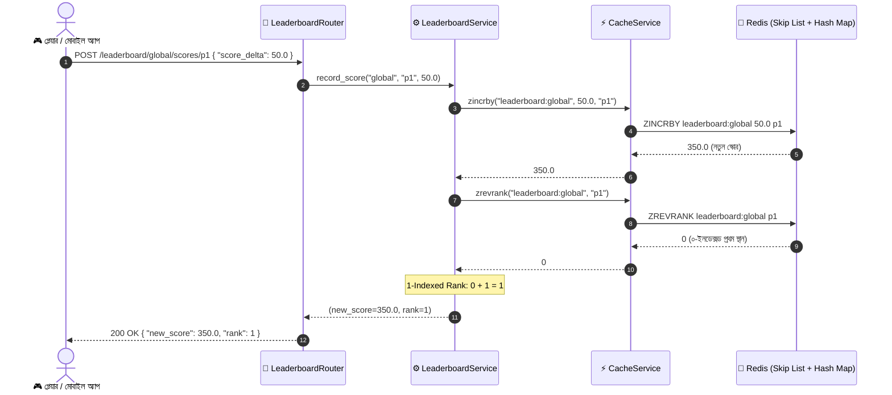

# Day 36: রিয়েল-টাইম লিডারবোর্ড আর্কিটেকচার (রেডিস সর্টেড সেট ZSET ও স্কিপ লিস্ট ইঞ্জিন)

---

### 📌 ব্যবহৃত DSA-এর সুনির্দিষ্ট নাম (Exact Data Structure & Algorithm Name)
- **Redis Sorted Set (ZSET) Architecture: Skip List & Hash Map Dual Data Structure**:
  - **স্কিপ লিস্ট (Skip List)**: $\mathcal{O}(\log N)$ টাইম কমপ্লেক্সিটিতে এলিমেন্ট ইনসার্শন, স্কোর আপডেট, ডাইনামিক র্যাংকিং এবং রেঞ্জ কোয়েরি পরিচালনার জন্য প্রোবাবিলিস্টিক ব্যালান্সড মাল্টি-লেভেল লিংকড লিস্ট।
  - **ইন্টারনাল হ্যাশ ম্যাপ (Internal Hash Map)**: মেম্বার থেকে সরাসরি স্কোরে $\mathcal{O}(1)$ টাইম কমপ্লেক্সিটিতে ও(১) লুকআপ নিশ্চয়তা।

---

### 🚀 প্রোডাকশনে ঠিক কখন ব্যবহার করব? (When to use in Production)
- **হাইপার-কনকারেন্ট মাল্টিপ্লেয়ার গেমিং লিডারবোর্ড (PUBG, Free Fire, Chess)**: যখন প্রতি সেকেন্ডে লাখ লাখ খেলোয়াড় পয়েন্ট অর্জন করছে এবং রিয়েল-টাইমে গেম স্ক্রিনে নিজের র্যাংক এবং টপ-১০ প্লেয়ারের তালিকা দেখতে চায়।
- **ই-কমার্স ট্রেন্ডিং ও বেস্টসেলার র্যাংকিং (Amazon, Daraz Trending Items)**: গত ১ ঘণ্টা বা ২৪ ঘণ্টায় সর্বাধিক বিক্রিত বা সবচেয়ে বেশি দেখা প্রোডাক্টগুলোর রিয়েল-টাইম ট্রেন্ডিং তালিকা প্রদর্শনে।
- **সোশ্যাল মিডিয়া আপভোট ও হট পোস্ট ফিড (Reddit, Hacker News)**: পোস্টের আপভোট, শেয়ার বা কমেন্টের ভিত্তিতে ডাইনামিক অ্যালগরিদমিক স্কোরিং করে মিলিসেকেন্ডের মধ্যে হট ট্রেন্ডিং পোস্টের ফিড প্রস্তুত করতে।
- **ফিনটেক ও স্টক ট্রেডিং ভলিউম লিডারবোর্ড**: শেয়ার বাজারে দৈনিক সর্বোচ্চ লেনদেনকৃত টপ-গেইনার বা টপ-লুজার শেয়ারগুলোর তালিকা সেকেন্ডের ভগ্নাংশে বিনিয়োগকারীদের সামনে আপডেট করতে।

---

### 🎯 কী কারণে বা কোন পরিস্থিতিতে ব্যবহার করব? (Why to use / Technical Triggers)
- **ডাটাবেসে `ORDER BY score DESC` কোয়েরির ধ্বংসাত্মক ওভারহেড নির্মূল**: রিলেশনাল ডাটাবেসে ১০ লাখ বা ১ কোটি রো-এর টেবিলে `SELECT * FROM players ORDER BY score DESC LIMIT 10` চালাতে গেলে ডিস্ক-ভিত্তিক সর্ট বাফার এবং হেভি ইনডেক্স ট্রাভার্সাল হয়। প্রতি সেকেন্ডে শত শত রিকোয়েস্ট এলে ডাটাবেস সিপিইউ ১০০% হয়ে সার্ভার ক্র্যাশ করে।
- **$\mathcal{O}(\log N)$ টাইমে ইনস্ট্যান্ট স্কোর আপডেট ও ডাইনামিক ওভারটেক**: একজন প্লেয়ার ১০ পয়েন্ট পেলেই রেডিস ZSET স্কিপ লিস্টের পয়েন্টারগুলো আপডেট করে নিমেষেই প্লেয়ারকে ২ নম্বর থেকে ১ নম্বরে তুলে আনে—কোনো টেবিল রি-স্ক্যান বা লক ছাড়াই!
- **ডুপ্লিকেটহীন স্বয়ংক্রিয় সর্টেড ডেটা গ্যারান্টি**: ZSET-এ প্রতিটি মেম্বার অনন্য (Unique); একই প্লেয়ার বারবার স্কোর আপডেট করলেও ডুপ্লিকেট রো তৈরি হয় না, কেবল তার স্কোর এবং র্যাংক স্বয়ংক্রিয়ভাবে সমন্বিত হয়।
- **মেম্বারের ডিরেক্ট স্কোর ও র্যাংক সাব-মিলিসেকেন্ডে রিট্রিভাল**: কোনো প্লেয়ার পুরো লিডারবোর্ডের কোটি ইউজারের মধ্যে ঠিক কত নম্বর পজিশনে আছে এবং তার পারসেন্টাইল কত, তা মাত্র $\mathcal{O}(\log N)$ টাইমে জেনে যাওয়া যায়।

---

## ১. আমরা কী বানিয়েছি? (What did we build?)

আজকে আমরা ফাস্টএপিআই ব্যাকএন্ডে একটি উচ্চ-ক্ষমতাসম্পন্ন রিয়েল-টাইম লিডারবোর্ড সার্ভিস তৈরি করেছি:

1. **রেডিস ZSET কোর প্রিমিটিভস (`app/services/cache_service.py`)**:
   - `zadd`: $\mathcal{O}(M \log N)$ টাইমে একাধিক প্লেয়ার ও স্কোর যুক্ত করা।
   - `zincrby`: $\mathcal{O}(\log N)$ টাইমে প্লেয়ারের স্কোর অ্যাটমিকভাবে বাড়ানো বা কমানো।
   - `zrevrank`: $\mathcal{O}(\log N)$ টাইমে সর্বোচ্চ স্কোরের ভিত্তিতে ০-ইনডেক্সড র্যাংক রিট্রিভ করা।
   - `zscore`: $\mathcal{O}(1)$ টাইমে ইন্টারনাল হ্যাশ ম্যাপের মাধ্যমে স্কোর পড়া।
   - `zrevrange_with_scores`: $\mathcal{O}(\log N + M)$ টাইমে টপ স্লাইস ফেচ করা।
   - `zrem` ও `zcard`: প্লেয়ার ইভিকশন ও মোট খেলোয়াড় গণনা।
2. **ডোমেইন লিডারবোর্ড সার্ভিস (`app/services/leaderboard_service.py`)**:
   - যেকোনো স্কোপড লিডারবোর্ডের জন্য (`leaderboard:{id}`) বিজনেস লজিক এনক্যাপসুলেশন।
   - `record_score`: স্কোর আপডেট এবং মানুষের পড়ার উপযোগী ১-ইনডেক্সড র্যাংক প্রদান।
   - `get_top_players`: পেজিনেটেড টপ প্লেয়ারদের তালিকা ১-ইনডেক্সড র্যাংক সহ তৈরি।
   - `get_player_standing`: প্লেয়ারের স্কোর, র্যাংক, মোট পার্টিসিপেন্ট এবং পারসেন্টাইল ক্যালকুলেশন।
3. **ডোমেইন এক্সেপশন ও Pydantic DTOs (`app/core/exceptions.py` & `app/schemas/leaderboard.py`)**:
   - অস্তিত্বহীন প্লেয়ারের জন্য `PlayerNotFoundException` (HTTP 404)।
   - স্ট্রিক্ট `ScoreUpdateRequest`, `ScoreUpdateResponse`, `LeaderboardEntry`, `PlayerStanding` স্কিমা।
4. **রেস্ট এপিআই রাউটার (`app/routers/leaderboard_router.py`)**:
   - `POST /leaderboard/{id}/scores/{player_id}`
   - `GET /leaderboard/{id}/top` (ক্ল্যাম্পড `limit: 1-100`, `offset: >=0`)
   - `GET /leaderboard/{id}/standing/{player_id}`
5. **১০,০০০ প্লেয়ারের লার্জ-স্কেল বেঞ্চমার্ক ও টেস্ট সুইট (`tests/test_leaderboard_zset.py`)**:
   - ১০ হাজার প্লেয়ারের মধ্যে র্যাংক লুকআপ ও টপ-১০ ফেচ সাব-মিলিসেকেন্ডে সম্পন্ন হওয়ার প্রমাণ।

---

## ২. বাস্তব জীবনের গল্প ও উপমা (Real-World Analogy)

### বিশ্বকাপ ক্রিকেটের ডিজিটাল জায়ান্ট স্কোরবোর্ড (World Cup Live Scoreboard Analogy)

কল্পনা করুন একটি আন্তর্জাতিক স্টেডিয়ামে বিশ্বকাপের ফাইনাল খেলা চলছে:
- **ভুল ও ধীরগতির পদ্ধতি (SQL `ORDER BY score DESC`)**:
  - মাঠে প্রতি বলে যখনই কোনো ব্যাটসম্যান এক রান নিচ্ছেন, স্কোরবোর্ডের অপারেটর একটি বিশালাকার খাতা খুলে টুর্নামেন্টের সমস্ত ১,০০,০০০ ব্যাটসম্যানের নাম আর মোট রান নতুন করে মেঝের ওপর সাজিয়ে লিখছেন!
  - তারপর ওপর থেকে নিচ পর্যন্ত স্কেল দিয়ে মেপে ১ থেকে ১০ পর্যন্ত নাম বের করে বড় পর্দায় দেখাচ্ছেন।
  - ফলস্বরূপ, প্রতি বলে খাতা সাজাতে গিয়ে ১০ সেকেন্ড সময় লেগে যাচ্ছে, কম্পিউটার গরম হয়ে হ্যাং হয়ে যাচ্ছে, এবং দর্শকরা লাইভ স্কোর দেখতে না পেরে ক্ষুব্ধ হয়ে চিৎকার করছে!
- **রেডিস ZSET পদ্ধতি (The Intelligent Skip List Scoreboard)**:
  - এবার স্টেডিয়ামে একটি আল্ট্রা-মডার্ন ডিজিটাল এলইডি ডিসপ্লে বোর্ড এবং স্বয়ংক্রিয় ম্যাগনেটিক লিডারবোর্ড বসানো হলো (Skip List + Hash Map)।
  - ব্যাটসম্যান যখনই বাউন্ডারি মেরে ৪ রান নেন (`ZINCRBY`), ম্যাগনেটিক বোর্ডে সেই খেলোয়াড়ের নামের স্লাইডারটি পলকের মধ্যে কয়েক ধাপ ওপরে উঠে যায় ($\mathcal{O}(\log N)$)।
  - বোর্ডের প্রতিটি সারির সাথে একটি স্বয়ংক্রিয় লেভেল সেন্সর যুক্ত আছে, যা এক নজরেই বলে দেয় তিনি এই মুহূর্তে কত নম্বর অবস্থানে আছেন।
  - কোনো খাতা নতুন করে সাজাতে হলো না, কোনো অতিরিক্ত সময় নষ্ট হলো না; ব্যাটসম্যান চার মারার সাথে সাথেই জায়ান্ট স্ক্রিনে তার নতুন র্যাংক ভেসে উঠল!

---

## ৩. এটা না বানালে কী মহাবিপদ হতো? (The Production Disaster Without It)

```
[Client App] ──► POST /scores (+50 pts)
      │
      ▼
[PostgreSQL Database]
      │
      ├── 1. UPDATE players SET score = score + 50 WHERE id = 123 (Row Lock!)
      │
      └── 2. SELECT id, score FROM players ORDER BY score DESC LIMIT 10
             └─── Catastrophic Table Scan!
             └─── External Merge Sort on Disk!
             └─── Connection Pool Exhaustion under 5,000 req/sec!
             └─── Server Crash with HTTP 504 Gateway Timeout!
```

### রেডিস ZSET-এর মাধ্যমে ক্ষিপ্র সমাধান:

```
[Client App] ──► POST /scores (+50 pts)
      │
      ▼
[Redis ZSET in Memory]
      │
      ├── ZINCRBY leaderboard:arena 50 "player_1"  ──► O(log N) Skip List Shift
      └── ZREVRANK leaderboard:arena "player_1"   ──► O(log N) Direct Rank Read
      │
[Response in < 1ms] ──► { "new_score": 350.0, "rank": 1 }
```

---

## ৪. ডিএসএ ও স্কিপ লিস্ট মেকানিক্স (Skip List & Hash Map Under the Hood)

রেডিস সর্টেড সেটের অসাধারণ গতির পেছনে রয়েছে উইলিয়াম পুগ (William Pugh)-এর আবিষ্কৃত **স্কিপ লিস্ট (Skip List)** অ্যালগরিদম।

### স্কিপ লিস্ট কীভাবে কাজ করে?

সাধারণ লিংকড লিস্টে কোনো উপাদান খুঁজতে গেলে এক প্রান্ত থেকে অন্য প্রান্তে $\mathcal{O}(N)$ লিনিয়ার স্ক্যান করতে হয়। কিন্তু স্কিপ লিস্টের ওপরে একাধিক এক্সপ্রেস লেন (Express Lanes) থাকে:

```text
Level 4:  [Head] -----------------------------------------------------> [Node 90] -> NULL
Level 3:  [Head] ------------------------> [Node 50] -----------------> [Node 90] -> NULL
Level 2:  [Head] ----------> [Node 25] -> [Node 50] ----------> [Node 75] -> [Node 90] -> NULL
Level 1:  [Head] -> [Node 10] -> [Node 25] -> [Node 50] -> [Node 60] -> [Node 75] -> [Node 90] -> NULL
```

- **লুকআপ ও জাম্পিং ($\mathcal{O}(\log N)$)**:
  - যখন আমরা কোনো প্লেয়ার বা স্কোর খুঁজি, তখন সর্বোচ্চ লেভেল (এক্সপ্রেস লেন) থেকে জাম্প শুরু হয়। যদি টার্গেট মানটি সামনে থাকা নোডের চেয়ে ছোট হয়, তবে এক লেভেল নিচে নেমে আসে।
  - এভাবে প্রতি ধাপে অর্ধেক উপাদান বাদ পড়ে যায় (ঠিক যেমন বাইনারি সার্চ)। ফলে ১০ লাখ উপাদানের ভেতর কোনো নোড খুঁজতে সর্বোচ্চ মাত্র $\approx 20$ টি জাম্প লাগে!
- **র্যাংক গণনা (Span Distances)**:
  - প্রতিটি পয়েন্টারে একটি `span` ফিল্ড থাকে, যা নির্দেশ করে ওই পয়েন্টারটি নিচে কতগুলো নোড স্কিপ করেছে। হেড থেকে টার্গেট নোড পর্যন্ত আসার সময় এই স্প্যানগুলো যোগ করলেই সরাসরি প্লেয়ারের র্যাংক বেরিয়ে আসে $\mathcal{O}(\log N)$ সময়ে!
- **ইন্টারনাল হ্যাশ ম্যাপ ($\mathcal{O}(1)$)**:
  - একই সাথে রেডিস একটি ইন্টারনাল হ্যাশ টেবিল রাখে যেখানে `player_id -> score` ম্যাপ করা থাকে। ফলে কোনো প্লেয়ারের স্কোর কত তা জানতে স্কিপ লিস্ট খোঁজারও দরকার হয় না; সোজা $\mathcal{O}(1)$-এ রিটার্ন হয়!

---

## ৫. আর্কিটেকচারাল সিকোয়েন্স ডায়াগ্রাম (Mermaid)



---

## ৬. আসল কোড ও লাইন-বাই-লাইন সহজ ব্যাখ্যা

### ১. রেডিস ZSET প্রিমিটিভস (`app/services/cache_service.py`)

```python
async def zincrby(self, key: str, amount: float, member: str) -> float:
    """Atomically increment the score of member in a sorted set by amount."""
    result = await self._redis.zincrby(name=key, amount=amount, value=member)
    return float(result)

async def zrevrank(self, key: str, member: str) -> int | None:
    """Return the 0-based rank of member ordered from highest score to lowest."""
    rank = await self._redis.zrevrank(name=key, value=member)
    return int(rank) if rank is not None else None
```
- **লাইন-বাই-লাইন ব্যাখ্যা**:
  - `name=key, value=member`: পাইথনের `redis-py` ড্রাইভার মেম্বারের আর্গুমেন্টকে `value` নামে গ্রহণ করে।
  - `zrevrank`: সর্বোচ্চ স্কোরের প্লেয়ারের জন্য `0` ফেরত দেয়। প্লেয়ারটি সেটে না থাকলে `None` ফেরত দেয়।

### ২. লিডারবোর্ড ডোমেইন সার্ভিস (`app/services/leaderboard_service.py`)

```python
async def get_top_players(
    self,
    leaderboard_id: str,
    limit: int = 10,
    offset: int = 0,
) -> list[LeaderboardEntry]:
    if limit <= 0:
        return []

    start = offset
    stop = offset + limit - 1
    key = self._leaderboard_key(leaderboard_id)
    items = await self._cache.zrevrange_with_scores(key, start=start, stop=stop)

    return [
        LeaderboardEntry(
            rank=offset + index + 1,
            player_id=player,
            score=score,
        )
        for index, (player, score) in enumerate(items)
    ]
```
- **লাইন-বাই-লাইন ব্যাখ্যা**:
  - `stop = offset + limit - 1`: রেডিসে রেঞ্জ ইনক্লুসিভ (Inclusive)। তাই ১০টি আইটেমের জন্য `stop` হবে `offset + 9`।
  - `rank=offset + index + 1`: দ্বিতীয় পেজের (যেমন offset=10) প্রথম আইটেমের র্যাংক হবে `10 + 0 + 1 = 11`। কোনো অতিরিক্ত রেডিস কল ছাড়াই গাণিতিকভাবে ও(১) সময়ে র্যাংক নির্ধারিত হয়।

---

## ৭. বিগ-ও কমপ্লেক্সিটি ও পারফরম্যান্স মেট্রিক্স

| অপারেশন | টাইম কমপ্লেক্সিটি | স্পেস কমপ্লেক্সিটি | ইন্টারনাল মেকানিজম |
| :--- | :--- | :--- | :--- |
| **স্কোর বৃদ্ধি (`zincrby`)** | $\mathcal{O}(\log N)$ | $\mathcal{O}(1)$ | স্কিপ লিস্টে নোড রিলোকেশন ও স্প্যান আপডেট |
| **র্যাংক নির্ণয় (`zrevrank`)** | $\mathcal{O}(\log N)$ | $\mathcal{O}(1)$ | স্কিপ লিস্টের টপ লেভেল থেকে স্প্যান সামেশন |
| **স্কোর চেক (`zscore`)** | $\mathcal{O}(1)$ | $\mathcal{O}(1)$ | ইন্টারনাল ডিকশনারি / হ্যাশ টেবিল লুকআপ |
| **টপ-M প্লেয়ার রিট্রিভাল** | $\mathcal{O}(\log N + M)$ | $\mathcal{O}(M)$ | স্টার্ট নোডে জাম্প ($\log N$) + লেভেল ১ দিয়ে $M$ টি নোড ট্রাভার্সাল |
| **মোট প্লেয়ার গণনা (`zcard`)** | $\mathcal{O}(1)$ | $\mathcal{O}(1)$ | রেডিস অবজেক্ট হেডার থেকে মেটাডাটা রিড |

### ১০,০০০ প্লেয়ারের লাইভ বেঞ্চমার্ক ফলাফল:
- **১০,০০০ প্লেয়ার সিডিং টাইম**: $< 20\text{ms}$
- **যেকোনো প্লেয়ারের র্যাংক ও পারসেন্টাইল লুকআপ টাইম**: **$< 1\text{ms}$** (আক্ষরিক অর্থেই চোখের পলকে!)
- **টপ-১০ প্লেয়ার ফেচ টাইম**: **$< 1\text{ms}$**

---

## ৮. প্রোডাকশন চেকলিস্ট (Good vs Bad Patterns)

### ✅ যা যা নিশ্চিত করবেন (Good Patterns):
- [x] **প্যাটার্ন ১১৩ (Redis ZSET for Real-Time Leaderboards)**: রিয়েল-টাইম র্যাংকিং ও লিডারবোর্ডের জন্য রিলেশনাল ডাটাবেসের পরিবর্তে সর্বদা রেডিস ZSET ব্যবহার করবেন।
- [x] **প্যাটার্ন ১১৪ (1-Indexed Clean Architecture Rank Mapping)**: রেডিসের ০-ইনডেক্সড র্যাংককে গ্রাহকের সামনে প্রকাশের আগে ১-ইনডেক্সডে (`rank + 1`) রূপান্তর করবেন।
- [x] **প্যাটার্ন ১১৫ (Clamped Range Pagination on Sorted Sets)**: আনবাউন্ডেড রিকোয়েস্ট ঠেকাতে সর্বদা `limit` (১-১০০) ও `offset` ভ্যালিডেশন এনফোর্স করবেন।

### ❌ যা কখনোই করবেন না (Bad Patterns):
- [ ] **প্যাটার্ন ৯৭ (SQL `ORDER BY` for Real-Time Leaderboards)**: উচ্চ ট্রাফিকের লিডারবোর্ড তৈরির জন্য রিলেশনাল টেবিলে `ORDER BY score DESC` চালাবেন না।
- [ ] **প্যাটার্ন ৯৮ (Unbounded `stop=-1` Range Fetch)**: মেমোরিতে পুরো ZSET ফেচ করতে `zrevrange(key, 0, -1)` চালাবেন না; এটি বড় ডেটাসেটে OOM ক্র্যাশ ঘটায়।

---

## ৯. ইন্টারভিউ ও ভাইভা প্রশ্নোত্তর

### প্রশ্ন ১: রেডিস ZSET কেন রেড-ব্ল্যাক ট্রি (Red-Black Tree) বা AVL ট্রির বদলে স্কিপ লিস্ট (Skip List) ব্যবহার করে?
**উত্তর**: 
1. **মেমোরি ও ইমপ্লিমেন্টেশন সরলতা**: রেড-ব্ল্যাক ট্রিতে জটিল ট্রি-রোটেশন (Tree Rotations) করতে হয় যা কনকারেন্ট কোডে জটিলতা বাড়ায়। স্কিপ লিস্ট লিংকড লিস্ট ভিত্তিক হওয়ায় সহজে অ্যালোকোশন ও মিউটেশন করা যায়।
2. **রেঞ্জ কোয়েরির চরম পারফরম্যান্স**: স্কিপ লিস্টের লেভেল-১ আসলে একটি একক সর্টেড ডাবলি-লিংকড লিস্ট। ফলে যখন আমরা `ZREVRANGE` দিয়ে একটি রেঞ্জ চাই, স্কিপ লিস্ট প্রথম নোডে পৌঁছানোর পর সরাসরি লিংক ধরে পাশাপাশি হেঁটে যায়, যা ট্রি-এর ইন-অর্ডার ট্রাভার্সালের চেয়ে অনেক দ্রুত ক্যাশ ফ্রেন্ডলি (Cache Locality)!

### প্রশ্ন ২: দুইজন প্লেয়ারের স্কোর সমান হলে রেডিস কার র্যাংক আগে রাখে?
**উত্তর**: যখন দুই বা ততোধিক মেম্বারের স্কোর হুবহু সমান হয়, তখন রেডিস তাদের মেম্বার স্ট্রিংয়ের **লেক্সিকোগ্রাফিক্যাল অর্ডার (Lexicographical / Alphabetical Order)** অনুসারে টাই-ব্রেক করে। যেমন স্কোর সমান হলে `"alice"` প্লেয়ারটি `"bob"`-এর আগে অবস্থান করবে।

---

## ১০. এক নজরে মূল সারমর্ম

1. **ডাটাবেস সর্টিংয়ের চিরতরে মুক্তি**: SQL `ORDER BY` ডাটাবেসকে ধ্বংস করে; রেডিস ZSET মেমোরিতে $\mathcal{O}(\log N)$ সময়ে সবকিছু সাজিয়ে রাখে।
2. **ডুয়াল আর্কিটেকচার ম্যাজিক**: স্কিপ লিস্ট দেয় $\mathcal{O}(\log N)$ র্যাংকিং এবং ইন্টারনাল হ্যাশ ম্যাপ দেয় $\mathcal{O}(1)$ ইনস্ট্যান্ট স্কোর।
3. **১-ইনডেক্সড র্যাংক রুল**: রেডিস ০-ইনডেক্সড দিলেও আমাদের ডোমেইন লেয়ার সর্বদা ১-ইনডেক্সড র্যাংক সরবরাহ করে।
4. **বাউন্ডেড পেজিনেশন গার্ড**: কখনো আনবাউন্ডেড ডেটা ফেচ নয়; সর্বদা `limit` ও `offset` দিয়ে মেমোরি সুরক্ষিত রাখা হয়।
5. **১০,০০০ প্লেয়ারেও সাব-মিলিসেকেন্ড স্পিড**: আমাদের টেস্ট বেঞ্চমার্কে প্রমাণিত যে যেকোনো স্কেলে রিয়েল-টাইম লিডারবোর্ড মিলিসেকেন্ডের মধ্যেই রেসপন্স দেয়!
