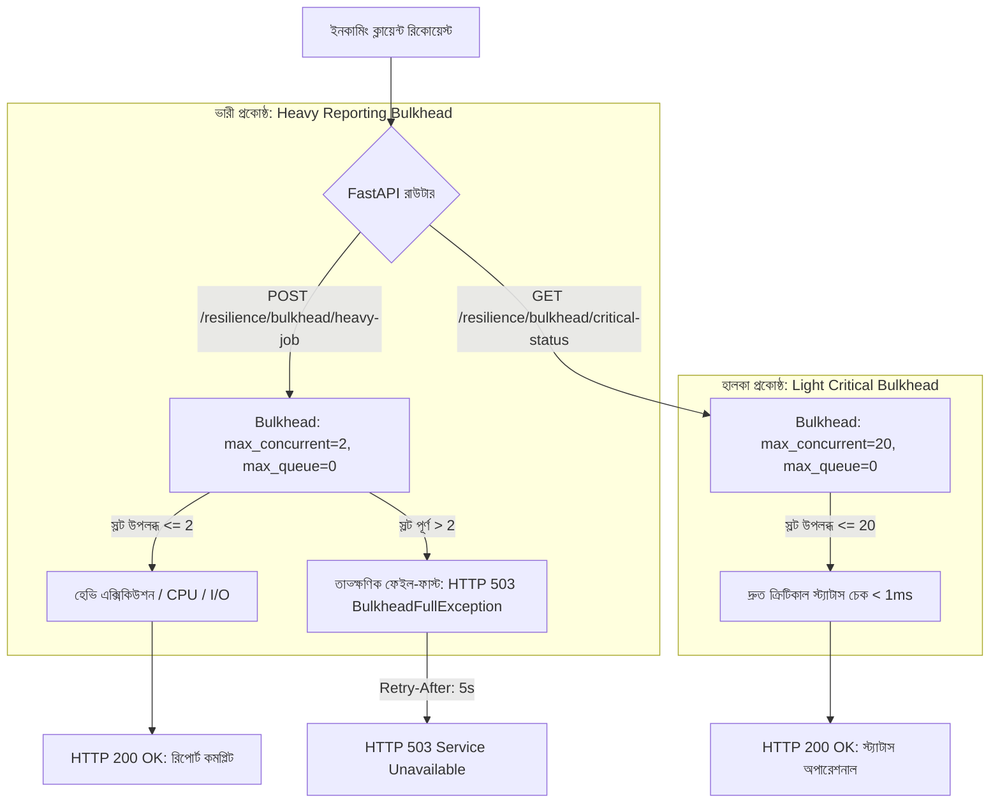

# ডে ৬২: বাল্কহেড আইসোলেশন প্যাটার্ন আর্কিটেকচার (রিসোর্স পার্টিশনিং ও কনকারেন্সি ক্ল্যাম্পিং)

## ১. ওভারভিউ ও মূল উদ্দেশ্য (Overview & Core Objectives)

ডিস্ট্রিবিউটেড ব্যাকএন্ড আর্কিটেকচারে যখন একটি ভারী বা ধীরগতির অপারেশন (যেমন: বিশাল PDF/CSV এক্সপোর্ট, ব্যাচ অ্যানালিটিক্স, আনবাউন্ডেড ডাটাবেস কোয়েরি) অতিরিক্ত ট্রাফিকের সম্মুখীন হয়, তখন তা সমস্ত সার্ভার থ্রেড, ইভেন্ট লুপ স্লট অথবা ডাটাবেস কানেকশন পুল দখল করে ফেলে। ফলে সিস্টেমের অন্যান্য অতি-গুরুত্বপূর্ণ ও দ্রুতগামী রিকোয়েস্ট (যেমন: অথেনটিকেশন চেক, পেমেন্ট ভেরিফিকেশন, হেলথ চেক) এক্সিকিউশন স্লট না পেয়ে টাইমআউট বা ক্র্যাশ করে। একে বলা হয় **ক্যাসকেডিং রিসোর্স স্টারভেশন (Cascading Resource Starvation)**।

আজকে **ডে ৬২**-তে আমরা মাইকেল নাইগার্ডের বিখ্যাত *Release It!* বইয়ের ক্যানোনিকাল স্পেসিফিকেশন অনুযায়ী **বাল্কহেড আইসোলেশন প্যাটার্ন (Bulkhead Isolation Pattern)** বাস্তবায়ন করেছি। জাহাজের নিচের অংশ যেমন কম্পার্টমেন্টে ভাগ করা থাকে যাতে একটি প্রকোষ্ঠ ফুটো হলে পুরো জাহাজ ডুবে না যায়, তেমনি আমাদের FastAPI অ্যাপ্লিকেশনের রিসোর্স ও কনকারেন্সিকে আমরা সুনির্দিষ্ট কম্পার্টমেন্টে বিভক্ত করেছি।

---

## ২. আর্কিটেকচারাল ডায়াগ্রাম ও থিওরি (Architecture & Theory)



### কেন সাধারণ আনবাউন্ডেড কনকারেন্সি বিপজ্জনক?
* ইভেন্ট লুপে যদি ১০০টি ভারী টাস্ক একসাথে `await` করা শুরু করে, তবে অপারেটিং সিস্টেম ও পাইথন রানটাইমে মেমরি প্রেশার এবং কনটেক্সট সুইচিং বৃদ্ধি পায়।
* ডাটাবেসের কানেকশন পুল (যেমন `pool_size=20`) যদি ভারী কোয়েরি দিয়ে পূর্ণ হয়ে যায়, তবে ইউজার লগইন বা পেমেন্ট কোয়েরি কানেকশন না পেয়ে আটকে যায়।
* বাল্কহেড পার্টিশনিংয়ের মাধ্যমে ভারী টাস্ককে মাত্র ২টি স্লটে বেঁধে রাখা হয়, বাকি ১৮টি বা ততোধিক স্লট ক্রিটিকাল বিজনেসের জন্য সম্পূর্ণ সুরক্ষিত থাকে।

---

## ৩. আমরা কী বানিয়েছি? (Mandatory Section 1)

আমরা প্রোডাকশন-গ্রেড রিসোর্স আইসোলেশন ইঞ্জিন তৈরি করেছি যার মূল উপাদানগুলো নিম্নরূপ:
1. **কোর বাল্কহেড ইঞ্জিন (`app/core/resilience/bulkhead.py`)**:
   - পাইথন `__slots__` অপ্টিমাইজড মেমরি-এফিশিয়েন্ট `Bulkhead` ক্লাস।
   - `asyncio.Semaphore` ব্যবহারের মাধ্যমে অ্যাসিঙ্ক্রোনাস কনকারেন্সি ক্ল্যাম্পিং।
   - লেজি-ইনিশিয়ালাইজড সেমাফোর (`_get_semaphore()`), যা রানটাইম ইভেন্ট লুপ বাইন্ডিং মিসম্যাচ দূর করে।
   - কনটেক্সট ম্যানেজার (`async with bulkhead:`), মেথড এক্সিকিউশন (`execute()`) এবং ফাংশন ডেকোরেটর (`@bulkhead.decorate`) ইন্টারফেস।
   - কনকারেন্সি সীমা অতিক্রান্ত হলে কোনো প্রকার ব্লকিং ছাড়াই $\mathcal{O}(1)$ সময়ে তাত্ক্ষণিক রিজেকশন।
2. **ডোমেইন এক্সেপশন ও প্রোটোকল হ্যান্ডলিং (`app/core/exceptions.py`)**:
   - `BulkheadFullException(ServiceUnavailableException)` ডোমেইন এরর।
   - এরর কোড `"BULKHEAD_CAPACITY_EXCEEDED"`, HTTP স্ট্যাটাস `503 Service Unavailable`।
   - স্ট্যান্ডার্ড `Retry-After: 5` রেসপন্স হেডার ইনজেকশন।
3. **মাল্টি-কম্পার্টমেন্ট সার্ভিস লেয়ার (`app/services/resilient_report_service.py`)**:
   - `ResilientReportService` যা দুটি স্বাধীন বাল্কহেড বজায় রাখে:
     - `heavy_bulkhead` (`max_concurrent=2`, `max_queue=0`): রিসোর্স-ইনটেনসিভ ব্যাচ রিপোর্টের জন্য।
     - `light_bulkhead` (`max_concurrent=20`, `max_queue=0`): হাই-প্রায়োরিটি ক্রিটিকাল হেলথ/কনফিগ কোয়েরির জন্য।
4. **এন্ডপয়েন্ট ও লাইভ টেলিমেট্রি (`app/routers/resilience_router.py`)**:
   - `POST /resilience/bulkhead/heavy-job`: কনকারেন্সি রেস্ট্রিক্টেড ভারী জব এক্সিকিউশন।
   - `GET /resilience/bulkhead/critical-status`: বিচ্ছিন্ন হাই-প্রায়োরিটি স্ট্যাটাস চেক।
   - `GET /metrics/bulkhead`: প্রতিটি কম্পার্টমেন্টের রিয়েল-টাইম স্লট, কিউ ও রিজেকশন মেট্রিক্স।

---

## ৪. ব্যবহৃত DSA ও রেজিলিয়েন্স প্যাটার্নের সুনির্দিষ্ট নাম (Mandatory Section 2)

| অ্যালগরিদম / ডেটা স্ট্রাকচার / প্যাটার্ন | প্রয়োগ ও ব্যবহারের ক্ষেত্র | টাইম কমপ্লেক্সিটি | স্পেস কমপ্লেক্সিটি |
| :--- | :--- | :--- | :--- |
| **Bulkhead Isolation Pattern** | সার্ভিস বা ওয়ার্কলোডের ধরন অনুযায়ী রিসোর্স পার্টিশনিং ও ক্যাপাসিটি কোটা নির্ধারণ | $\mathcal{O}(1)$ | $\mathcal{O}(1)$ |
| **Counting Semaphore (`asyncio.Semaphore`)** | সমসাময়িক এক্সিকিউশন স্লটের সংখ্যা গণনা ও স্লট অ্যাকোয়ার/রিলিজ নিয়ন্ত্রণ | $\mathcal{O}(1)$ | $\mathcal{O}(1)$ |
| **Bounded Queue (`asyncio.Queue` / স্লট বাফারিং)** | ট্র্যাফিক স্পাইকে অতিরিক্ত রিকোয়েস্ট নির্ধারিত সীমা পর্যন্ত ওয়েটিং স্টেটে রাখা | $\mathcal{O}(1)$ | $\mathcal{O}(k)$ ($k$ হলো কিউ সাইজ) |
| **Fail-Fast Rejection Engine** | সেমাফোর ও কিউ পূর্ণ হলে কোনো থ্রেড/লুপ ব্লক না করে সাথে সাথে রিজেক্ট করা | $\mathcal{O}(1)$ | $\mathcal{O}(1)$ |
| **Slotted Class (`__slots__`)** | অবজেক্টের `__dict__` ওভারহেড সম্পূর্ণ বর্জন করে আল্ট্রা-লাইট মেমরি ফুটপ্রিন্ট নিশ্চিতকরণ | $\mathcal{O}(1)$ | $\mathcal{O}(1)$ |
| **Atomic Slot Release (`try...finally`)** | টাস্ক সফল হোক বা এক্সেপশন ঘটুক, স্লট লিকেজ ১০০% রোধ করার গ্যারান্টি | $\mathcal{O}(1)$ | $\mathcal{O}(1)$ |

---

## ৫. প্রোডাকশনে ঠিক কখন ব্যবহার করব? (Mandatory Section 3)

### বাস্তব জীবনের ব্যবহারের ক্ষেত্রসমূহ (Production Scenarios):
1. **হেভি রিপোর্ট ও এক্সপোর্ট প্রসেসিং বনাম ইউজার ইন্টারঅ্যাকশন**:
   - যখন ব্যাকঅফিস ব্যবহারকারীরা বিশাল বড় ডেটা এক্সপোর্ট করতে থাকে, তখন পাবলিক ওয়েবসাইটের রেগুলার ইউজাররা যেন স্লো বা টাইমআউটের মুখে না পড়ে।
2. **তৃতীয় পক্ষের পেমেন্ট গেটওয়ে কোটা ম্যানেজমেন্ট**:
   - Stripe বা PayPal এপিআই যদি প্রতি সেকেন্ডে সর্বোচ্চ ২০টি কনকারেন্ট রিকোয়েস্ট অনুমোদন করে, তবে বাল্কহেড দিয়ে লোকাল স্লট ক্ল্যাম্প করে 429 Too Many Requests ও অ্যাকাউন্ট সাসপেনশন এড়ানো যায়।
3. **শেয়ার্ড ডাটাবেস কানেকশন পুল প্রটেকশন**:
   - জটিল অ্যানালিটিক্স কোয়েরি যাতে সমস্ত ডিবি কানেকশন দখল করে নরমাল ওএলটিপি (OLTP) রিড/রাইট বন্ধ না করে দেয়।
4. **মাইক্রোসার্ভিস ক্লায়েন্ট আইসোলেশন**:
   - একটি আনস্টেবল ডাউনস্ট্রিম সার্ভিসের জন্য রিকোয়েস্ট আটকে গিয়ে অন্য হেলদি ডাউনস্ট্রিম সার্ভিসের কল যাতে ব্লক না হয়।

### কখন ব্যবহার করব না?
- অতি দ্রুতগতির ইন-মেমরি অপারেশনের ক্ষেত্রে অতিরিক্ত সেমাফোর বাফারিং অপ্রয়োজনীয়।
- যেখানে সমস্ত রিকোয়েস্ট ব্যাকগ্রাউন্ড অ্যাসিঙ্ক ওয়ার্কারে অফলোড করা সম্ভব (Celery/ARQ), সেখানে বাল্কহেডের চেয়ে মেসেজ কিউ উপযুক্ত।

---

## ৬. কোড ইমপ্লিমেন্টেশন ও টেকনিক্যাল ডীপ-ডাইভ (Code Implementation & Deep Dive)

### ১. বাল্কহেড ক্লাস ও লেজি সেমাফোর আর্কিটেকচার
```python
class Bulkhead:
    __slots__ = (
        "name", "max_concurrent", "max_queue",
        "_active_count", "_waiting_count", "_rejections_count",
        "_total_successes", "_total_failures", "_semaphore",
    )

    def _get_semaphore(self) -> asyncio.Semaphore:
        """ইভেন্ট লুপ বাইন্ডিং এরর এড়াতে লেজি ইনিশিয়ালাইজেশন।"""
        if self._semaphore is None:
            self._semaphore = asyncio.Semaphore(self.max_concurrent)
        return self._semaphore
```

### ২. $\mathcal{O}(1)$ ফেইল-ফাস্ট কনটেক্সট ম্যানেজার
```python
async def __aenter__(self) -> Bulkhead:
    sem = self._get_semaphore()
    if self._active_count >= self.max_concurrent:
        if self._waiting_count >= self.max_queue:
            self._rejections_count += 1
            raise BulkheadFullException(
                compartment=self.name,
                message=f"Bulkhead capacity for compartment '{self.name}' exceeded.",
                retry_after=5,
            )
        self._waiting_count += 1
        try:
            await sem.acquire()
        finally:
            self._waiting_count -= 1
    else:
        await sem.acquire()

    self._active_count += 1
    return self
```

### ৩. গ্যারান্টেড স্লট রিলিজ ও লিকেজ প্রিভেনশন
```python
async def __aexit__(self, exc_type, exc_val, exc_tb) -> None:
    """টাস্কে ত্রুটি হলেও স্লট রিলিজ নিশ্চিত করা হয়।"""
    self._active_count -= 1
    sem = self._get_semaphore()
    sem.release()

    if exc_val is None:
        self._total_successes += 1
    else:
        self._total_failures += 1
```

---

## ৭. এক্সেপশন ও ফেইল-ফাস্ট স্ট্র্যাটেজি (Exceptions & Fail-Fast Strategy)

যখন কোনো কম্পার্টমেন্টের কনকারেন্সি সর্বোচ্চ সীমায় পৌঁছায়:
1. ইঞ্জিন কোনো অপেক্ষা না করে সাথে সাথে `BulkheadFullException` রেইজ করে।
2. এটি `ServiceUnavailableException`-এর সাবক্লাস হওয়ায় সেন্ট্রালাইজড এক্সেপশন হ্যান্ডলার এটিকে HTTP 503 স্ট্যাটাসে কনভার্ট করে।
3. ক্লায়েন্টকে সুস্পষ্ট নির্দেশনা দিতে রেসপন্সে `Retry-After: 5` হেডার সংযুক্ত করা হয়, যার মাধ্যমে ক্লায়েন্ট ৫ সেকেন্ড পর ট্রাই করতে পারে।

---

## ৮. টেস্ট ড্রাইভেন ভেরিফিকেশন (TDD Verification)

`tests/test_bulkhead_isolation.py`-তে ৮টি কঠোর টেস্ট কেস অন্তর্ভুক্ত করা হয়েছে:
1. `test_bulkhead_concurrency_clamping_strict_fail_fast`: ২টি স্লট পূর্ণ থাকা অবস্থায় ৩য় কলটি তৎক্ষণাৎ `BulkheadFullException` দেয়।
2. `test_bulkhead_slot_release_on_completion`: টাস্ক সফলভাবে শেষ হলে স্লট পুনরায় খালি হয়।
3. `test_bulkhead_slot_release_on_exception`: ভেতরের কোডে এক্সেপশন ঘটলেও `finally:` ব্লকে স্লট ১০০% রিলিজ হয়।
4. `test_bulkhead_cross_compartment_non_interference`: হেভি কম্পার্টমেন্ট সম্পূর্ণ স্যাচুরেটেড থাকলেও লাইট ক্রিটিকাল কম্পার্টমেন্ট মিলি-সেকেন্ডের মধ্যে রেসপন্স দেয়।
5. `test_bulkhead_max_queue_buffering`: বাউন্ডেড কিউ ধারণক্ষমতা সঠিকভাবে পরিচালনা করে।
6. `test_bulkhead_decorator_interface`: ডেকোরেটর সিনট্যাক্স সঠিকভাবে মেথড র‍্যাপ করে।
7. `test_bulkhead_metrics_and_reset`: লাইভ টেলিমেট্রি এবং স্টেট রিসেট যাচাইকরণ।
8. `test_http_bulkhead_heavy_job_and_rejection`: HTTP 503, `code: BULKHEAD_CAPACITY_EXCEEDED` এবং `Retry-After: 5` যাচাইকরণ।

---

## ৯. প্রোডাকশন রেজিলিয়েন্স চেকলিস্ট (Production Resilience Checklist)

- [x] **Zero Slot Leakage**: এক্সেপশন হলেও স্লট রিলিজ নিশ্চিত।
- [x] **O(1) Fail-Fast**: কিউ পূর্ণ হলে অপ্রয়োজনীয় থ্রেড ব্লকিং বন্ধ।
- [x] **Event Loop Independence**: লেজি ইনিশিয়ালাইজেশন থাকায় বিভিন্ন অ্যাসিঙ্ক টেস্ট লুপে কোনো ক্র্যাশ নেই।
- [x] **Standard HTTP Codes**: ডোমেইন এরর থেকে HTTP 503 ও Retry-After হেডার হ্যান্ডলিং।
- [x] **Live Observability**: `/metrics/bulkhead` এন্ডপয়েন্টে রিয়েল-টাইম কনকারেন্সি ও রিজেকশন মনিটরিং।

---

## ১০. সারসংক্ষেপ ও পরবর্তী দিনের প্রস্তুতি (Summary & Next Steps)

ডে ৬১-এর সার্কিট ব্রেকারের সাথে ডে ৬২-এর বাল্কহেড যুক্ত হয়ে আমাদের ব্যাকএন্ড এখন ক্যাটারিং ফেইলিউর ও রিসোর্স স্টারভেশন উভয় দিক থেকেই এন্টারপ্রাইজ-গ্রেড সুরক্ষিত।
পরবর্তী ডে ৬৩-তে আমরা **Rate Limiter & Traffic Shaping (Adaptive Throttling & Token Leaky Bucket Integration)** আর্কিটেকচারে অগ্রসর হব।
