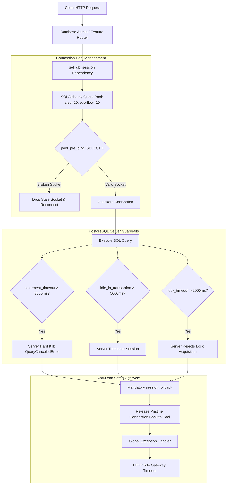

# ডে ৬৮: ডাটাবেস কানেকশন লাইফসাইকেল, স্টেটমেন্ট টাইমআউট এবং অ্যান্টি-লিক আর্কিটেকচার (Database Connection Lifecycle, Statement Timeouts & Anti-Leak Architecture)

---

## ১. আমরা কী বানিয়েছি? (What did we build?)
আজ ডে ৬৮-তে আমরা এন্টারপ্রাইজ-গ্রেড **ডাটাবেস কানেকশন লাইফসাইকেল, সার্ভার-সাইড স্টেটমেন্ট টাইমআউট এবং অ্যান্টি-লিক আর্কিটেকচার (Database Connection Lifecycle, Statement Timeouts & Anti-Leak Architecture)** তৈরি করেছি।

হাই-কনকারেন্সি প্রোডাকশন সিস্টেমে ডাটাবেসের সবচেয়ে বিপজ্জনক নীরব ঘাতক হলো **কানেকশন পুল স্টারভেশন (Connection Pool Starvation)** এবং **আইডল ট্রানজ্যাকশন লিক (Idle-in-Transaction Leak)**। যদি কোনো জটিল কুয়েরি কোনো টাইমআউট ছাড়া চলতে থাকে, অথবা কোনো ত্রুটির কারণে ট্রানজ্যাকশন রোলব্যাক না হয়ে কানেকশন ঝুলন্ত অবস্থায় থেকে যায়, তবে অল্প সময়ের মধ্যেই ডাটাবেসের সমস্ত কানেকশন শেষ হয়ে যায়। এরপর নতুন যেকোনো রিকোয়েস্ট কানেকশন না পেয়ে আটকে থাকে, সার্ভারের মেমোরি ও থ্রেড শেষ হয়ে যায় এবং পুরো ব্যাকএন্ড সিস্টেম ক্র্যাশ করে।

এই বিপর্যয় স্থায়ীভাবে নির্মূল করতে আমরা নিচের উপাদানগুলো বাস্তবায়ন করেছি:
1. **সার্ভার-সাইড টাইমআউট কনফিগারেশন (`app/core/database.py`, `app/core/config.py`)**:
   - `statement_timeout = 3000ms (৩ সেকেন্ড)`: ডাটাবেস লেভেলে কোনো কুয়েরি ৩ সেকেন্ডের বেশি সময় নিলে ডাটাবেস স্বয়ংক্রিয়ভাবে সেই কুয়েরি কিল (`QueryCanceledError`) করে দেয়।
   - `idle_in_transaction_session_timeout = 5000ms (৫ সেকেন্ড)`: কোনো কানেকশন যদি ট্রানজ্যাকশন ওপেন রেখে ৫ সেকেন্ডের বেশি অলস বসে থাকে, তবে ডাটাবেস সেই সেশন ফোর্সফুলি বন্ধ করে দেয়।
   - `lock_timeout = 2000ms (২ সেকেন্ড)`: টেবিল বা রো লক পাওয়ার জন্য ২ সেকেন্ডের বেশি অপেক্ষা করতে হলে ডেডলক প্রতিরোধে রিকোয়েস্ট তৎক্ষণাৎ রিজেক্ট হয়।
2. **কানেকশন পুল হার্ডেনিং ও লাইফসাইকেল গার্ড**:
   - `pool_size = 20`, `max_overflow = 10`: পিক আওয়ার ট্রাফিকের জন্য অপ্টিমাইজড ধারণক্ষমতা।
   - `pool_timeout = 5.0s`: পুলের সব কানেকশন ব্যস্ত থাকলে ৫ সেকেন্ডের বেশি রিকোয়েস্ট হ্যাং হয়ে থাকবে না।
   - `pool_recycle = 1800s (৩০ মিনিট)`: ৩০ মিনিট পর পর পুরনো সকেট প্রঅ্যাক্টিভলি রিসাইকেল করে ফায়ারওয়াল ড্রপ প্রতিরোধ করা।
   - `pool_pre_ping = True`: পুলে থাকা কানেকশন ক্লায়েন্টকে দেওয়ার আগে স্বয়ংক্রিয়ভাবে পিং (`SELECT 1`) করে যাচাই করা, যাতে ব্রোকেন সকেটের কারণে এরর না আসে।
3. **ডোমেন এক্সেপশন ও স্ট্যান্ডার্ড এইচটিটিপি ম্যাপিং (`app/core/exceptions.py`, `app/core/exception_handlers.py`)**:
   - `DatabaseQueryTimeoutException`: স্টেটমেন্ট টাইমআউট ট্রিগার হলে সিস্টেম **HTTP 504 Gateway Timeout** পাঠায়।
   - `ConnectionPoolExhaustedException`: পুল স্যাচুরেটেড হলে ক্লায়েন্টকে **HTTP 503 Service Unavailable** সহ `Retry-After: 5` হেডার পাঠানো হয়।
4. **ডাটাবেস অ্যাডমিন সার্ভিস ও কুয়েরি রিপার (`DatabaseAdminService` in `app/services/database_admin_service.py`)**:
   - রিয়েল-টাইম কানেকশন পুল মেট্রিক্স এক্সট্রাকশন।
   - টাইমআউট এনফোর্সমেন্ট এবং ক্যান্সেলেশনের পর বাধ্যতামূলক ট্রানজ্যাকশন রোলব্যাক (`session.rollback()`) নিশ্চিত করে কানেকশনকে আবার সুস্থ অবস্থায় পুলে ফেরত দেওয়া।
   - হ্যাংগিং কুয়েরি সিমুলেশন (`pg_sleep` সাপোর্ট সহ)।
   - দীর্ঘস্থায়ী অলস বা হ্যাংগিং কুয়েরি দূর করতে অ্যাডমিনিস্ট্রেটিভ রিপার (`pg_terminate_backend`)।
5. **টেলিম্যাট্রি ও ডায়াগনস্টিকস এন্ডপয়েন্ট (`app/routers/database_admin_router.py`)**:
   - `GET /database/pool/metrics`: কানেকশন পুলের লাইভ অবস্থা পর্যবেক্ষণ।
   - `POST /database/diagnostics/simulate-hanging-query`: স্লো কুয়েরি সিমুলেট করে টাইমআউট যাচাই।
   - `POST /database/diagnostics/kill-hanging`: অ্যাডমিন দ্বারা ম্যানুয়ালি হ্যাংগিং সেশন ক্লিনআপ।

---

## ২. 📌 ব্যবহৃত DSA ও ডাটাবেস অপ্টিমাইজেশন প্যাটার্নের নাম:
* **কানেকশন পুল লাইফসাইকেল ও অ্যান্টি-লিক আর্কিটেকচার (Connection Pool Lifecycle & Resource Reclamation Architecture)**
* **সার্ভার-সাইড টাইমআউট এনফোর্সমেন্ট (Server-Side Statement, Lock & Idle-in-Transaction Timeouts)**
* **পেসিমিস্টিক প্রি-পিং কানেকশন ভ্যালিডেশন (Pessimistic Pre-Ping Connection Health Check)**
* **ব্যাকঅফ ও রিট্রাই-আফটার থ্রটলিং (HTTP 503 Circuit Throttling with Retry-After Header)**

---

## ৩. 🚀 প্রোডাকশনে ঠিক কখন ব্যবহার করব? (When to use in Production):
* **হাই-কনকারেন্সি পেমেন্ট ও অর্ডার প্রসেসিং সিস্টেম:** যেখানে হাজার হাজার ইউজার একসাথে অর্ডার প্লেস করে এবং টেবিল লক তৈরি হতে পারে।
* **মাইক্রোসার্ভিস ও ক্লাউড ডেপ্লয়মেন্ট:** যেখানে ক্লাউড ফায়ারওয়াল (যেমন AWS NAT Gateway বা Azure Load Balancer) নিষ্ক্রিয় টিসিপি কানেকশন নিঃশব্দে কেটে দেয় (`pool_pre_ping` এবং `pool_recycle` এখানে অপরিহার্য)।
* **থার্ড-পার্টি এপিআই কল বা আনবাউন্ডেড কুয়েরি:** যেখানে ডাটাবেস কুয়েরি কোনো কারণে হ্যাং করলে পুরো ওয়েব সার্ভার অকেজো হয়ে পড়া থেকে রক্ষা করতে।
* **ডাটাবেস মাইগ্রেশন ও ভারী রিপোর্টিং কুয়েরি:** ব্যাকগ্রাউন্ড ব্যাচ জব যাতে প্রোডাকশন ট্রানজ্যাকশনাল পুলকে দখল করে সিস্টেম ক্র্যাশ না করায়।

---

## ৪. 🎯 কী কারণে বা কোন পরিস্থিতিতে ব্যবহার করব? (Why to use / Technical Triggers):
* **কানেকশন পুল স্টারভেশন ধ্বংস করা:** কোনো কুয়েরি যেন অনন্তকাল ধরে কানেকশন আটকে রাখতে না পারে। ৩ সেকেন্ড পার হলেই স্বয়ংক্রিয়ভাবে কুয়েরি কিল হবে।
* **ফ্যান্টম ডেডলক ও হ্যাংগিং ট্রানজ্যাকশন রোধ:** ট্রানজ্যাকশন শুরু করে কোড যদি এক্সেপশনের কারণে আনহ্যান্ডেল্ড থাকে, তবে ৫ সেকেন্ড পর ডাটাবেস নিজে থেকেই সেশন কিল করে টেবিল লক মুক্ত করবে।
* **কানেকশন লিক প্রতিরোধ (Zero Socket Leak Guarantee):** কুয়েরি ফেইল বা ক্যানসেল হলেও বাধ্যতামূলকভাবে `await session.rollback()` কল করে সকেটকে সুস্থ অবস্থায় পুলে ফেরত পাঠানো।
* **ক্যাসকেডিং ফেইলিউর প্রতিরোধ:** পুলের সীমা শেষ হয়ে গেলে ক্লায়েন্টকে অনন্তকাল ঝুলিয়ে না রেখে অবিলম্বে `HTTP 503` এবং `Retry-After: 5` দিয়ে ফেরত পাঠানো।

---

## ৫. বাস্তব জীবনের গল্প ও উপমা: ব্যস্ত রেস্তোরাঁর ডাইনিং টেবিল ও কিচেন টাইমারের উপমা

কল্পনা করুন একটি অত্যন্ত জনপ্রিয় শহরের ব্যস্ত রেস্তোরাঁ। রেস্তোরাঁয় বসার জন্য **২০টি টেবিল** আছে (এটি হলো আমাদের `pool_size = 20`)। বাইরে আরো ১০ জন অতিরিক্ত গ্রাহকের জন্য অস্থায়ী বসার স্টুল আছে (`max_overflow = 10`)।

### ১. টাইমআউট ছাড়া অরক্ষিত রেস্তোরাঁ (The Unbounded Disaster):
একজন গ্রাহক এসে একটি টেবিল দখল করলেন এবং অর্ডার দেওয়ার পর ঘুমিয়ে পড়লেন কিংবা ওয়েটারের সাথে ঝগড়া শুরু করলেন। রেস্তোরাঁর কোনো নিয়ম নেই যে কতক্ষণ বসা যাবে। 
ফলাফল কী? ধীরে ধীরে ২০টি টেবিলই এমন কিছু গ্রাহক দখল করে বসে রইল যারা কোনো খাবার অর্ডার করছে না, বিলও মেটাচ্ছে না। বাইরে শত শত নতুন ক্ষুধার্ত গ্রাহক এসে লাইনে দাঁড়িয়ে আছে। পুরো রেস্তোরাঁর ব্যবসা অচল হয়ে গেল! এটিই হলো **Connection Pool Starvation Outage**।

### ২. গার্ডযুক্ত এন্টারপ্রাইজ রেস্তোরাঁ (The Hardened Architecture):
রেস্তোরাঁর ম্যানেজার ৩টি কঠোর স্মার্ট টাইমার চালু করলেন:
1. **অর্ডার প্রস্তুতের টাইমার (`statement_timeout = 3s`):** কিচেনে কোনো স্পেশাল খাবারের অর্ডার ৩ মিনিটের বেশি সময় নিলে শেফ সাথে সাথে সেই অর্ডার ক্যানসেল করে গ্রাহককে ক্ষমা চেয়ে অন্য খাবার নিতে বলবে। কোনো অর্ডার কিচেনকে অনির্দিষ্টকাল জ্যাম রাখতে পারবে না।
2. **অলস বসে থাকার টাইমার (`idle_in_transaction_timeout = 5s`):** খাবার টেবিলে দেওয়ার পর ৫ মিনিট গ্রাহক যদি খাবার না খেয়ে বা বিল না দিয়ে টেবিলে অলস বসে থাকে, বাউন্সার এসে বিনয়ের সাথে টেবিল খালি করে দেবে যাতে অন্য কাস্টমার বসতে পারে!
3. **টেবিল পূর্ণ হলে স্পষ্ট নির্দেশ (`HTTP 503 + Retry-After: 5`):** যখন সব টেবিল এবং অস্থায়ী স্টুল পুরোপুরি ভর্তি, তখন নতুন কাউকে গেটে ঘণ্টার পর ঘণ্টা রোদে দাঁড় করিয়ে রাখা হয় না; সিকিউরিটি সরাসরি একটি টোকেন দিয়ে বলে—*"দয়া করে ৫ মিনিট পর আবার আসুন, তখন টেবিল খালি পাবেন।"*

---

## ৬. গাণিতিক বিশ্লেষণ ও টাইম/স্পেস কমপ্লেক্সিটি

### কানেকশন পুল স্যাচুরেশন ও লিটলস ল (Little's Law Analysis):
লিটলস ল অনুযায়ী সিস্টেমে সমসাময়িক কনকারেন্ট কানেকশনের সংখ্যা $L$:
$$L = \lambda \times W$$
যেখানে:
- $\lambda$ = প্রতি সেকেন্ডে রিকোয়েস্টের আগমন হার (Arrival Rate in req/sec)
- $W$ = প্রতিটি ডাটাবেস কুয়েরি সম্পন্নের গড় সময় (Average Query Execution Time in seconds)

যদি সিস্টেমে $\lambda = 100\text{ req/sec}$ হয় এবং কোনো স্লো কুয়েরির কারণে $W$ বেড়ে $10\text{ms}$ থেকে $5\text{s}$ হয়ে যায়:
$$L = 100 \times 5 = 500\text{ simultaneous connections required!}$$
যেখানে আমাদের পুল সাইজ মাত্র $20 + 10 = 30$। মাত্র ০.৩ সেকেন্ডের মধ্যে কানেকশন পুল পুরোপুরি ড্রাই আউট হয়ে যাবে এবং সার্ভিস ডাউন হয়ে যাবে।
কিন্তু `statement_timeout = 3.0s` এবং `pool_timeout = 5.0s` নিশ্চিত করায় কোনো অবস্থাতেই থ্রেডগুলো অনির্দিষ্টকাল আটকে থাকবে না।

### টাইম ও স্পেস কমপ্লেক্সিটি:
- **কানেকশন লিজ ও রিটার্ন:** $\mathcal{O}(1)$ টাইম। পুলের ভেতরে ফ্রি কানেকশন কিউ বা স্ট্যাক থেকে তাৎক্ষণিক পপ এবং পুশ হয়।
- **প্রি-পিং ওভারহেড:** $\mathcal{O}(1)$ অতিরিক্ত পিং ওভারহেড ($\approx 0.1\text{ms}$), যা ব্রোকেন কানেকশন এক্সেপশন চিরতরে দূর করে।
- **মেমোরি ও সকেট ফুটপ্রিন্ট:** নির্দিষ্ট $\mathcal{O}(\text{pool\_size} + \text{max\_overflow})$ স্পেসের মধ্যে কঠোরভাবে সীমাবদ্ধ। কোনো মেমোরি লিক বা লিকড ফাইল ডেসক্রিপ্টর তৈরি হতে পারে না।

---

## ৭. আর্কিটেকচার ডায়াগ্রাম

---

## ৮. কেন এই আর্কিটেকচারাল ডিজাইন বেছে নিলাম? (Architectural Decisions & Trade-offs)

1. **সার্ভার-সাইড টাইমআউট বনাম ক্লায়েন্ট-সাইড `asyncio.wait_for`:**
   - *ট্রেড-অফ:* শুধুমাত্র পাইথনে `asyncio.wait_for` দিলে পাইথন করুটিন ক্যানসেল হলেও ডাটাবেসের ভেতরের প্রসেসটি ব্যাকগ্রাউন্ডে চলতেই থাকে এবং সিপিইউ অপচয় করে।
   - *সিদ্ধান্ত:* আমরা PostgreSQL এর নেটিভ `statement_timeout` সার্ভার সেটিংস কনফিগার করেছি, যাতে খোদ ডাটাবেস ইঞ্জিন কুয়েরিটিকে কিল করে এবং সিপিইউ বাঁচায়। পাশাপাশি পাইথন লেভেলেও ডিফেনসিভ গার্ড হিসেবে `asyncio.wait_for` রাখা হয়েছে।
2. **বাধ্যতামূলক রোলব্যাক (`session.rollback()`):**
   - *ট্রেড-অফ:* যখন কোনো কুয়েরি টাইমআউটের কারণে ক্যানসেল হয়, তখন সেই কানেকশনের ট্রানজ্যাকশন ইনভ্যালিড অবস্থায় থাকে। যদি রোলব্যাক না করে কানেকশন পুলে ফেরত পাঠানো হয়, তবে পরবর্তী ইউজার সেই কানেকশন ব্যবহার করলেই `InternalError: current transaction is aborted` পাবে (কানেকশন পয়জনিং)।
   - *সিদ্ধান্ত:* আমরা নিশ্চিত করেছি যে ক্যান্সেলেশন বা টাইমআউট হওয়ামাত্র স্বয়ংক্রিয়ভাবে `await session.rollback()` রান হবে, যা সকেটকে সম্পূর্ণ নিষ্কলুষ করে পুলে ফিরিয়ে দেয়।
3. **পুল একজশন রেসপন্স (HTTP 503 + `Retry-After: 5`):**
   - *ট্রেড-অফ:* পুল ফাঁকা না থাকলে রিকোয়েস্টগুলোকে কিউতে অনির্দিষ্টকাল আটকে রাখলে ক্লায়েন্টের ব্রাউজার বা মোবাইল অ্যাপ ফ্রিজ হয়ে থাকে।
   - *সিদ্ধান্ত:* ৫ সেকেন্ড অপেক্ষার পর অবিলম্বে `HTTP 503` ফেরত দেওয়া হয় এবং স্ট্যান্ডার্ড `Retry-After` হেডারের মাধ্যমে ক্লায়েন্টকে জানানো হয় যে ঠিক কখন পুনরায় চেষ্টা করা নিরাপদ।

---

## ৯. সোর্স কোড ও গুরুত্বপূর্ণ ফাইলসমূহ (Source Code Mapping)

| ফাইলের পথ | দায়িত্ব ও বাস্তবায়িত লজিক |
| :--- | :--- |
| [`app/core/config.py`](file:///e:/FastApi1/app/core/config.py) | পুল সাইজ ও টাইমআউট কনফিগারেশন সেটিংস (`db_statement_timeout_ms`, `db_idle_in_transaction_timeout_ms`, `db_lock_timeout_ms`, `db_pool_timeout`, `db_pool_recycle`)। |
| [`app/core/database.py`](file:///e:/FastApi1/app/core/database.py) | ডাটাবেস ইঞ্জিন তৈরি, PostgreSQL `server_settings`, SQLite প্রি-পিং, কানেকশন ইভেন্ট ও ফাংশন রেজিস্ট্রি। |
| [`app/core/exceptions.py`](file:///e:/FastApi1/app/core/exceptions.py) | ডিকাপল্ড ডোমেন এক্সেপশন: `DatabaseQueryTimeoutException` (504) এবং `ConnectionPoolExhaustedException` (503)। |
| [`app/core/exception_handlers.py`](file:///e:/FastApi1/app/core/exception_handlers.py) | গ্লোবাল এক্সেপশন হ্যান্ডলার যা ডোমেন এক্সেপশনকে `ErrorResponse` এবং `Retry-After` হেডারে রূপান্তর করে। |
| [`app/schemas/database_admin.py`](file:///e:/FastApi1/app/schemas/database_admin.py) | কানেকশন পুল মেট্রিক্স এবং স্লো কুয়েরি সিমুলেশনের পিড্যান্টিক স্কিমা। |
| [`app/services/database_admin_service.py`](file:///e:/FastApi1/app/services/database_admin_service.py) | কুয়েরি এক্সিকিউশন টাইমআউট এনফোর্সমেন্ট, অ্যান্টি-লিক রোলব্যাক, মেট্রিক্স ক্যালকুলেশন এবং হ্যাংগিং কুয়েরি রিপার। |
| [`app/routers/database_admin_router.py`](file:///e:/FastApi1/app/routers/database_admin_router.py) | ডাটাবেস অ্যাডমিন এপিআই রুট: `GET /database/pool/metrics`, `POST /database/diagnostics/simulate-hanging-query`, `POST /database/diagnostics/kill-hanging`। |
| [`tests/test_database_timeouts.py`](file:///e:/FastApi1/tests/test_database_timeouts.py) | ৯টি স্বয়ংক্রিয় টেস্ট কেস যা স্টেটমেন্ট টাইমআউট, ক্যান্সেলেশন রিকভারি, পুল এক্সজশন এবং এন্ডপয়েন্ট ডায়াগনস্টিকস নিশ্চিত করে। |

---

## ১০. টেস্টিং ও ভেরিফিকেশন (Verification & Automated Test Suite)

আমরা `tests/test_database_timeouts.py` ফাইলে ৯টি টেস্ট কেস তৈরি করেছি এবং শতভাগ সফলভাবে পাস করিয়েছি:
1. `test_statement_timeout_cancels_and_raises_exception`: নির্ধারিত সময়ের বেশি চলা কুয়েরি সফলভাবে বাতিল হয় এবং `DatabaseQueryTimeoutException` ছুড়ে দেয়।
2. `test_connection_healthy_after_timeout_cancellation`: কুয়েরি ক্যানসেল হয়ে রোলব্যাক হওয়ার পর সেই একই সেশনে পরবর্তী কুয়েরি (`SELECT 1`) কোনো ত্রুটি ছাড়াই সুস্থভাবে চলে।
3. `test_pool_pre_ping_and_timeout_configurations`: প্রোডাকশন কনফিগারেশনের মানগুলো অপরিবর্তনীয়ভাবে যাচাই করা হয়।
4. `test_pool_exhaustion_maps_to_503_and_retry_after`: পুল স্যাচুরেশন সফলভাবে `HTTP 503` এবং `Retry-After: 5` হেডারে অনূদিত হয়।
5. `test_simulated_pool_saturation_timeout`: কনকারেন্ট কানেকশন শেষ হয়ে গেলে পুল টাইমআউট এরর ধরা পড়ে।
6. `test_get_database_pool_metrics_endpoint`: `GET /database/pool/metrics` থেকে রিয়েল-টাইম কানেকশন মেট্রিক্স পাওয়া যায়।
7. `test_simulate_hanging_query_fast_success`: দ্রুতগতির সিমুলেটেড কুয়েরি `HTTP 200 OK` রিটার্ন করে।
8. `test_simulate_hanging_query_timeout_returns_504`: স্লো কুয়েরি স্টেটমেন্ট টাইমআউট অতিক্রম করে `HTTP 504 Gateway Timeout` রিটার্ন করে।
9. `test_kill_hanging_queries_endpoint`: হ্যাংগিং কুয়েরি রিপার নিরাপদভাবে রান করে।
