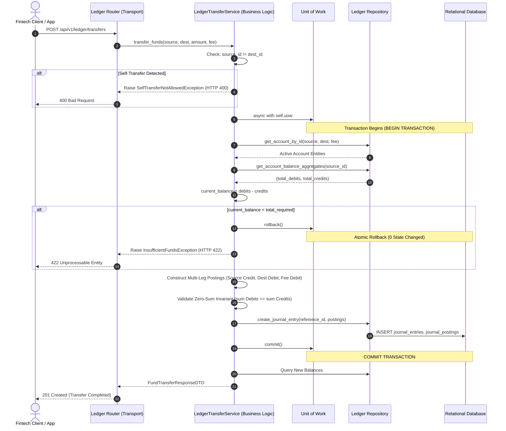

# ডে ৮৪: ফিনটেক অ্যাটমিক মানি ট্রান্সফার আর্কিটেকচার (ACID আইসোলেশন, মাল্টি-লেগ লেজার পোস্টিংস এবং নন-নেগেটিভ ব্যালেন্স ইনভেরিয়েন্ট)

## ১. ভূমিকা ও উদ্দেশ্য (Objective & Overview)
আজকের ক্লাসে আমরা তৈরি করলাম এন্টারপ্রাইজ গ্রেড **ফিনটেক অ্যাটমিক মানি ট্রান্সফার আর্কিটেকচার (Fintech Atomic Money Transfer Architecture)**। 
একটি মিশন-ক্রিটিক্যাল ফিনটেক সিস্টেমে (যেমন bKash, Nagad, Stripe, Wise) দুই বা ততোধিক অ্যাকাউন্টের মধ্যে অর্থ স্থানান্তর কেবল একটি সহজ ডেটাবেজ আপডেট নয়। এতে জড়িয়ে থাকে অ্যাসিড (ACID) ট্রানজ্যাকশন আইসোলেশন, মাল্টি-লেগ লেজার পোস্টিং, ফান্ড সংরক্ষণ নীতি (Conservation of Money), এবং কড়া প্রি-ট্রান্সফার নন-নেগেটিভ ব্যালেন্স গার্ড।

আজকের মূল শিক্ষণীয় লক্ষ্য:
1. **Unit of Work (UoW) প্যাটার্নের মাধ্যমে ACID ট্রানজ্যাকশনাল গ্যারান্টি**: একাধিক পোস্টিং লেগ ও জার্নাল এন্ট্রিকে একটি একক পারমাণবিক (atomic) ট্রানজ্যাকশনে আবদ্ধ করা। যেকোনো একটি ধাপে সমস্যা হলে স্বয়ংক্রিয় সম্পূর্ণ রোলব্যাক (Rollback)।
2. **Strict Non-Negative Balance Guard**: ট্রান্সফার শুরুর পূর্বেই রিয়েল-টাইম ক্লিয়ার্ড ব্যালেন্স ভ্যালিডেট করা। ব্যালেন্স অপর্যাপ্ত হলে `InsufficientFundsException` (HTTP 422) ছুড়ে দিয়ে শূন্য স্টেট পরিবর্তন নিশ্চিত করা।
3. **Compound Multi-Leg Transfers (P2P + Platform Fee)**: সাধারণ P2P স্থানান্তরের পাশাপাশি প্ল্যাটফর্ম প্রসেসিং ফি বাবদ অতিরিক্ত পোস্টিং লেগ হ্যান্ডেল করা।
4. **Self-Transfer & Duplicate Replay Protection**: একই অ্যাকাউন্টে ট্রান্সফার নিষিদ্ধ করা (`SelfTransferNotAllowedException`, HTTP 400) এবং রেফারেন্স আইডির মাধ্যমে ডুপ্লিকেট রি-প্লে প্রতিরোধ করা (`DuplicateReferenceException`, HTTP 409)।
5. **Clean Architecture Rules 1–5 Compliance**: রাউটারে ০ মডেল ইমপোর্ট, সার্ভিসে ০ ট্রান্সপোর্ট ইমপোর্ট এবং প্রোটোকল ভিত্তিক ডিপেন্ডেন্সি ইনভার্সন বজায় রাখা।

---

## ২. 📌 বাস্তব জীবনের ব্যাংকিং/ফিনটেক এনালজি (Real-World Analogy)

ধরা যাক, **সাদিক** তার ওয়ালেট থেকে **আবির**-কে ১,০০০ টাকা পাঠাতে চান। প্ল্যাটফর্মের ট্রান্সফার ফি ৫ টাকা।
মোট প্রয়োজনীয় অর্থ = $১০০০ + ৫ = ১০০৫$ টাকা।

যদি একটি সাধারণ বা অপেশাদার সিস্টেমে এটি করা হয়:
```python
# অপেশাদার মারাত্মক ভুল (Dangerous Anti-Pattern)
db.execute("UPDATE accounts SET balance = balance - 1005 WHERE id = ?", [sadiq_id])
# 💥 ঠিক এই মুহূর্তে ডাটাবেজ ক্র্যাশ করল বা নেটওয়ার্ক বিচ্ছিন্ন হলো!
db.execute("UPDATE accounts SET balance = balance + 1000 WHERE id = ?", [abir_id])
db.execute("UPDATE accounts SET balance = balance + 5 WHERE id = ?", [platform_fee_id])
```
এখানে সাদিকের অ্যাকাউন্ট থেকে ১০০৫ টাকা কেটে নেওয়া হয়েছে, কিন্তু আবির বা প্ল্যাটফর্ম কেউ টাকা পায়নি! টাকাগুলো ডিজিটাল মহাশূন্যে গায়েব হয়ে গেল।

### ফিনটেক লেজার সমাধান:
আমাদের আজকের অ্যাটমিক ট্রান্সফার সার্ভিসে:
1. **প্রি-ফ্লাইট চেক**: সাদিকের ক্লিয়ার্ড ব্যালেন্স কি ১০০৫ টাকার বেশি বা সমান? যদি না হয়, সাথে সাথে লেনদেন বাতিল।
2. **পোস্টিং গঠন (Multi-Leg Journal Entry)**:
   - সাদিকের ওয়ালেট (ASSET হ্রাস): ক্রেডিট ১০০৫ টাকা
   - আবিরের ওয়ালেট (ASSET বৃদ্ধি): ডেবিট ১০০০ টাকা
   - প্ল্যাটফর্ম ফি অ্যাকাউন্ট (ASSET বৃদ্ধি): ডেবিট ৫ টাকা
3. **জিরো-সাম ব্যালেন্স ইনভেরিয়েন্ট**:
   $$\sum \text{Debits} (1000 + 5) = 1005.0000 = \sum \text{Credits} (1005.0000)$$
4. **অ্যাটমিক কমিট**: `async with self.uow:` ব্লকের মধ্যে সম্পূর্ণ লেনদেনটি একটি সিঙ্গেল ডেটাবেজ ট্রানজ্যাকশনে রেকর্ড হয়। সামান্যতম ব্যর্থতা ঘটলেও কোনো ডেটা পরিবর্তন হয় না।

---

## ৩. আমরা কী বানিয়েছি? (What We Built)

আমরা তৈরি করেছি সম্পূর্ণ প্রোডাকশন-রেডি, টাইপ-সেফ এবং ক্লিন আর্কিটেকচার অনুসরণকারী ফিনটেক ট্রান্সফার সাব-সিস্টেম:

1. **ডোমেন এক্সেপশন ও হ্যান্ডলার (`app/core/exceptions.py`, `app/core/exception_handlers.py`)**:
   - `InsufficientFundsException`: ব্যালেন্স অপর্যাপ্ত হলে অ্যাকাউন্ট আইডি, বর্তমান ব্যালেন্স ও প্রয়োজনীয় অ্যামাউন্ট সহ তথ্যবহুল এরর মেসেজ এবং HTTP 422 স্ট্যাটাস কোড প্রদান করে।
   - `SelfTransferNotAllowedException`: সোর্স ও ডেস্টিনেশন একই অ্যাকাউন্ট হলে HTTP 400 স্ট্যাটাস কোড প্রদান করে।

2. **ডোমেন ডেটা ট্রান্সফার অবজেক্ট (`app/schemas/ledger.py`)**:
   - `FundTransferRequestDTO`: সোর্স অ্যাকাউন্ট, ডেস্টিনেশন অ্যাকাউন্ট, ট্রান্সফার অ্যামাউন্ট, প্ল্যাটফর্ম ফি, ফি অ্যাকাউন্ট, ইউনিক রেফারেন্স আইডি এবং ডেসক্রিপশন ধারণ করে।
   - `FundTransferResponseDTO`: সফল ট্রানজ্যাকশনের জার্নাল এন্ট্রি আইডি, রেফারেন্স আইডি, সোর্স ও ডেস্টিনেশনের রিয়েল-টাইম নতুন ব্যালেন্স এবং টাইমস্ট্যাম্প রিটার্ন করে।

3. **ইউনিট অব ওয়ার্ক ইন্টিগ্রেশন (`app/core/unit_of_work.py`)**:
   - `UnitOfWorkProtocol`-এ `ledger: LedgerRepositoryProtocol` প্রোপার্টি যুক্ত করা হয়েছে।
   - `SqlAlchemyUnitOfWork`: একই `AsyncSession` ব্যবহার করে পোস্টিং ও জার্নাল এন্ট্রি ট্রানজ্যাকশন ম্যানেজ করে।
   - `InMemoryUnitOfWork`: রোলব্যাক কল হলে পূর্ববর্তী স্টেট স্ন্যাপশটে রোলব্যাক করার মেকানিজম যুক্ত করা হয়েছে।

4. **অ্যাটমিক ট্রান্সফার ইঞ্জিন (`app/services/ledger_transfer_service.py`)**:
   - `LedgerTransferService`: সমস্ত বিজনেস রুলস ও ভ্যালিডেশন সমন্বয় করে পারমাণবিক লেনদেন সম্পাদন করে।

5. **এইচটিটিপি রাউটার (`app/routers/ledger_router.py`)**:
   - `POST /api/v1/ledger/transfers`: RESTful ট্রান্সফার এন্ডপয়েন্ট (HTTP 201 Created)।

---

## ৪. ব্যবহৃত DSA ও ফিনটেক ট্রানজ্যাকশন প্যাটার্ন

### ৪.১ প্রি-ট্রান্সফার ব্যালেন্স গার্ড ও টাইম কমপ্লেক্সিটি ($\mathcal{O}(1)$)
অ্যাকাউন্টের পূর্ববর্তী সকল ডেবিট ও ক্রেডিটের যোগফল ডেটাবেজে অপ্টিমাইজড বি-ট্রি ইনডেক্স (`account_id`) ব্যবহার করে সিঙ্গেল পাস অ্যাগ্রিগেশনের মাধ্যমে $\mathcal{O}(1)$ নেটওয়ার্ক রাউন্ড-ট্রিপে নির্ণয় করা হয়:
$$\text{Cleared Balance} = \begin{cases} 
\sum \text{Debits} - \sum \text{Credits} & \text{যদি ASSET / EXPENSE} \\ 
\sum \text{Credits} - \sum \text{Debits} & \text{যদি LIABILITY / REVENUE / EQUITY} 
\end{cases}$$
যদি $\text{Cleared Balance} < \text{amount} + \text{fee\_amount}$ হয়, তবে কোনো পোস্টিং তৈরি না করেই $\mathcal{O}(1)$ সময়ে এক্সেপশন রেইজ করা হয়।

### ৪.২ ব্যালেন্সড মাল্টি-লেগ পোস্টিং কনস্ট্রাকশন ($\mathcal{O}(k)$)
এখানে $k$ হলো পোস্টিং লেগের সংখ্যা (সাধারণত ২ বা ৩)। 
- সাধারণ P2P-তে $k=2$।
- ফি ডিডাকশন সহ $k=3$।
পোস্টিং গঠনের পর প্রতিটি লেগ লুপের মাধ্যমে যোগ করে জিরো-সাম ইনভেরিয়েন্ট যাচাই করা হয়:
$$\left| \sum_{i=1}^k \text{Debit}_i - \sum_{i=1}^k \text{Credit}_i \right| == 0.0000$$

### ৪.৩ ইউনিট অব ওয়ার্ক স্ন্যাপশট ও রোলব্যাক অ্যালগরিদম (In-Memory Testing)
ইন-মেমোরি টেস্টিংয়ের জন্য আমরা একটি ডিপ-কপি স্ন্যাপশট মেকানিজম বাস্তবায়ন করেছি:
1. `__aenter__` চলাকালীন অ্যাকাউন্টের ইন-মেমোরি ডিকশনারি এবং পোস্টিং লিস্টের কপি সংরক্ষণ করা হয়।
2. যদি কোনো এক্সেপশন ঘটে, তবে `rollback()` মেথড মেমোরি স্টেটকে হুবহু পূর্বাবস্থায় ফিরিয়ে দেয়।

---

## ৫. আর্কিটেকচারাল সিকোয়েন্স ডায়াগ্রাম



---

## ৬. কোড ডিপ-ডাইভ (Key Code Highlights)

### ৬.১ অ্যাটমিক ফান্ড ট্রান্সফার ইঞ্জিন
```python
# app/services/ledger_transfer_service.py
async def transfer_funds(
    self,
    source_account_id: uuid.UUID,
    destination_account_id: uuid.UUID,
    amount: Decimal,
    reference_id: str,
    description: str,
    fee_amount: Decimal = Decimal("0.0000"),
    fee_account_id: uuid.UUID | None = None,
) -> FundTransferResponseDTO:
    # ১. সেলফ-ট্রান্সফার ভ্যালিডেশন
    if source_account_id == destination_account_id:
        raise SelfTransferNotAllowedException("Transfers to the same account are prohibited.")

    total_required = amount + fee_amount

    async with self.uow:
        # ২. ডুপ্লিকেট রেফারেন্স আইডি গার্ড (Idempotency)
        existing = await self.uow.ledger.get_journal_entry_by_ref(reference_id)
        if existing is not None:
            raise DuplicateReferenceException(f"Reference ID '{reference_id}' has already been processed.")

        # ৩. ব্যালেন্স ভেরিফিকেশন ও নন-নেগেটিভ গার্ড
        src_debits, src_credits = await self.uow.ledger.get_account_balance_aggregates(source_account_id)
        current_balance = src_debits - src_credits
        if current_balance < total_required:
            raise InsufficientFundsException(
                message=f"Insufficient funds: Balance {current_balance} < Required {total_required}",
                account_id=source_account_id,
                current_balance=current_balance,
                required_amount=total_required,
            )

        # ৪. মাল্টি-লেগ পোস্টিং গঠন
        postings = [
            PostingCreateDTO(account_id=source_account_id, amount=total_required, direction=PostingDirection.CREDIT),
            PostingCreateDTO(account_id=destination_account_id, amount=amount, direction=PostingDirection.DEBIT),
        ]
        if fee_amount > Decimal("0.0000") and fee_account_id is not None:
            postings.append(PostingCreateDTO(account_id=fee_account_id, amount=fee_amount, direction=PostingDirection.DEBIT))

        # ৫. পারমাণবিক জার্নাল এন্ট্রি ইনসার্ট ও কমিট
        entry = await self.uow.ledger.create_journal_entry(
            reference_id=reference_id,
            description=description,
            postings=postings,
        )
        await self.uow.commit()
```

---

## ৭. প্রোডাকশনে ঠিক কখন ব্যবহার করব? (When to Use in Production)

| পরিস্থিতি | কেন এই আর্কিটেকচার অপরিহার্য? |
| :--- | :--- |
| **Peer-to-Peer (P2P) ওয়ালেট ট্রান্সফার** | প্রেরকের টাকা কাটা এবং প্রাপকের টাকা জমা হওয়া যেন কখনোই আলাদা ট্রানজ্যাকশনে না ঘটে। |
| **মার্কেটপ্লেস ও ই-কমার্স স্প্লিট পেমেন্ট** | গ্রাহক পণ্য কিনলে পণ্যের দাম সেলার অ্যাকাউন্টে যাবে, ডেলিভারি চার্জ লজিস্টিক্সে যাবে এবং প্ল্যাটফর্ম ফি প্ল্যাটফর্ম অ্যাকাউন্টে ক্রেডিট হবে—একক অ্যাটমিক জার্নালে। |
| **ব্যাংক উইথড্রয়াল বা পে-আউট** | ইউজারের ব্যালেন্স ডেবিট করে এসক্রো/ক্লিয়ারিং অ্যাকাউন্টে স্থানান্তরের সময় ওভারড্রাফট রোধে। |
| **ক্যাশ-ইন ও ক্যাশ-আউট এজেন্ট কমিশন** | এজেন্টের ওয়ালেটে ক্যাশ প্রদান এবং তার কমিশন বাবদ অতিরিক্ত আয়ের লেগ একই লেনদেনে নিষ্পত্তি করতে। |

---

## ৮. ⚠️ যে ভুলগুলো প্রোডাকশনে রক্তক্ষরণ ঘটায় (Production Pitfalls)

1. **ক্লিয়ার্ড ব্যালেন্স যাচাই না করে ট্রানজ্যাকশন পোস্ট করা**:
   - *ভুল*: ইউজার অ্যাকাউন্টে পর্যাপ্ত টাকা আছে কিনা তা না দেখেই সরাসরি পোস্টিং লিখে ফেলা।
   - *রক্তক্ষরণ*: ইউজার ওভারড্রাফট করে কোটি কোটি টাকা তুলে নিয়ে প্ল্যাটফর্মকে দেউলিয়া করে দিতে পারে।
   - *প্রতিকার*: পোস্টিং লেখার পূর্বে ডেটাবেজ লেভেলে ক্লিয়ার্ড ব্যালেন্সের কঠোর নন-নেগেটিভ চেক নিশ্চিত করা।

2. **ডুয়াল-রাইট অ্যান্টি-প্যাটার্ন (Non-Atomic Dual Writes)**:
   - *ভুল*: সোর্সের টাকা কেটে কমিট করা, তারপর ডেস্টিনেশনের টাকা জমা করার জন্য আলাদা কুয়েরি চালানো।
   - *রক্তক্ষরণ*: মাঝপথে কোনো সংযোগ ত্রুটি বা সার্ভার ক্র্যাশে টাকা একদিক থেকে উধাও হবে কিন্তু অন্য প্রান্তে পৌঁছাবে না।
   - *প্রতিকার*: Unit of Work প্যাটার্ন ব্যবহার করে সকল লেগ একটি একক ডেটাবেজ ট্রানজ্যাকশনে অন্তর্ভুক্ত করা।

3. **সেলফ-ট্রান্সফার ভ্যালিডেশন ভুলে যাওয়া**:
   - *ভুল*: সোর্স এবং ডেস্টিনেশন একই অ্যাকাউন্ট আইডি হলে ট্রান্সফার অ্যালাও করা।
   - *রক্তক্ষরণ*: ফিন্যান্সিয়াল রিপোর্ট ও লেজারে অপ্রয়োজনীয় ভুয়া পোস্টিং তৈরি হবে এবং ফি ডিডাকশনের কারণে গ্রাহক বিভ্রান্ত হবে।
   - *প্রতিকার*: সার্ভিসের শুরুতে `source_account_id == destination_account_id` চেক করে HTTP 400 দেওয়া।

---

## ৯. 💡 ইন্টারভিউ প্রস্তুতি ও প্রশ্নোত্তর (Interview Q&A)

### প্রশ্ন ১: ব্যাংকিং সিস্টেমে 'Conservation of Money' নীতিটি কীভাবে নিশ্চিত করা হয়?
**উত্তর**: Conservation of Money নিশ্চিত করা হয় ডাবল-এন্ট্রি বুককিপিং এবং জিরো-সাম ইনভেরিয়েন্টের মাধ্যমে। প্রতিটি জার্নাল এন্ট্রিতে মোট ডেবিট এবং মোট ক্রেডিটের পরিমাণ গাণিতিকভাবে নিখুঁতভাবে সমান ($\sum \text{Debits} == \sum \text{Credits}$) হতে হয়। ফলে কোনো টাকা সৃষ্টি বা ধ্বংস হতে পারে না, কেবল স্থানান্তরিত হয়।

### প্রশ্ন ২: ব্যালেন্স চেক করার পর এবং পোস্টিং কমিট করার মাঝের সময়ে কনকারেন্সি কীভাবে সামলানো হয়?
**উত্তর**: উচ্চ কনকারেন্সির পরিবেশে রেস কন্ডিশন রোধ করতে ডাটাবেজে `SELECT ... FOR UPDATE` (Pessimistic Row Locking) অথবা ডিস্ট্রিবিউটেড লক (যেমন Redis Redlock) ব্যবহার করে সোর্স অ্যাকাউন্ট লক করা হয়। পরবর্তী ডে ৮৫-তে আমরা এই ডিস্ট্রিবিউটেড লকিং ও কনকারেন্সি কন্ট্রোল বাস্তবায়ন করব।

### প্রশ্ন ৩: প্ল্যাটফর্ম ফি কাটার ক্ষেত্রে পোস্টিং ডিরেকশন কেমন হয়?
**উত্তর**: যদি অ্যাকাউন্টগুলো ASSET ক্যাটাগরির হয়, তবে সোর্স অ্যাকাউন্ট থেকে পুরো টাকা (মূল অর্থ + ফি) ক্রেডিট হয়ে কমে যায়। অপরদিকে ডেস্টিনেশন অ্যাকাউন্টে মূল অর্থ ডেবিট হয়ে বাড়ে এবং প্ল্যাটফর্মের ফি অ্যাকাউন্টে ফি-এর অর্থ ডেবিট হয়ে বাড়ে। মোট ডেবিট ও মোট ক্রেডিট সর্বদা সমান থাকে।

---

## ১০. ভেরিফিকেশন ও টেস্ট রেজাল্ট (Verification)

আমরা ৭টি পুঙ্খানুপুঙ্খ টেস্ট কেসের মাধ্যমে সম্পূর্ণ কার্যকারিতা যাচাই করেছি:
1. `test_successful_p2p_fund_transfer`: সফল P2P ট্রান্সফার ও রিয়েল-টাইম ব্যালেন্স আপডেট।
2. `test_compound_transfer_with_platform_fee`: ৩-লেগ বিশিষ্ট ট্রান্সফার (সোর্স, ডেস্টিনেশন ও প্ল্যাটফর্ম ফি)।
3. `test_insufficient_funds_rejection_and_atomic_rollback`: অপ্রতুল ব্যালেন্সের জন্য HTTP 422 এবং কোনো ডেটা পরিবর্তন না হওয়া।
4. `test_self_transfer_prohibited`: নিজের অ্যাকাউন্টে ট্রান্সফার চেষ্টায় HTTP 400 রিজেকশন।
5. `test_duplicate_reference_id_replay_conflict`: ডুপ্লিকেট রেফারেন্স আইডিতে HTTP 409 কনফ্লিক্ট।
6. `test_inactive_account_transfer_rejection`: নিষ্ক্রিয় অ্যাকাউন্টের ক্ষেত্রে ট্রান্সফার প্রত্যাখ্যান।
7. `test_in_memory_uow_atomic_transfer_unit_test`: ইন-মেমোরি UoW-এর মাধ্যমে দ্রুতগতিতে ইউনিট টেস্ট ও স্ন্যাপশট রোলব্যাক ভেরিফিকেশন।

```text
tests/test_ledger_transfers.py::test_successful_p2p_fund_transfer PASSED [ 14%]
tests/test_ledger_transfers.py::test_compound_transfer_with_platform_fee PASSED [ 28%]
tests/test_ledger_transfers.py::test_insufficient_funds_rejection_and_atomic_rollback PASSED [ 42%]
tests/test_ledger_transfers.py::test_self_transfer_prohibited PASSED     [ 57%]
tests/test_ledger_transfers.py::test_duplicate_reference_id_replay_conflict PASSED [ 71%]
tests/test_ledger_transfers.py::test_inactive_account_transfer_rejection PASSED [ 85%]
tests/test_ledger_transfers.py::test_in_memory_uow_atomic_transfer_unit_test PASSED [100%]

======================== 7 passed, 1 warning in 1.68s =========================
================= Architecture Compliance: Strict DAG (0 Cycles) ==============
================= Mypy Strict: 0 Issues in 9 files ============================
================= Ruff Linter & Formatter: All Checks Passed ==================
```

---

## ১১. রিক্যাপ ও পরবর্তী দিনের পূর্বাভাস (Next Steps)
- **আজ সম্পন্ন হলো**: ডে ৮৪—ফিনটেক অ্যাটমিক মানি ট্রান্সফার আর্কিটেকচার, মাল্টি-লেগ ব্যালেন্সড পোস্টিং, এবং প্রি-ফ্লাইট নন-নেগেটিভ ব্যালেন্স গার্ড।
- **পরবর্তী দিন (Day 85)**: **Fintech Distributed Pessimistic Row Locking & Concurrency Control Architecture** (`SELECT FOR UPDATE`, রেস কন্ডিশন প্রতিরোধ এবং উচ্চ ট্রাফিকের ডেডলক হ্যান্ডলিং)।
