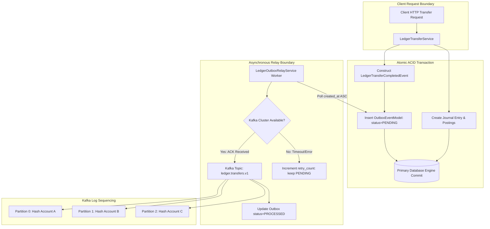

# ডে ৮৭: রিয়েল-টাইম লেজার অডিট স্ট্রিম ও ট্রানজ্যাকশনাল আউটবক্স রিলে আর্কিটেকচার (Kafka Event Streaming & Zero Dual-Write Invariants)

## ১. আমরা কী বানিয়েছি? (What did we build?)
আজ আমরা আমাদের এন্টারপ্রাইজ ডাবল-এন্ট্রি লেজার সিস্টেমের সাথে অ্যাপাচি কাফকার (Apache Kafka) একটি রিয়েল-টাইম ফিন্যান্সিয়াল অডিট স্ট্রিমিং আর্কিটেকচার প্রতিষ্ঠা করেছি। এখানে **ট্রানজ্যাকশনাল আউটবক্স প্যাটার্ন (Transactional Outbox Pattern)** ব্যবহারের মাধ্যমে সফটওয়্যার ইঞ্জিনিয়ারিংয়ের কুখ্যাত **ডুয়াল-রাইট প্রবলেম (Dual-Write Problem)** চিরতরে নির্মূল করা হয়েছে। 

লেজার ট্রান্সফার সার্ভিসের ভেতরে মূল ডাটাবেসে টাকা ট্রান্সফারের জার্নাল ও পোস্টিং লেখার সাথে সাথে একই ডাটাবেস ট্রানজ্যাকশনে (Atomic Unit of Work) একটি `LedgerTransferCompletedEvent` আউটবক্স টেবিল-এ রেকর্ড করা হয়। পরবর্তীতে একটি ব্যাকগ্রাউন্ড `LedgerOutboxRelayService` ইঞ্জিন সেই ইভেন্টগুলোকে ক্রমানুসারে তুলে নিয়ে কাফকা ব্রোকারে প্রেরণ করে এবং `source_account_id` দিয়ে মেসেজের পার্টিশন কি (Partition Key) নির্ধারণ করে strict FIFO অর্ডারিং নিশ্চিত করে।

---

## ২. 📌 ব্যবহৃত DSA ও ফিনটেক ইভেন্ট স্ট্রিমিং প্যাটার্নের নাম
- **ট্রানজ্যাকশনাল আউটবক্স ও কাফকা লেজার অডিট স্ট্রিমিং (Transactional Outbox Pattern & Real-Time Kafka Audit Streaming — Eliminating Dual-Write Inconsistencies & Partition Key Event Ordering)**
- **অ্যাকাউন্ট-লেভেল পার-পার্টিশন কি হ্যাশিং (Consistent Partition Key Hashing via Murmur2 / SHA-256 for Account FIFO Sequencing)**
- **অ্যাট-লিস্ট-ওয়ানস ডেলিভারি ও আইডেমপোটেন্ট কনজিউমার স্টেট (At-Least-Once Delivery Guarantee with Monotonic UUIDv7 Deduplication)**
- **ফ্লোটিং-পয়েন্ট ড্রিফটহীন স্ট্রিং প্রিসিশন সিরিয়ালাইজেশন (Zero Floating-Point Drift via Arbitrary-Precision String Decimal Transport)**

---

## ৩. 🚀 প্রোডাকশনে ঠিক কখন ব্যবহার করব? (When to use in Production)
- **রিয়েল-টাইম অডিট ও নোটিফিকেশন:** টাকা কাটার সাথে সাথে এসএমএস অ্যালার্ট, ইমেইল রসিদ এবং সেন্ট্রাল ব্যাংক রেগুলেটরি অডিট পোর্টালে রিয়েল-টাইম স্ট্রিম পাঠানো।
- **ফ্রড ডিটেকশন ও অ্যানোমালি স্ক্যানিং:** প্রতিটি আর্থিক লেনদেন কাফকা দিয়ে ফ্রড ডিটেকশন ইঞ্জিন (ML মডেল) ও ভেলোসিটি ফিল্টারে পাঠানো, যাতে অস্বাভাবিক ঘন ঘন টাকা তোলার ঘটনা মিলিসেকেন্ডে ব্লক করা যায়।
- **অ্যানালিটিক্স ডাটা পাইপলাইন:** Snowflake, ClickHouse বা BigQuery-এর মতো ডেটা ওয়্যারহাউজে কোর ব্যাংকিং ডেটাবেসের উপর কোনো বাড়তি রিড/রাইট চাপ সৃষ্টি না করে ইভেন্ট-ড্রিভেন পদ্ধতিতে লাইভ লেজার ডেটা স্ট্রিম করা।

---

## ৪. 🎯 কী কারণে বা কোন পরিস্থিতিতে ব্যবহার করব? (Why to use / Technical Triggers)
- **ডুয়াল-রাইট প্রবলেম চিরতরে নির্মূল করা:** একই HTTP হ্যান্ডলারের ভেতর ডাটাবেসে Commit করা এবং নেটওয়ার্কে কাফকাতে Publish করা অসম্ভব ঝুঁকিপূর্ণ। কারণ ডাটাবেসে লেখা সম্পন্ন হলেও কাফকা নেটওয়ার্ক টাইমআউট হতে পারে, যার ফলে ডাটাবেসে টাকা কাটার তথ্য থাকবে অথচ সেন্ট্রাল অডিটে কোনো ইভেন্ট যাবে না। আউটবক্স প্যাটার্ন একই লোকাল ACID বাউন্ডারিতে উভয় তথ্য সেভ করে এই অমিল শূন্যে নামায়।
- **মেসেজ অর্ডারিং গ্যারান্টি (FIFO):** কাফকাতে যদি পার্টিশন কি ছাড়া র্যান্ডম পার্টিশনে ইভেন্ট যায়, তবে কনজিউমার ব্যালেন্স ডেবিটের আগে টাকা জমার ইভেন্ট প্রসেস করে ভুল ফিন্যান্সিয়াল স্টেট তৈরি করতে পারে। `source_account_id`-কে পার্টিশন কি হিসেবে ব্যবহার করায় একটি নির্দিষ্ট অ্যাকাউন্টের সব লেনদেন কাফকার একই পার্টিশনে ক্রমানুসারে জমা হয়।
- **জিরো ডাটা লস রেজিলিয়েন্স:** কাফকা ক্লাস্টার যদি সাময়িকভাবে ডাউন বা আনরিচেবলও থাকে, লেজার লেনদেন বাধাগ্রস্ত হবে না; আউটবক্স টেবিলে ইভেন্টটি `PENDING` অবস্থায় জমা থাকবে এবং কাফকা ক্লাস্টার রিকভার করার সাথে সাথে রিলে কর্মী স্বয়ংক্রিয়ভাবে ব্যাকঅফ রিট্রাই দিয়ে তা ব্রোকারে পাঠিয়ে দেবে।

---

## ৫. বাস্তব জীবনের গল্প ও উপমা
কল্পনা করুন একটি উচ্চ আদালতের এজলাস। মহামান্য বিচারক যখন কোনো আসামির জামিন বা রায়ের আদেশ দেন, তিনি কখনোই এজলাস থেকে নিজে দৌড়ে পোস্ট অফিসে গিয়ে চিঠি পোস্ট করেন না। কারণ বিচারক যদি মাঝপথে জ্যামে পড়েন বা পোস্ট অফিস বন্ধ পান, তাহলে আদালতের এজলাসের কাজ আটকে যাবে কিংবা চিঠি হারিয়ে যাবে!

বিচারক যা করেন তা হলো: তিনি এজলাসের লাল খাতায় (ডাটাবেস ট্রানজ্যাকশন) রায় লেখেন এবং রায়ের অনুলিপিটি সরাসরি বেঞ্চ সহকারীর ডেস্কের আউটবক্সে (Transactional Outbox Table) ফাইল করে দেন। বিচারকের কাজ এখানেই শেষ। পরবর্তীতে আদালতের বিশ্বস্ত বার্তাবাহক (Outbox Relay Worker) সেই আউটবক্স থেকে চিঠিগুলো সংগ্রহ করে রেজিস্ট্রি ডাকযোগে (Kafka Broker) প্রাপকের ঠিকানায় পৌঁছে দেয় এবং ডেস্কে এসে সিল মেরে দেয় "প্রেরিত" (PROCESSED)। পোস্ট অফিসের সার্ভার ডাউন থাকলেও বিচারকের রায়ের কোনো ক্ষতি হয় না।

---

## ৬. এটা না বানালে কী মহাবিপদ হতো? (Silent Audit Loss Disaster)
যদি আমরা সরাসরি লেজার ট্রান্সফার এন্ডপয়েন্টের ভেতর কাফকা প্রডিউসার কল করতাম (`await kafka_producer.send(...)`):
১. **সাইলেন্ট অডিট লস (Silent Audit Loss Disaster):** ১ কোটি টাকার ফান্ড ট্রান্সফার ডাটাবেসে সফলভাবে কমিট হলো, কিন্তু কাফকা ক্লাস্টারে নেটওয়ার্ক স্পাইক বা লিডার ইলিশন চলায় কাফকা টাইমআউট দিল। গ্রাহকের অ্যাকাউন্ট থেকে টাকা কাটল, কিন্তু নোটিফিকেশন গেল না, সেন্ট্রাল ব্যাংকের অডিটে তথ্য জমা পড়ল না, এবং ফ্রড ইঞ্জিন কোনো সংকেত পেল না। ব্যাংকের লাখ লাখ ডলার গরমিল হয়ে রেগুলেটরি লাইসেন্স বাতিল হতে পারত!
২. **অর্ডার ডিসঅর্ডার বিপর্যয় (Out-of-Order Execution):** পার্টিশন কি ছাড়া কাফকাতে ইভেন্ট পাঠালে একই গ্রাহকের প্রথমে টাকা কাটার ইভেন্ট পার্টিশন ২-এ এবং পরে টাকা জমার ইভেন্ট পার্টিশন ০-তে চলে যেত। কনজিউমার পার্টিশন ০ আগে প্রসেস করে নেগেটিভ ব্যালেন্সের মিথ্যা অ্যালার্ট পাঠাত।
৩. **ফ্লোটিং পয়েন্ট ট্রাঙ্কেশন:** অ্যামাউন্ট যদি `float` হিসেবে JSON-এ যেত, তবে `100.0050` পরিণত হতো `100.00499999999999`-এ, যার ফলে অডিট ট্রেইলে সেন্টের ভগ্নাংশ হারিয়ে ব্যালেন্স মিসম্যাচ হতো।

---

## ৭. আমাদের প্রজেক্টের আসল কোড ও লাইন-বাই-লাইন সহজ ব্যাখ্যা

### ক) ক্লাউডইভেন্টস-সম্মত ডোমেইন ইভেন্ট স্কিমা (`app/schemas/ledger_events.py`)
```python
class LedgerTransferCompletedEvent(BaseModel):
    model_config = ConfigDict(frozen=True, extra="forbid")

    event_id: str = Field(default_factory=lambda: str(generate_uuidv7()))
    event_type: str = Field(default="ledger.transfer.completed.v1")
    reference_id: str
    source_account_id: str
    destination_account_id: str
    amount: str          # Decimal স্ট্রিং, শূন্য ফ্লোট!
    currency: str
    fee_amount: str = "0.0000"
    posted_at: str = Field(default_factory=lambda: datetime.now(UTC).isoformat())
    partition_key: str = ""

    def model_post_init(self, __context: Any) -> None:
        # পার্টিশন কি কঠোরভাবে source_account_id এর সাথে আবদ্ধ
        if not self.partition_key:
            object.__setattr__(self, "partition_key", str(self.source_account_id))
```
- **ব্যাখ্যা:** `frozen=True` ইভেন্ট অবজেক্টটিকে ইমিউটেবল রাখে। `amount` এবং `fee_amount` ফিল্ডগুলো স্ট্রিং হিসেবে সংরক্ষিত হয়, যাতে নেটওয়ার্ক সিরিয়ালাইজেশনের সময় কোনো দশমিক সংখ্যা ট্রাঙ্কেট না হয়। `partition_key` স্বয়ংক্রিয়ভাবে `source_account_id` ধারণ করে।

### খ) অ্যাটমিক আউটবক্স কো-লোকেশন (`app/services/ledger_transfer_service.py`)
```python
# ১. জার্নাল এন্ট্রি ও মাল্টি-লেগ পোস্টিং সংরক্ষণ
entry = await self.uow.ledger.create_journal_entry(
    reference_id=reference_id,
    description=description,
    postings=postings,
)

# ২. একই লোকাল ডাটাবেস ট্রানজ্যাকশনে আউটবক্স ইভেন্ট তৈরি
event = LedgerTransferCompletedEvent.create(
    reference_id=reference_id,
    source_account_id=str(source_account_id),
    destination_account_id=str(destination_account_id),
    amount=amount,
    currency=source_acc.currency,
    fee_amount=fee_amount,
    posted_at=entry.posted_at,
)
outbox_event = OutboxEventModel(
    topic="ledger.transfers.v1",
    event_type="ledger.transfer.completed.v1",
    partition_key=str(source_account_id),
    payload=event.model_dump(),
    status="PENDING",
)
await self.uow.outbox.create(outbox_event)

# ৩. একই সাথে কমিট (Zero Dual-Write)
await self.uow.commit()
```
- **ব্যাখ্যা:** জার্নাল এন্ট্রি এবং আউটবক্স ইভেন্ট উভয়ই `async with self.uow:` ব্লকের ভেতরে কমিট হওয়ার পূর্বে ডাটাবেসে ফ্ল্যাশ করা হয়। যদি ব্যালেন্সের গরমিল থাকে বা ডাটাবেস এরর দেয়, তবে জার্নাল এন্ট্রি এবং আউটবক্স রেকর্ড উভয়ই একসাথে রোলব্যাক হবে। কাফকা ডাউন থাকলেও ট্রান্সফার নিরাপদে সম্পন্ন হবে।

### গ) লেজার আউটবক্স রিলে ওয়ার্কার ইঞ্জিন (`app/services/ledger_outbox_relay_service.py`)
```python
async def publish_pending_events(self, batch_size: int = 50) -> int:
    producer = await self._resolve_producer()
    dispatched_count = 0

    async with self._uow as uow:
        pending_events = await uow.outbox.get_pending_events(batch_size=batch_size)
        for event in pending_events:
            topic = event.aggregate_type or "ledger.transfers.v1"
            partition_key = event.aggregate_id
            payload_bytes = json.dumps(event.payload).encode("utf-8")

            try:
                # কাফকাতে পার্টিশন কি সহ ইভেন্ট পাঠানো
                await producer.send_and_wait(
                    topic=topic,
                    key=partition_key.encode("utf-8"),
                    value=payload_bytes,
                )
                # ব্রোকার কনফার্ম করলে স্ট্যাটাস PROCESSED করা
                await uow.outbox.mark_published(event.id, status="PROCESSED")
                dispatched_count += 1
            except Exception as exc:
                # ব্রোকার ব্যর্থ হলে রিট্রাই কাউন্ট বৃদ্ধি, কিন্তু স্টেট PENDING থাকবে
                await uow.outbox.mark_failed(event.id)
                logger.error("Kafka dispatch failed: %s", exc)

        await uow.commit()
    return dispatched_count
```
- **ব্যাখ্যা:** রিলে সার্ভিস পোলিং করে ডাটাবেসের `outbox_events` টেবিল থেকে `PENDING` রেকর্ডগুলো তুলে আনে। প্রতিটি রেকর্ড কাফকা ব্রোকারে `send_and_wait` দিয়ে সফলভাবে কনফার্ম হওয়ার পরই কেবলমাত্র সেটির স্ট্যাটাস `PROCESSED` হিসেবে ডাটাবেসে মার্ক করা হয় (At-Least-Once Delivery)।

---

## ৮. ডিএসএ ও স্ট্রিমিং মেকানিক্স (Architecture Deep-Dive)



### স্ট্রিমিং ও ডিএসএ উপাদানসমূহ:
1. **ডিস্ট্রিবিউটেড কমিট লগ (Distributed Commit Log):** কাফকার প্রতিটি পার্টিশন হলো ডিস্কের একটি অ্যাপেন্ড-অনলি সিকোয়েন্সিয়াল লগ। এটি $\mathcal{O}(1)$ ডিস্ক রাইট পারফরম্যান্স প্রদান করে।
2. **পার্টিশন কি হ্যাশিং (Murmur2 / SHA-256 Integer Modulo):**
   $$\text{Partition} = \text{Hash}(\text{Account ID}) \pmod{\text{Number of Partitions}}$$
   এর ফলে একই অ্যাকাউন্টের শত শত ট্রানজ্যাকশন কাফকার একই পার্টিশনে সিরিয়াল অর্ডারে প্রবেশ করে, যা রেস কন্ডিশন সম্পূর্ণ দূর করে।
3. **বি-ট্রি ক্লাস্টার্ড ইনডেক্স লোকালিটি:** আউটবক্স টেবিলের প্রাথমিক কি হিসেবে RFC 9562 UUIDv7 ব্যবহার করায় ডাটাবেসের বি-ট্রি পেজে নতুন রেকর্ডগুলো সবসময় সর্ব-ডানে অ্যাপেন্ড হয়, যা র্যান্ডম UUIDv4 পেজ স্প্লিট প্রতিরোধ করে।

---

## ৯. ইন্টারভিউ ও ভাইভা প্রশ্ন

### প্রশ্ন ১: ডিস্ট্রিবিউটেড আর্কিটেকচারে Dual-Write Problem কী এবং Transactional Outbox Pattern কীভাবে এটি শতভাগ নির্ভরযোগ্যভাবে সমাধান করে?
**উত্তর:**
ডুয়াল-রাইট প্রবলেম ঘটে যখন একটি অ্যাপ্লিকেশনের একই ব্যবসায়িক কার্যক্রমে দুটি ভিন্ন ভিন্ন ডিস্ট্রিবিউটেড সিস্টেমে (যেমন একটি RDBMS ডাটাবেস এবং একটি কাফকা ব্রোকার) ডাটা লিখতে হয়। যেহেতু এদের মধ্যে 2PC (Two-Phase Commit) পারফরম্যান্সের কারণে অত্যন্ত ধীর ও ভঙ্গুর, তাই যেকোনো একটি সফল হয়ে অন্যটি নেটওয়ার্ক ফেইলিওরের কারণে ব্যর্থ হতে পারে (যেমন ডাটাবেসে টাকা কাটা হলো কিন্তু কাফকা ডাউন থাকায় ইভেন্ট ড্রপ হলো)। 

ট্রানজ্যাকশনাল আউটবক্স প্যাটার্ন কাফকাকে সরাসরি রিকোয়েস্টের লাইফসাইকেল থেকে আলাদা করে ফেলে। ব্যবসায়িক সত্তার সাথে সাথে ব্রোকারে পাঠানোর বার্তাটিও একই রিলেশনাল ডাটাবেসের একটি বিশেষ "আউটবক্স" টেবিলে একই লোকাল ACID ট্রানজ্যাকশনে সেভ করা হয়। ডাটাবেস কমিট সফল হলে ইভেন্ট নিশ্চিতভাবে সেভ থাকে, আর ব্যর্থ হলে দুটোই একসাথে রোলব্যাক হয়। পরবর্তীতে একটি আলাদা প্রসেস আউটবক্স টেবিল থেকে ডাটা রিড করে কাফকাতে পাঠায়। ফলে নেটওয়ার্ক ডাউন হলেও কোনো তথ্য কখনোই হারায় না।

### প্রশ্ন ২: কাফকাতে ফিন্যান্সিয়াল ইভেন্ট পাঠানোর সময় কেন Partition Key নির্ধারণ করা অত্যন্ত জরুরি? র্যান্ডম পার্টিশনিং করলে কী ক্ষতি হতো?
**উত্তর:**
কাফকাতে বার্তাগুলোর ধারাবাহিকতা (Strict Ordering) শুধুমাত্র একই পার্টিশনের ভেতরে গ্যারান্টিযুক্ত থাকে; একাধিক ভিন্ন পার্টিশনের মধ্যে কোনো গ্লোবাল অর্ডারিং থাকে না।

যদি ফিন্যান্সিয়াল ইভেন্ট র্যান্ডমলি বা রাউন্ড-রবিন উপায়ে বিভিন্ন পার্টিশনে পাঠানো হয়, তবে একই ব্যাংক অ্যাকাউন্টের ডিপোজিট ও উইথড্রয়াল ইভেন্ট বিভিন্ন পার্টিশনে চলে যাবে। ডাউনস্ট্রিম কনজিউমার ডিপোজিটের আগেই উইথড্রয়াল ইভেন্ট প্রসেস করে ফেলতে পারে, যার ফলে গ্রাহকের একাউন্টে পর্যাপ্ত টাকা থাকা সত্ত্বেও সিস্টেম মিথ্যা "অ্যাকাউন্ট ওভারড্রাফট" বা "জিরো ব্যালেন্স" অ্যালার্ট তৈরি করবে। `source_account_id`-কে পার্টিশন কি হিসেবে নির্দিষ্ট করলে কাফকার ডিটারমিনিস্টিক হ্যাশিং নিশ্চিত করে যে ওই অ্যাকাউন্টের সমস্ত ইভেন্ট সর্বদা একই পার্টিশনে এবং কঠোরভাবে FIFO অর্ডারে প্রসেস হবে।

---

## ১০. এক নজরে আসল মূল লজিক (Summary)
**লেজার ট্রান্সফার সার্ভিসের ভেতরে কাফকাকে সরাসরি কল না করে ডাটাবেসের একই ট্রানজ্যাকশনে আউটবক্স ইভেন্ট সেভ করা হয়, এবং ডেডিকেটেড রিলে সার্ভিসের মাধ্যমে `source_account_id` পার্টিশন কি সহযোগে কাফকাতে স্ট্রিম করে ডুয়াল-রাইট ডিসক্রিপেন্সি শূন্যে নামিয়ে পার-অ্যাকাউন্ট মেসেজ অর্ডারিং নিশ্চিত করা হয়।**
