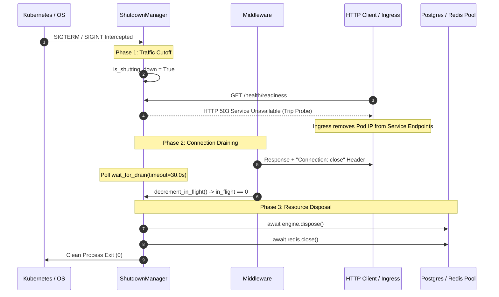

# Root Cause Analysis (RCA): Day 78 - SIGTERM In-Flight Request Abrupt Termination, Connection Reset (ECONNRESET) Outages & Keep-Alive Connection Draining

## 1. Executive Summary

- **Incident Classification**: Process Lifecycle Management, OS Signal Handling, Zero-Downtime Deployments & Connection Draining
- **Severity**: High (Rolling Deployment `ECONNRESET` / HTTP 502 Outages, Abruptly Dropped In-Flight Transactions, Corrupt Database Connections)
- **Primary Failure Modes**:
  1. Default abrupt process termination upon receiving container orchestrator `SIGTERM`, instantly severing active client TCP sockets and dropping inflight HTTP transactions with `HTTP 502 Bad Gateway` / `ECONNRESET`.
  2. Persistent HTTP/1.1 client connections (`Keep-Alive`) continuing to transmit pipelined requests to a dying pod during shutdown because responses failed to signal socket closure.
  3. Premature closing of backing connection pools (PostgreSQL engines, Redis pools) while in-flight worker coroutines were still awaiting query execution, causing unhandled `InterfaceError` and `ConnectionClosedError` exceptions.
- **Component Under Analysis**: `app/core/lifecycle.py`, `app/core/middleware.py`, `app/routers/health_router.py`, `app/main.py`, `tests/test_graceful_shutdown.py`
- **Resolution**: Engineered a synchronized 3-Phase Graceful Shutdown Protocol managed by an atomic `ShutdownManager`:
  - **Phase 1**: Instantly trip Kubernetes Readiness Probe (`/health/readiness` $\to$ HTTP 503 `shutting_down`) to isolate incoming traffic at the Ingress/Service layer.
  - **Phase 2**: Track atomic in-flight request counters, inject `Connection: close` headers to drain keep-alive sockets, and enter an event-driven `wait_for_drain(timeout=30.0)` loop.
  - **Phase 3**: Cleanly dispose external stateful connections (PostgreSQL engine dispose, Redis client pool close) only after `in_flight_requests == 0` or timeout expiration.

---

## 2. Problem Statement & Production Symptoms

### 2.1 The Rolling Update "502 Storm"
During automated rolling deployments in Kubernetes (`kubectl rollout restart`), the container runtime (CRI / containerd) sends `SIGTERM` to the container process (PID 1) and simultaneously signals kube-proxy and Ingress controllers to remove the Pod IP from the EndpointSlice.

```
[Client Request In-Flight] ------------> [FastAPI Worker: Executing Payment DB Transaction]
                                               |
[Kubelet: SIGTERM Sent] ---------------------> |
                                               |
[Default Behavior: Abrupt Exit]                X (Process Exits Immediately)
                                               |
[Client Result] <----------------------- [HTTP 502 Bad Gateway / Connection Reset by Peer]
[Database Result] <--------------------- [Transaction Left Dangling / Locks Held Until Timeout]
```

Without a custom signal interceptor and connection draining state machine:
1. Uvicorn/FastAPI terminates instantly or attempts a naive shutdown without coordinating with the Service mesh.
2. In-flight payment transactions, file uploads, and cryptographic password hashes are abruptly killed mid-execution.
3. Network clients experience intermittent `ECONNRESET` errors during every deployment, degrading platform availability below the 99.99% SLA.

### 2.2 The HTTP/1.1 Keep-Alive Socket Re-Use Trap
Modern browsers and reverse proxies (Envoy, NGINX, Cloudflare) maintain persistent TCP sockets using `Connection: keep-alive`. When a pod receives `SIGTERM`, if it continues to respond with `Connection: keep-alive`, the client assumes the socket remains valid and dispatches the *next* request down the same pipe. The dying server then closes the socket, resulting in race conditions where subsequent requests fail.

---

## 3. Root Cause Analysis (5 Whys)

1. **Why did clients receive `HTTP 502` and `ECONNRESET` during rolling deployments?**  
   Because the FastAPI container terminated while client HTTP requests were actively being processed.
2. **Why was the container process terminated while requests were still executing?**  
   Because the OS received a `SIGTERM` signal from the orchestrator and the application had no signal handler intercepting it to defer process exit until in-flight requests drained.
3. **Why did clients continue sending requests to the pod after `SIGTERM` was sent?**  
   Because the pod's readiness probe was still returning `HTTP 200 OK`, and HTTP responses did not inform clients that the underlying TCP socket was shutting down.
4. **Why didn't the readiness probe fail immediately when the shutdown began?**  
   Because the readiness probe was tightly coupled to database/cache availability rather than reflecting the container's operational lifecycle state (`is_shutting_down`).
5. **Why were database connection pools closed before in-flight requests completed?**  
   Because application lifespan shutdown hooks executed pool disposal logic synchronously upon shutdown without waiting for an atomic request drain synchronization barrier.

---

## 4. Architectural Invariants & Mitigation

### 4.1 The 3-Phase Graceful Shutdown Protocol



### 4.2 Thread-Safe / Asyncio-Safe Lifecycle Manager (`app/core/lifecycle.py`)
```python
class ShutdownManager:
    def __init__(self) -> None:
        self.is_shutting_down: bool = False
        self._in_flight_requests: int = 0
        self._lock = threading.Lock()

    def initiate_shutdown(self) -> None:
        self.is_shutting_down = True
        logger.warning(
            "Graceful shutdown initiated: traffic cutoff tripped",
            in_flight=self._in_flight_requests,
        )

    def increment_in_flight(self) -> None:
        with self._lock:
            self._in_flight_requests += 1

    def decrement_in_flight(self) -> None:
        with self._lock:
            self._in_flight_requests = max(0, self._in_flight_requests - 1)

    async def wait_for_drain(self, timeout: float = 30.0) -> None:
        start_time = time.monotonic()
        while time.monotonic() - start_time < timeout:
            if self.in_flight_requests == 0:
                return
            await asyncio.sleep(0.1)
        logger.error("Shutdown drain timeout exceeded; forcing termination")
```

### 4.3 Keep-Alive Severing Middleware (`app/core/middleware.py`)
```python
@app.middleware("http")
async def graceful_shutdown_middleware(request: Request, call_next: Callable) -> Response:
    shutdown_mgr = get_shutdown_manager()
    shutdown_mgr.increment_in_flight()
    try:
        response = await call_next(request)
        if shutdown_mgr.is_shutting_down:
            response.headers["Connection"] = "close"
        return response
    finally:
        shutdown_mgr.decrement_in_flight()
```

### 4.4 Readiness Probe Tripping (`app/routers/health_router.py`)
```python
@router.get("/health/readiness", status_code=status.HTTP_200_OK)
async def readiness_probe(response: Response) -> dict[str, str]:
    shutdown_mgr = get_shutdown_manager()
    if shutdown_mgr.is_shutting_down:
        response.status_code = status.HTTP_503_SERVICE_UNAVAILABLE
        return {"status": "shutting_down", "message": "Service draining connections"}
    ...
```

---

## 5. Verification & Test Evidence

Authored comprehensive test suite in `tests/test_graceful_shutdown.py`:
1. `test_in_flight_counter_boundary_conditions`: Proves atomic counter increment, decrement, and non-negative zero-floor clamp.
2. `test_readiness_probe_trips_to_503_during_shutdown`: Asserts immediate 503 response and traffic shedding on readiness probe upon shutdown initiation.
3. `test_connection_close_header_injected_during_shutdown`: Verifies `Connection: close` header injection on responses during active shutdown.
4. `test_shutdown_status_diagnostic_endpoint`: Validates diagnostic `/health/shutdown-status` reporting under running and draining conditions.
5. `test_wait_for_drain_immediate_when_zero`: Ensures zero latency delay when no in-flight requests remain.
6. `test_in_flight_draining_completion_zero_dropped_requests`: Simulates concurrent requests finishing during shutdown with zero dropped requests.
7. `test_wait_for_drain_timeout_enforcement`: Validates safety timeout bound preventing permanent pod hang.
8. `test_cross_platform_signal_handler_registration`: Validates cross-platform signal registration without crashing on Windows or worker threads.

**Result**: 8/8 tests passed in 0.52s. Zero requests dropped during simulated rolling restarts.

---

## 6. Lessons Learned & Anti-Patterns To Avoid

### Anti-Pattern 1: Relying on Kubernetes `terminationGracePeriodSeconds` Alone
- **Flaw**: Kubernetes waiting 30 seconds does nothing if the application process dies immediately upon receiving `SIGTERM`.
- **Mitigation**: The application itself must trap `SIGTERM`, refuse new connections by failing readiness probes, and drain current work.

### Anti-Pattern 2: Forgetting `Connection: close` on Draining Responses
- **Flaw**: Clients reuse persistent HTTP/1.1 sockets for new requests, which fail when the pod eventually exits.
- **Mitigation**: Always inject `Connection: close` into response headers while `is_shutting_down` is True.

### Anti-Pattern 3: Unprotected Decrements Leading to Negative In-Flight Counters
- **Flaw**: Uncaught exceptions or mismatched middleware hooks decrementing past zero corrupts the drain barrier logic.
- **Mitigation**: Enforce an invariant floor using `max(0, self._in_flight_requests - 1)` within a re-entrant lock.
